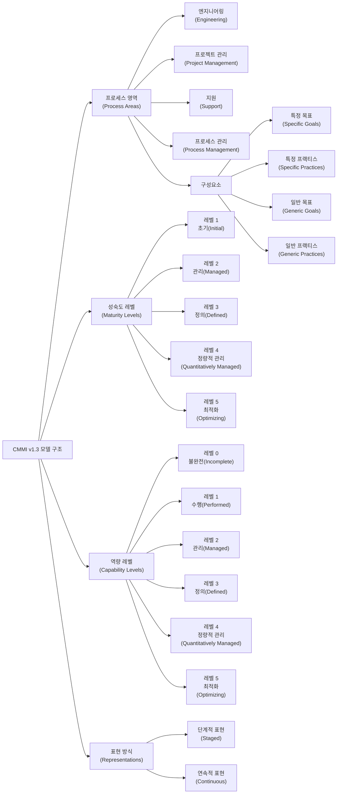
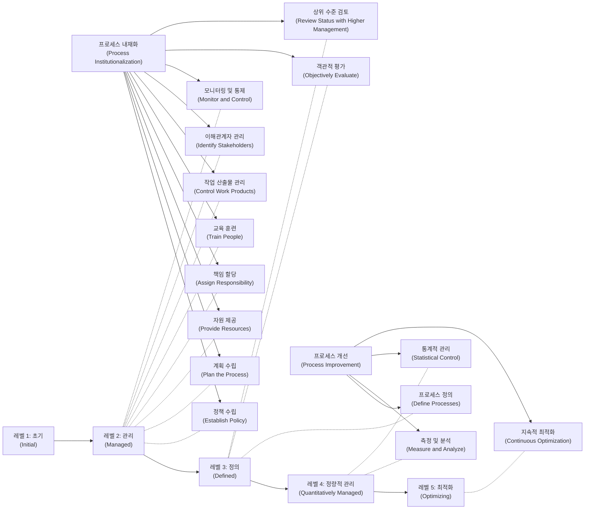

# CMMi v1.3: 프로세스 개선 및 내재화의 핵심

<!-- mtoc-start -->

- [특징](#특징)
- [CMMi의 모델 구조 (P, G, P, C)](#cmmi의-모델-구조-p-g-p-c)
- [CMMi의 표현 방법](#cmmi의-표현-방법)
  - [1. Staged 표현 (단계적 성숙도 모델)](#1-staged-표현-단계적-성숙도-모델)
  - [2. Continuous 표현 (연속적 성숙도 모델)](#2-continuous-표현-연속적-성숙도-모델)
- [Staged 표현과 Continuous 표현 비교](#staged-표현과-continuous-표현-비교)
- [CMMi v1.3 모델 상세 구조](#cmmi-v13-모델-상세-구조)
- [CMMI v1.3프로세스 개선 및 내재화(Process Institutionalization) 프로세스](#cmmi-v13프로세스-개선-및-내재화process-institutionalization-프로세스)
- [성숙도 레벨(Maturity Levels)](#성숙도-레벨maturity-levels)
- [프로세스 개선의 핵심 원칙](#프로세스-개선의-핵심-원칙)
- [기대 효과](#기대-효과)
- [Keywords](#keywords)

<!-- mtoc-end -->

CMMi(Capability Maturity Model Integration) v1.3은 기존의 CMM 모델을 통합하고 SPICE 표준을 준수하는 소프트웨어 개발 능력 및 성숙도 평가 모델이다. 지속적인 품질 개선을 위한 체계적인 접근법을 제공하며, 조직의 프로세스 개선 및 내재화에 중점을 둔다.

## 특징

- **통합 모델**: 기존 CMM 모델을 통합한 성숙도 기반 평가 모델
- **진화적 관점**: 프로세스가 어떻게 개선되는지를 점진적으로 평가

## CMMi의 모델 구조 (P, G, P, C)

- **Process Area (PA)**: 수행 활동 영역
- **Goal (G)**: 달성 목표
- **Practice (P)**: 목표를 위한 활동
- **Common Feature (C)**: 공동 수행 항목 (수행방침, 수행능력, 직접이행, 이행검증)

## CMMi의 표현 방법

CMMi는 두 가지 방법으로 표현된다.

### 1. Staged 표현 (단계적 성숙도 모델)

조직 전체의 성숙도를 평가하는 방식으로, Maturity Level을 1~5단계(IMDQO)로 구분한다.

- **Level 1 (Initial)**: 비정형적 프로세스
- **Level 2 (Managed)**: 기본적인 프로젝트 관리
- **Level 3 (Defined)**: 표준화된 프로세스
- **Level 4 (Quantitatively Managed)**: 정량적 관리
- **Level 5 (Optimized)**: 지속적 프로세스 개선

### 2. Continuous 표현 (연속적 성숙도 모델)

개별 프로세스 영역을 평가하는 방식으로, Capability Level을 0~5단계(IPMDQO)로 구분한다.

- **Level 0 (Incomplete)**: 미완성
- **Level 1 (Performed)**: 수행됨
- **Level 2 (Managed)**: 관리됨
- **Level 3 (Defined)**: 정의됨
- **Level 4 (Quantitatively Managed)**: 정량적 관리
- **Level 5 (Optimized)**: 지속적 개선

## Staged 표현과 Continuous 표현 비교

| 구분        | Staged 표현 (Maturity Level) | Continuous 표현 (Capability Level) |
| ----------- | ---------------------------- | ---------------------------------- |
| 개념        | 특정 영역 평가 후 전체 평가  | 개별 프로세스 영역을 그룹화 평가   |
| 방식        | Bottom-Up                    | Top-Down                           |
| 범위        | 조직 전체 수준 평가          | 특정 프로세스 영역 평가            |
| PA 그룹화   | Maturity Level 기준          | Capability Level 기준              |
| 성숙도 단계 | 1~5단계 (IMDQO)              | 0~5단계 (IPMDQO)                   |

## CMMi v1.3 모델 상세 구조

CMMI(Capability Maturity Model Integration)는 조직의 프로세스 개선을 위한 체계적인 프레임워크:

1. **프로세스 영역(Process Areas)**: 관련 활동들의 집합으로 특정 영역의 목표를 달성하기 위한 실천사항들이 포함됩니다.

   - 엔지니어링(요구사항 관리, 검증 등)
   - 프로젝트 관리(프로젝트 계획, 위험 관리 등)
   - 프로세스 관리(조직 프로세스 정의, 조직 성과 관리 등)
   - 지원(형상 관리, 품질 보증 등)

2. **표현 방식(Representations)**:

   - 단계적 표현(Staged): 성숙도 레벨을 통해 조직 전체의 개선 수준을 평가
   - 연속적 표현(Continuous): 개별 프로세스 영역의 역량 레벨을 통해 특정 영역의 개선 수준을 평가

3. **목표와 프랙티스**:
   - 특정 목표(SG)와 특정 프랙티스(SP): 특정 프로세스 영역에만 적용되는 목표와 실천사항
   - 일반 목표(GG)와 일반 프랙티스(GP): 모든 프로세스 영역에 공통으로 적용되는 목표와 실천사항

## CMMI v1.3프로세스 개선 및 내재화(Process Institutionalization) 프로세스

프로세스 내재화는 조직 문화의 일부로 프로세스가 정착되는 것을 의미:

1. **정책 수립**: 조직의 기대사항을 명확히 하는 정책 수립
2. **계획 수립**: 프로세스 수행에 필요한 계획 마련
3. **자원 제공**: 인력, 도구, 인프라 등 필요한 자원 할당
4. **책임 할당**: 역할과 책임을 명확하게 정의하고 할당
5. **교육 훈련**: 프로세스 수행에 필요한 기술과 지식 교육
6. **작업 산출물 관리**: 산출물의 무결성 보장을 위한 통제
7. **이해관계자 식별 및 참여**: 관련 이해관계자 식별 및 참여 유도
8. **모니터링 및 통제**: 프로세스 수행 상태 점검 및 시정조치
9. **객관적 평가**: 프로세스 준수 여부 및 산출물 품질 평가
10. **상위 수준 검토**: 경영진의 프로세스 활동 검토 및 의사결정

## 성숙도 레벨(Maturity Levels)

CMMI의 성숙도 레벨은 조직의 프로세스 개선 단계를 표현

1. **레벨 1(초기)**: 프로세스가 체계적이지 않고 예측 불가능함
2. **레벨 2(관리)**: 프로젝트 수준에서 프로세스가 계획되고 수행됨
3. **레벨 3(정의)**: 조직 표준 프로세스가 정의되고 프로젝트에 맞게 조정됨
4. **레벨 4(정량적 관리)**: 프로세스 성과가 통계적으로 관리되고 예측 가능함
5. **레벨 5(최적화)**: 지속적인 프로세스 개선이 조직 문화로 정착됨

## 프로세스 개선의 핵심 원칙

1. **점진적 접근**: 한 번에 모든 것을 완벽하게 하려 하지 않고 단계적으로 개선
2. **측정 기반 관리**: 데이터와 측정을 통해 객관적으로 프로세스 관리
3. **지속적 개선**: 프로세스 개선을 일회성 활동이 아닌 지속적인 활동으로 인식
4. **조직 지원**: 경영진의 확고한 의지와 지원이 프로세스 개선의 성공 요소
5. **통합적 접근**: 프로세스, 인력, 기술을 통합적으로 고려한 개선 접근법

CMMI 모델의 체계적인 접근을 통해 조직은 프로세스의 예측 가능성, 효과성, 효율성을 향상시킬 수 있으며, 궁극적으로 조직의 품질과 생산성을 높이는 데 기여할 수 있습니다.

## 기대 효과

CMMi v1.3을 도입하면 소프트웨어 개발 프로세스를 체계적으로 개선하고 조직의 성숙도를 향상할 수 있다. 이를 통해 품질 향상, 리스크 감소, 생산성 증가, 고객 만족도 제고 등의 효과를 기대할 수 있다.

## Keywords

CMMi v1.3, 프로세스 개선, 성숙도 모델, Staged 표현, Continuous 표현, Maturity Level, Capability Level, 소프트웨어 개발, 품질 관리, 프로세스 평가
