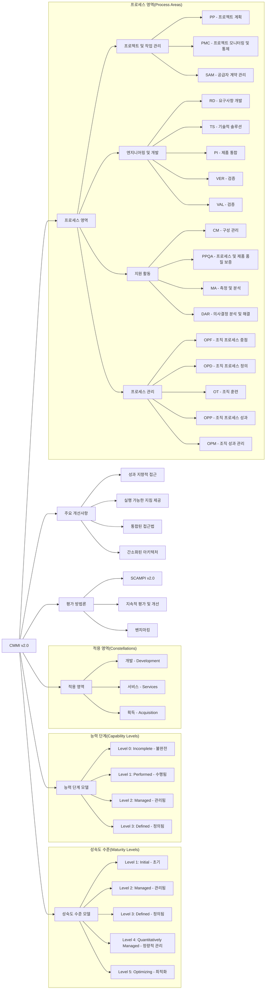

# CMMi v2.0: 프로세스 개선과 성숙도 모델

<!-- mtoc-start -->

- [Process Category (DMEI)](#process-category-dmei)
- [Capability Area (12개 영역)](#capability-area-12개-영역)
  - [1. Doing (QPSS)](#1-doing-qpss)
  - [2. Managing (WRW)](#2-managing-wrw)
  - [3. Enabling (ISS)](#3-enabling-iss)
  - [4. Improving (PC)](#4-improving-pc)
- [Model View](#model-view)
- [CMMI v2.0 프로세스 성숙도 모델](#cmmi-v20-프로세스-성숙도-모델)
  - [1. 구조적 특징](#1-구조적-특징)
  - [2. CMMI v2.0의 주요 개선사항](#2-cmmi-v20의-주요-개선사항)
  - [3. 프로세스 영역 구성](#3-프로세스-영역-구성)
  - [4. 평가 및 적용](#4-평가-및-적용)
- [기대 효과](#기대-효과)
- [Keywords](#keywords)

<!-- mtoc-end -->

CMMi v2.0은 조직의 프로세스 개선을 위한 최신 프레임워크로, CMMi v1.3을 발전시켜 더욱 유연하고 실용적인 접근 방식을 제공한다. 조직이 프로세스를 지속적으로 최적화하고 성숙도를 높일 수 있도록 돕는다.

## Process Category (DMEI)

CMMi v2.0은 네 가지 주요 프로세스 카테고리로 구성된다.

- **Doing**: 핵심 프로세스 수행
- **Managing**: 프로세스 및 운영 관리
- **Enabling**: 조직 내 지원 및 보안 관리
- **Improving**: 지속적인 개선과 역량 구축

## Capability Area (12개 영역)

각 프로세스 카테고리는 12개의 주요 역량 영역으로 세분화된다.

### 1. Doing (QPSS)

- **Ensuring Quality**: 품질 보증 및 유지
- **Engineering and Developing Products**: 제품 개발 및 엔지니어링
- **Delivering and Managing Services**: 서비스 제공 및 관리
- **Selecting and Managing Supplies**: 공급업체 선정 및 관리

### 2. Managing (WRW)

- **Planning and Managing Work**: 업무 계획 및 관리
- **Managing Business Resilience**: 비즈니스 연속성 관리
- **Managing the Workforce**: 인력 관리

### 3. Enabling (ISS)

- **Supporting Implementation**: 실행 지원
- **Managing Safety**: 안전 관리
- **Managing Security**: 보안 관리

### 4. Improving (PC)

- **Improving Performance**: 성과 개선
- **Building and Sustaining Capability**: 지속적인 역량 구축

## Model View

CMMi v2.0은 다양한 산업과 조직 요구사항에 맞게 네 가지 모델을 제공한다.

- **CMMi-DEV (Development)**: 소프트웨어 및 시스템 개발 프로세스 관리
- **CMMi-SVC (Service)**: 서비스 제공 및 운영 프로세스 관리
- **CMMi-SPM (Supplier Management)**: 공급업체 및 조달 프로세스 관리
- **CMMi-PPL (People)**: 인적 자원 및 조직 문화 개선

## CMMI v2.0 프로세스 성숙도 모델

CMMI(Capability Maturity Model Integration) v2.0은 조직의 프로세스 개선과 성숙도를 평가하고 향상시키기 위한 모델:

### 1. 구조적 특징

- **성숙도 수준(Maturity Levels)**: 조직 전체의 프로세스 성숙도를 5단계로 구분
  - Level 1(초기) → Level 2(관리됨) → Level 3(정의됨) → Level 4(정량적 관리) → Level 5(최적화)
- **능력 단계(Capability Levels)**: 개별 프로세스 영역의 성숙도를 0~3단계로 평가
  - Level 0(불완전) → Level 1(수행됨) → Level 2(관리됨) → Level 3(정의됨)

### 2. CMMI v2.0의 주요 개선사항

- **성과 지향적 접근**: 결과와 비즈니스 가치에 중점
- **실행 가능한 지침 제공**: 실질적인 구현 방법 제시
- **통합된 접근법**: 개발, 서비스, 공급자 관리를 통합적으로 다룸
- **간소화된 아키텍처**: 이해와 적용이 용이하도록 구성

### 3. 프로세스 영역 구성

- **프로젝트 및 작업 관리**: 프로젝트 계획, 모니터링, 공급자 관리
- **엔지니어링 및 개발**: 요구사항 개발, 기술적 솔루션, 제품 통합, 검증, 확인
- **지원 활동**: 구성 관리, 품질 보증, 측정 및 분석, 의사결정
- **프로세스 관리**: 조직 프로세스 개선, 정의, 훈련, 성과 관리

### 4. 평가 및 적용

- **SCAMPI v2.0**: 공식 평가 방법론
- **지속적 개선**: 지속적인 평가와 개선 사이클 강조
- **적용 유연성**: 다양한 산업과 프로젝트 유형에 적용 가능

CMMI v2.0은 이전 버전에 비해 더 실용적이고 비즈니스 가치에 중점을 두며, 조직이 프로세스 개선을 통해 효율성과 품질을 향상시킬 수 있는 체계적인 프레임워크를 제공합니다.

## 기대 효과

CMMi v2.0을 도입하면 조직의 프로세스 성숙도를 효과적으로 높이고, 품질 관리 및 리스크 최소화를 통해 지속적인 개선이 가능하다. 또한, 조직의 비즈니스 목표와 정렬된 프로세스 최적화를 지원하여 경쟁력을 강화할 수 있다.

## Keywords

CMMi v2.0, 프로세스 개선, 성숙도 모델, Doing, Managing, Enabling, Improving, CMMi-DEV, CMMi-SVC, CMMi-SPM, CMMi-PPL, 품질 보증, 서비스 관리, 성과 개선
