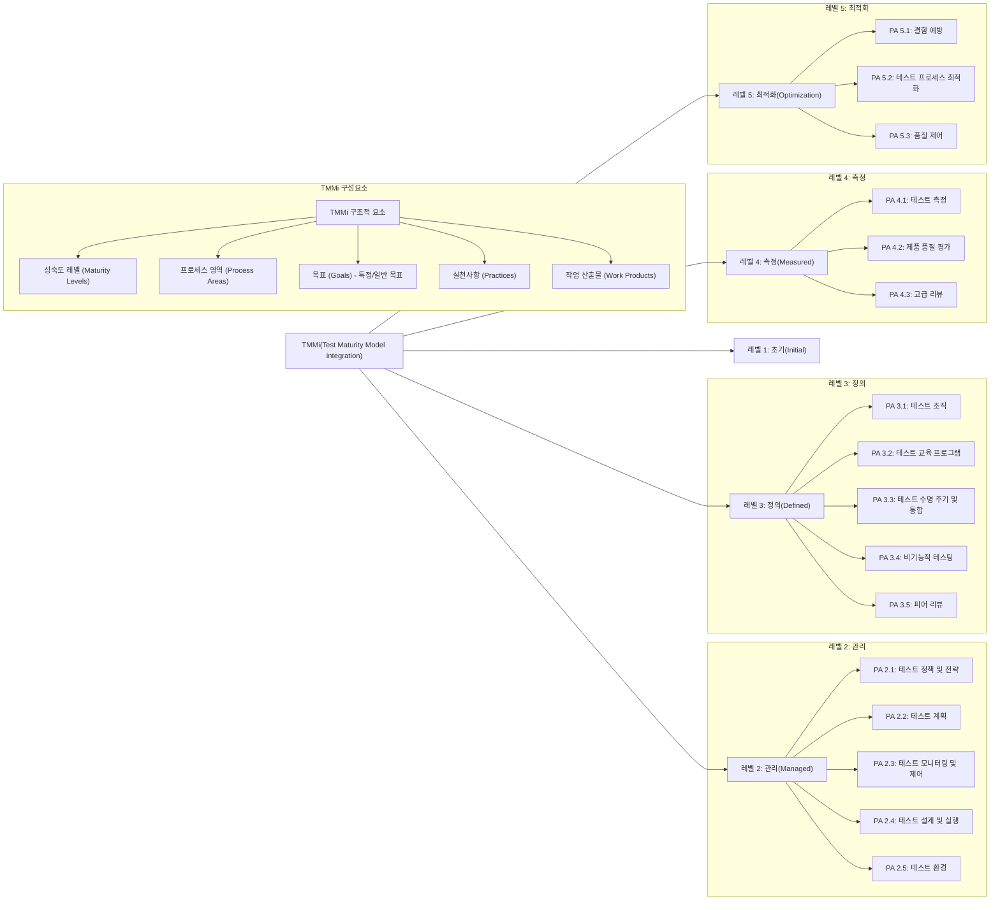
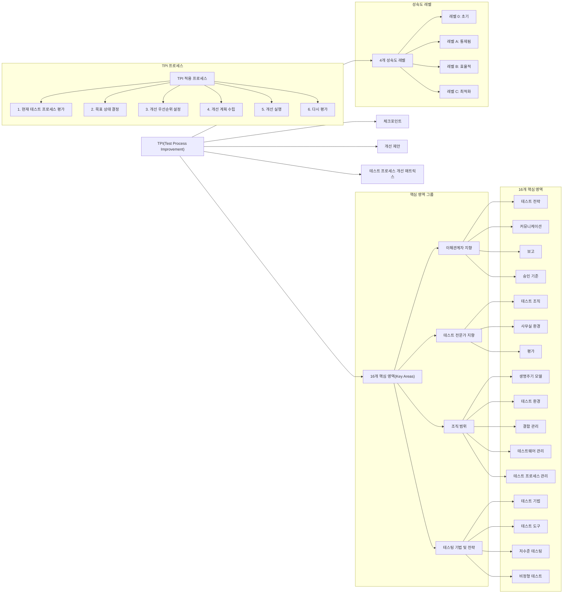

# TMMi / TPI: 소프트웨어 테스트 프로세스 성숙도 모델

<!-- mtoc-start -->

- [TMMi (Test Maturity Model Integration)](#tmmi-test-maturity-model-integration)
  - [특징](#특징)
  - [성숙도 단계 (IMDMMO)](#성숙도-단계-imdmmo)
- [TMMi와 TPI: 소프트웨어 테스트 프로세스 성숙도 모델](#tmmi와-tpi-소프트웨어-테스트-프로세스-성숙도-모델)
  - [TMMi (Test Maturity Model integration) 모델](#tmmi-test-maturity-model-integration-모델)
    - [TPI (Test Process Improvement)](#tpi-test-process-improvement)
    - [TMMi와 TPI 모델 비교표](#tmmi와-tpi-모델-비교표)
  - [기대 효과](#기대-효과)
  - [Keywords](#keywords)

<!-- mtoc-end -->

소프트웨어 테스트 프로세스의 성숙도를 평가하고 개선하기 위해 TMMi(Test Maturity Model Integration)와 TPI(Test Process Improvement) 모델이 활용된다. 이는 조직의 테스트 역량을 진단하고 지속적인 품질 향상을 지원하는 대표적인 성숙도 모델이다.

## TMMi (Test Maturity Model Integration)

TMMi는 기존의 CMMi에서 테스트 활동에 대한 프로세스 개선을 보조하고, 개선 결과를 측정할 수 있는 수단을 제공한다.

### 특징

- 기존 CMMi 모델과 연계하여 조직의 종합적인 성숙도를 측정
- 테스트 프로세스 개선 결과를 객관적으로 측정할 수 있는 기준 제공
- 독립적으로도 활용 가능하지만, CMMi와 함께 적용 시 더욱 효과적

### 성숙도 단계 (IMDMMO)

TMMi는 5단계 성숙도로 구성된다.

1. **Initial (초기)**: 비정형적 테스트 수행
2. **Managed (관리됨)**: 테스트 정책, 전략 및 계획 수립
3. **Defined (정의됨)**: 테스트 전담 조직 구성, 교육 및 훈련 프로그램 운영
4. **Management & Measurement (관리 및 측정)**: 테스트 작업 측정 및 평가, 발전된 동료 검토 수행
5. **Optimization (최적화)**: 결함 예방, 테스트 프로세스 최적화, 지속적 개선

# TMMi와 TPI: 소프트웨어 테스트 프로세스 성숙도 모델

### TMMi (Test Maturity Model integration) 모델

- **목적**: 소프트웨어 테스트 프로세스의 성숙도를 평가하고 개선하기 위한 단계적 프레임워크
- **구조**: CMMI에 영향을 받은 5단계 성숙도 모델
  - **Level 1(초기)**: 테스트가 비공식적이고 무작위로 수행됨
  - **Level 2(관리)**: 테스트 정책, 전략, 계획이 확립됨
  - **Level 3(정의)**: 테스트 프로세스가 조직적으로 정의되고 표준화됨
  - **Level 4(측정)**: 테스트 성과가 측정되고 분석됨
  - **Level 5(최적화)**: 테스트 프로세스가 지속적으로 개선됨
- **특징**: 프로세스 영역(PA), 특정 목표(SG), 특정 사례(SP), 일반 사례(GP)로 구성

### TPI (Test Process Improvement)

- **목적**: 테스트 프로세스의 강점과 약점을 식별하고 단계적 개선을 위한 로드맵 제공
- **구조**: 16개 핵심 영역(Key Areas)과 4단계 성숙도 수준으로 구성
  - 핵심 영역: 이해관계자 커뮤니케이션, 테스트 전략, 테스트 계획, 테스트 도구 등
  - 성숙도 수준: 초기(Initial), 통제된(Controlled), 효율적(Efficient), 최적화(Optimizing)
- **특징**: 점검점(Checkpoints)을 통해 각 핵심 영역의 성숙도를 평가하고 개선점 식별

### TMMi와 TPI 모델 비교표

| 비교 항목         | TMMi (Test Maturity Model integration)                                                                                                                 | TPI (Test Process Improvement)                                                                                                                                  |
| ----------------- | ------------------------------------------------------------------------------------------------------------------------------------------------------ | --------------------------------------------------------------------------------------------------------------------------------------------------------------- |
| **개발 기관**     | TMMi 재단 (TMMi Foundation)                                                                                                                            | Sogeti                                                                                                                                                          |
| **기반 모델**     | CMMI (Capability Maturity Model Integration)                                                                                                           | 독자적 개발 (Sogeti의 경험 기반)                                                                                                                                |
| **구조**          | 5단계 성숙도 레벨, 각 레벨마다 프로세스 영역(PA)                                                                                                       | 16개 핵심 영역(Key Areas)과 4단계 성숙도 레벨(0,A,B,C)                                                                                                          |
| **접근 방식**     | 단계적(staged) 접근법 - 레벨 순차적으로 달성                                                                                                           | 연속적(continuous) 접근법 - 개별 영역별 독립적 개선 가능                                                                                                        |
| **평가 방법**     | 공식적 평가(Assessment), SCAMPI 기반                                                                                                                   | 체크포인트(Checkpoints) 기반 자체 평가, 매트릭스 활용                                                                                                           |
| **범위**          | 조직 전체 테스트 프로세스                                                                                                                              | 특정 테스트 영역 또는 프로젝트 단위 적용 가능                                                                                                                   |
| **성숙도 레벨**   | 1. 초기(Initial) 2. 관리(Managed) 3. 정의(Defined) 4. 측정(Measured) 5. 최적화(Optimization)                                               | 0. 초기(Initial) A. 통제됨(Controlled) B. 효율적(Efficient) C. 최적화(Optimizing)                                                                      |
| **상세 구성요소** | - 성숙도 레벨(Maturity Levels) - 프로세스 영역(Process Areas) - 목표(Goals) - 특정/일반 - 실천사항(Practices) - 작업 산출물(Work Products) | - 핵심 영역(Key Areas) - 성숙도 레벨(Maturity Levels) - 체크포인트(Checkpoints) - 개선 제안(Improvement Suggestions) - 테스트 매트릭스(Test Matrix) |
| **레벨 평가**     | 모든 하위 레벨이 달성되어야 상위 레벨 인정                                                                                                             | 각 핵심 영역별로 다른 레벨 가능, 독립적으로 발전                                                                                                                |
| **유연성**        | 엄격한 계층 구조, 덜 유연함                                                                                                                            | 높은 유연성, 맞춤형 개선 경로                                                                                                                                   |
| **적합한 조직**   | 대규모 조직, 체계적 개선 필요 조직                                                                                                                     | 다양한 규모의 조직, 특히 빠른 개선 결과 필요 시                                                                                                                 |
| **인증 여부**     | 공식 인증 가능                                                                                                                                         | 공식 인증 체계 없음                                                                                                                                             |
| **개선 계획**     | 단계적 발전 계획 (레벨별)                                                                                                                              | 유연한 개선 로드맵 (영역별)                                                                                                                                     |
| **장점**          | - 체계적이고 포괄적인 프레임워크 - 표준화된 접근 방식 - 공식적 인증 가능                                                                         | - 실용적이고 맞춤형 접근 - 빠른 개선 결과 도출 - 적용 용이성                                                                                              |
| **단점**          | - 적용에 많은 시간과 자원 필요 - 경직된 구조 - 작은 조직에 과도할 수 있음                                                                        | - 표준화된 평가 방법 부족 - 조직 전체 관점 부족 - 공식 인증 불가                                                                                          |

- **TMMi**: 더 포괄적이고 공식적인 프레임워크로, 조직 전체의 테스트 성숙도를 평가
- **TPI**: 더 유연하고 실용적인 접근법으로, 특정 테스트 영역의 개선에 초점
- **상호보완성**: 두 모델은 함께 사용될 수 있으며, TMMi가 큰 그림을 제공하고 TPI가 세부 실행 방법을 제시함

두 모델 모두 테스트 프로세스의 체계적인 평가와 지속적인 개선을 통해 소프트웨어 품질을 향상시키는 것을 목표로 합니다.

## 기대 효과

TMMi와 TPI를 적용하면 조직의 테스트 프로세스를 효과적으로 개선하고, 품질 관리 역량을 높일 수 있다. 이를 통해 테스트 비용 절감, 소프트웨어 품질 향상, 리스크 감소 등의 효과를 기대할 수 있다.

## Keywords

TMMi, TPI, 소프트웨어 테스트, 테스트 프로세스 개선, 성숙도 모델, 품질 보증, 테스트 최적화, 결함 예방, CMMi 연계, 소프트웨어 품질 관리
