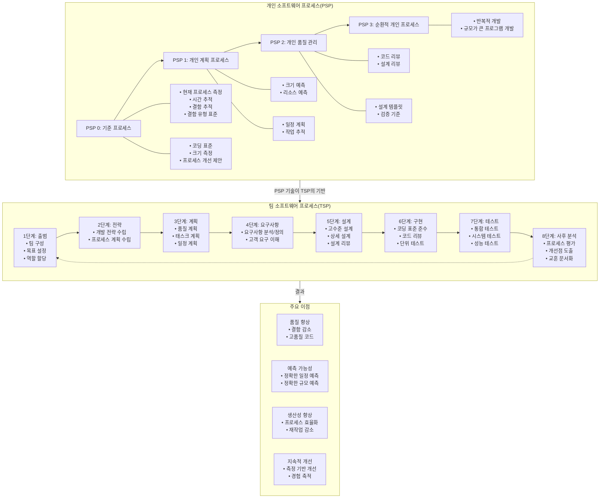

# PSP/TSP: 소프트웨어 개발 프로세스 개선

<!-- mtoc-start -->

- [PSP (Personal Software Process)](#psp-personal-software-process)
  - [특징](#특징)
- [TSP (Team Software Process)](#tsp-team-software-process)
  - [특징](#특징-1)
- [PSP/TSP SW 개발 프포세스 개선 절차](#psptsp-sw-개발-프포세스-개선-절차)
  - [PSP (개인 소프트웨어 프로세스)](#psp-개인-소프트웨어-프로세스)
  - [TSP (팀 소프트웨어 프로세스)](#tsp-팀-소프트웨어-프로세스)
  - [주요 이점](#주요-이점)
  - [핵심 철학](#핵심-철학)
- [기대 효과](#기대-효과)
- [Keywords](#keywords)

<!-- mtoc-end -->

PSP(Personal Software Process)와 TSP(Team Software Process)는 소프트웨어 개발자의 생산성과 품질을 향상시키기 위한 프로세스 개선 모델이다. PSP는 개발자가 개인의 개발 능력을 분석하고 개선하는 데 초점을 맞추며, TSP는 PSP를 기반으로 팀 단위의 소프트웨어 개발을 최적화한다.

## PSP (Personal Software Process)

PSP는 개발자들이 자신의 개발 능력을 파악하고 개선할 수 있도록 지원하는 프로세스이다.

### 특징

- 개발자가 개인별 소프트웨어 개발 프로세스를 측정하고 개선할 수 있도록 지원
- 코드 작성, 리뷰, 테스트 및 유지보수 과정에서의 성능 평가 제공
- 체계적인 분석을 통해 개발자의 생산성과 품질을 지속적으로 향상

## TSP (Team Software Process)

TSP는 PSP로 훈련된 3~15명의 소프트웨어 엔지니어 팀을 위한 프로세스로, 개발 및 유지보수 프로세스를 체계적으로 관리한다.

### 특징

- 독립적인 팀 단위의 소프트웨어 개발 프로세스 제어
- PSP를 기반으로 팀의 효율성과 품질을 최적화
- 프로젝트 계획, 일정 관리, 품질 보증 및 지속적 개선을 위한 체계적인 접근법 제공

## PSP/TSP SW 개발 프포세스 개선 절차

### PSP (개인 소프트웨어 프로세스)

- **정의**: 개발자 개인이 자신의 작업을 체계적으로 관리하고 개선하는 프레임워크
- **단계적 발전**: PSP 0(기준) → PSP 1(계획) → PSP 2(품질) → PSP 3(순환적 개발)
- **핵심 요소**: 시간 추적, 결함 관리, 크기 예측, 코드 리뷰, 설계 템플릿

### TSP (팀 소프트웨어 프로세스)

- **정의**: PSP를 기반으로 한 팀 단위의 소프트웨어 개발 방법론
- **핵심 단계**: 출범 → 전략 → 계획 → 요구사항 → 설계 → 구현 → 테스트 → 사후 분석
- **특징**: 명확한 역할 분담, 체계적인 품질 관리, 정량적 관리 접근

### 주요 이점

1. **품질 향상**: 초기 단계부터 결함 예방, 체계적인 리뷰로 고품질 코드 생산
2. **예측 가능성 증가**: 데이터 기반의 정확한 일정 및 규모 예측
3. **생산성 향상**: 효율적인 프로세스로 재작업 감소, 자원 낭비 방지
4. **지속적 개선**: 측정 데이터를 활용한 프로세스 개선 및 경험 축적

### 핵심 철학

- 측정 가능한 프로세스 관리 ("측정할 수 없으면 관리할 수 없다")
- 개인의 역량 향상이 팀 성과 향상으로 이어짐
- 데이터 기반의 의사결정과 계획 수립
- 품질은 사후 검사가 아닌 예방으로 확보

PSP/TSP는 소프트웨어 품질과 생산성을 동시에 향상시키는 체계적인 접근법으로, 개인 역량 강화에서 시작하여 팀 전체의 성과 향상으로 확장됩니다.

## 기대 효과

PSP/TSP를 도입하면 개발자의 역량을 체계적으로 향상시킬 수 있으며, 팀 단위의 협업을 강화하여 소프트웨어 품질과 생산성을 높일 수 있다. 이를 통해 프로젝트의 성공률을 향상시키고, 개발 비용을 절감할 수 있다.

## Keywords

PSP, TSP, 소프트웨어 프로세스, 개인 개발 프로세스, 팀 소프트웨어 프로세스, 품질 개선, 생산성 향상, 개발 방법론, 프로젝트 관리, 소프트웨어 공학
