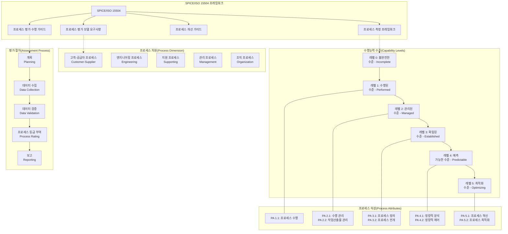

# SPICE / ISO 15504: SW 프로세스 수행능력 평가 및 개선

<!-- mtoc-start -->

- [정의 및 개념](#정의-및-개념)
- [주요 특징](#주요-특징)
- [수행능력 평가 단계](#수행능력-평가-단계)
- [프로세스 범주](#프로세스-범주)
- [PA(프로세스 속성) 충족도 평가](#pa프로세스-속성-충족도-평가)
- [SPICE/ISO 15504 SW 프로세스 수행능력 평가 및 개선 프레임워크](#spiceiso-15504-sw-프로세스-수행능력-평가-및-개선-프레임워크)
  - [주요 특징](#주요-특징-1)
  - [수행능력 수준 (Capability Levels)](#수행능력-수준-capability-levels)
  - [프로세스 범주](#프로세스-범주-1)
  - [평가 프로세스](#평가-프로세스)
  - [활용 이점](#활용-이점)
- [활용 사례](#활용-사례)
- [기대 효과 및 필요성](#기대-효과-및-필요성)
- [마무리](#마무리)
- [Keywords](#keywords)

<!-- mtoc-end -->

소프트웨어 프로세스의 수행능력을 평가하고 지속적인 개선을 지원하기 위한 국제 표준 모델이다. 여러 프로세스 개선 모델을 통합하여 ISO에서 표준화한 SW 프로세스 평가 모델로, 조직의 프로세스 역량을 객관적으로 측정하고 개선할 수 있도록 한다.

## 정의 및 개념

ISO 15504(SPICE, Software Process Improvement and Capability dEtermination)는 SW 프로세스의 수행능력 수준을 평가하고 개선하기 위한 국제 표준.

- 목표: SW 프로세스 수행능력 평가 및 지속적 개선
- 특징: 국제 표준화, 프로세스 역량 평가, 개선 지향적 접근 방식

## 주요 특징

- **국제 표준 모델**: 다양한 프로세스 개선 모델을 통합하여 표준화한 평가 모델
- **수행능력 평가**: 6단계 수행능력 평가 모델을 통해 조직의 SW 프로세스 수준 측정
- **프로세스 분류**: 기본, 조직, 지원 프로세스로 구분하여 평가 수행
- **개선 중심 접근**: 프로세스 수행 능력 향상을 위한 지속적인 개선 프레임워크 제공
- **객관적 평가 기준**: PA(프로세스 속성) 충족도를 4단계로 평가하여 명확한 성과 지표 제공

## 수행능력 평가 단계

SPICE / ISO 15504의 수행능력은 총 6단계로 구분된다.

1. **Level 0 (Incomplete)**: 프로세스 수행이 되지 않거나 불완전한 상태
2. **Level 1 (Performed)**: 프로세스가 수행되지만 체계화되지 않은 상태
3. **Level 2 (Managed)**: 프로세스가 프로젝트 수준에서 관리되는 상태
4. **Level 3 (Established)**: 조직적으로 표준화된 프로세스 운영 상태
5. **Level 4 (Predictable)**: 프로세스가 정량적으로 관리되고 예측 가능한 상태
6. **Level 5 (Optimizing)**: 지속적인 개선을 통해 최적화된 상태

## 프로세스 범주

SPICE는 SW 프로세스를 아래 세 가지 범주로 나누어 평가한다.

1. **기본 프로세스 (Fundamental Processes)**

   - **CUS (Customer-Supplier, 고객-공급자)**: 고객 요구사항 관리 및 제공
   - **ENG (Engineering, 공학-SW 개발)**: SW 개발 및 엔지니어링

2. **조직 프로세스 (Organizational Processes)**

   - **ORG (Organization, 조직-인력)**: 조직 수준의 프로세스 및 인력 관리
   - **MAN (Management, 프로젝트 관리)**: 프로젝트 관리 및 일정 조정

3. **지원 프로세스 (Support Processes)**
   - **SUP (Support, 지원)**: 문서화, 형상 관리, 품질 보증 등 지원 기능 수행

## PA(프로세스 속성) 충족도 평가

프로세스 수행 능력은 PA(프로세스 속성) 충족도를 기준으로 평가되며, 4단계로 구분된다.

- **N (Not Achieved, 0~15%)**: 거의 충족되지 않음
- **P (Partially Achieved, 16~50%)**: 부분적으로 충족됨
- **L (Largely Achieved, 51~85%)**: 대부분 충족됨
- **F (Fully Achieved, 86~100%)**: 완전히 충족됨

## SPICE/ISO 15504 SW 프로세스 수행능력 평가 및 개선 프레임워크

- **SPICE(Software Process Improvement and Capability Determination)**: 소프트웨어 프로세스 평가 및 개선을 위한 국제 표준 프레임워크
- **ISO 15504**: 프로세스 평가를 위한 국제 표준으로, SPICE를 기반으로 개발

### 주요 특징

1. **이중 차원 모델**: 프로세스 차원과 수행능력 차원으로 구성
2. **객관적 평가**: 프로세스의 수행능력을 객관적으로 측정 가능
3. **연속적 표현**: 각 프로세스별로 독립적 수행능력 수준 평가
4. **유연성**: 다양한 조직과 도메인에서 사용 가능하도록 설계

### 수행능력 수준 (Capability Levels)

- **레벨 0 (불완전)**: 프로세스가 구현되지 않거나 목적 달성 실패
- **레벨 1 (수행됨)**: 프로세스가 목적을 달성
- **레벨 2 (관리됨)**: 프로세스가 계획되고 모니터링되며 조정됨
- **레벨 3 (확립됨)**: 표준 프로세스 사용으로 일관된 결과 도출
- **레벨 4 (예측 가능)**: 정량적 측정으로 성과 예측 및 제어
- **레벨 5 (최적화)**: 지속적 개선을 통한 혁신과 최적화

### 프로세스 범주

1. **고객-공급자 프로세스**: 고객 요구사항 획득, 제품 인도 등
2. **엔지니어링 프로세스**: 요구사항 분석, 설계, 구현, 테스트 등
3. **지원 프로세스**: 품질 보증, 형상 관리, 문서화 등
4. **관리 프로세스**: 프로젝트 계획, 위험 관리, 자원 관리 등
5. **조직 프로세스**: 프로세스 개선, 인력 관리, 인프라 관리 등

### 평가 프로세스

1. 평가 계획 수립
2. 데이터 수집 및 검증
3. 프로세스 등급 부여
4. 평가 결과 보고
5. 개선 계획 수립

### 활용 이점

- 소프트웨어 개발 프로세스의 강점과 약점 식별
- 프로세스 개선 우선순위 결정 지원
- 공급자 역량 평가를 위한 프레임워크 제공
- 국제 표준에 따른 프로세스 성숙도 인증

SPICE/ISO 15504는 조직의 소프트웨어 프로세스 개선을 체계적으로 지원하여 품질, 생산성, 예측 가능성을 향상시키는 포괄적인 프레임워크.

## 활용 사례

- **SW 품질 개선**: 조직의 SW 개발 프로세스를 국제 표준에 맞추어 평가하고 개선
- **IT 기업 평가 기준**: 기업의 SW 개발 프로세스 역량을 객관적으로 측정하는 기준으로 활용
- **CMMI 대체 또는 보완**: 기존의 CMMI 모델과 함께 활용하여 조직의 성숙도 향상
- **SW 프로젝트 리스크 관리**: 프로젝트 수행 시 프로세스 성숙도를 기반으로 리스크를 줄이는 전략 수립

## 기대 효과 및 필요성

- **SW 프로세스의 체계적 개선**: 수행능력 평가를 통해 지속적으로 프로세스를 향상
- **품질 및 생산성 향상**: 프로세스 성숙도를 높여 개발 품질과 효율성을 극대화
- **국제 표준 준수**: 글로벌 IT 시장에서의 경쟁력 확보
- **리스크 감소**: 예측 가능한 프로세스를 통해 프로젝트 실패율 감소

## 마무리

SPICE / ISO 15504는 SW 프로세스 수행능력을 평가하고 지속적으로 개선할 수 있는 국제 표준 모델이다. 이를 도입함으로써 조직의 프로세스를 체계적으로 관리하고 품질과 생산성을 높일 수 있다. SW 개발 및 IT 관리에 있어 국제 표준 준수의 중요성이 증가하는 만큼, SPICE를 활용한 평가와 개선 활동은 필수적인 요소가 될 것이다.

## Keywords

SPICE, ISO 15504, SW 프로세스 개선, 수행능력 평가, 소프트웨어 품질, 프로세스 성숙도, IT 표준, 프로젝트 관리, 프로세스 최적화, 리스크 관리
