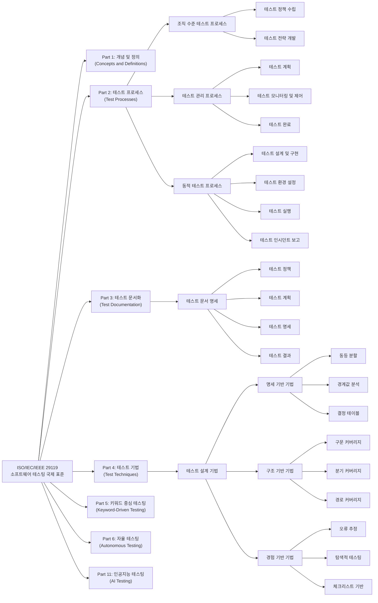

# ISO 29119: SW 테스팅 국제 표준

<!-- mtoc-start -->

- [정의 및 개념](#정의-및-개념)
- [주요 특징](#주요-특징)
- [ISO 29119 표준 구성](#iso-29119-표준-구성)
- [ISO 29119 SW 테스팅 국제표준 구조도](#iso-29119-sw-테스팅-국제표준-구조도)
- [활용 사례](#활용-사례)
- [기대 효과 및 필요성](#기대-효과-및-필요성)
- [마무리](#마무리)
- [Keywords](#keywords)

<!-- mtoc-end -->

소프트웨어 테스팅 전반에 걸친 개념, 프로세스, 문서 및 기법을 명확하게 정의하기 위한 국제 표준이다. 기존의 다양한 테스팅 표준(BS 7925 등)을 통합하여 체계적인 SW 테스팅 라이프사이클을 제공한다.

## 정의 및 개념

ISO 29119는 소프트웨어 테스팅의 전 과정을 표준화하기 위해 제정된 국제 표준.

- 목표: SW 테스팅 프로세스의 국제 표준화 및 품질 향상
- 특징: 용어 정의, 프로세스 정립, 문서화 기준 제시, 테스팅 기법 제공

## 주요 특징

- **국제 표준화**: 다양한 테스팅 관련 표준(BS 7925 등)을 통합하여 제정
- **테스팅 라이프사이클 전반 적용**: 개념, 프로세스, 문서 및 기법을 포함한 종합적인 접근
- **명확한 용어 정의**: 테스팅 관련 용어 및 개념의 표준화
- **테스트 문서 표준 제공**: 테스트 계획서, 테스트 결과 보고서 등의 문서 표준화
- **다양한 테스트 기법 지원**: 일반적인 테스트 기법뿐만 아니라 키워드 주도 테스트까지 포함

## ISO 29119 표준 구성

ISO 29119는 총 4개 영역으로 구성되어 있으며, 각 영역은 테스팅 프로세스의 특정 부분을 담당한다.

1. **ISO 29119-1 (개념 및 용어)**

   - SW 테스팅에 필요한 주요 개념 및 용어 정의
   - 테스팅 관련 표준 및 프레임워크 개요 제공

2. **ISO 29119-2 (테스트 프로세스)**

   - SW 테스팅의 전체 프로세스를 정의
   - 테스트 계획, 실행, 리포팅 등의 활동 포함

3. **ISO 29119-3 (테스트 문서)**

   - 테스트 관련 문서(테스트 계획서, 테스트 결과 보고서 등)의 표준 제공
   - 문서화된 테스트 수행을 통한 일관성 유지

4. **ISO 29119-4 (테스트 기법 및 키워드 주도 테스트)**
   - SW 테스팅 수행 시 활용할 다양한 테스트 기법 정의
   - 키워드 주도 테스트(Keyword-Driven Testing) 개념 포함

## ISO 29119 SW 테스팅 국제표준 구조도

1. **표준 구성 및 목적**

   - 총 7개 파트로 구성된 국제 표준 (1, 2, 3, 4, 5, 6, 11부)
   - 소프트웨어 테스팅의 모든 측면에 대한 표준화된 접근 방식 제공
   - 다양한 소프트웨어 개발 생명주기(애자일, 워터폴 등)에 적용 가능

2. **주요 파트별 내용**

   - **Part 1**: 테스팅의 개념과 용어 정의
   - **Part 2**: 테스트 프로세스 (조직, 관리, 동적 테스트 프로세스)
   - **Part 3**: 테스트 문서화 (정책, 계획, 명세, 결과 등)
   - **Part 4**: 테스트 기법 (명세 기반, 구조 기반, 경험 기반)
   - **Part 5**: 키워드 중심 테스팅 방법론
   - **Part 6**: 자율 테스팅(autonomous testing)
   - **Part 11**: 인공지능 시스템 테스트(2023년 추가)

3. **테스트 프로세스 계층 구조**

   - **조직 수준**: 테스트 정책 및 전략 수립
   - **테스트 관리**: 계획, 모니터링, 제어 및 완료
   - **동적 테스트**: 설계, 환경 설정, 실행 및 인시던트 보고

4. **테스트 설계 기법 분류**

   - **명세 기반**: 동등 분할, 경계값 분석, 결정 테이블 등
   - **구조 기반**: 구문, 분기, 경로 커버리지 등
   - **경험 기반**: 오류 추정, 탐색적 테스팅, 체크리스트 기반 등

5. **산업적 의의**
   - 테스팅 활동의 일관성과 효율성 향상
   - 국제적으로 인정된 테스팅 기준 제공
   - 다양한 프로젝트 및 조직 환경에 적응 가능한 유연한 프레임워크

ISO 29119는 소프트웨어 테스팅에 대한 포괄적인 가이드라인을 제공하여 품질 향상과 체계적인 테스트 활동을 지원합니다.

## 활용 사례

- **기업의 SW 품질 관리**: 국제 표준에 맞는 테스팅 절차 도입을 통해 품질 보증
- **테스팅 프로세스 개선**: 체계적인 테스트 프로세스를 적용하여 효율적 테스팅 수행
- **소프트웨어 개발 생명주기(SDLC) 적용**: 개발 단계별 테스팅 문서 및 기법 활용
- **자동화 테스팅 지원**: 키워드 주도 테스트를 통한 자동화 테스트 프레임워크 구축

## 기대 효과 및 필요성

- **SW 품질 향상**: 명확한 테스트 기준과 절차 제공으로 제품 신뢰성 증대
- **국제 표준 준수**: 글로벌 시장에서의 경쟁력 확보
- **테스팅 프로세스 일관성 유지**: 체계적인 문서화를 통한 테스트 프로세스 최적화
- **자동화 테스트 강화**: 키워드 주도 테스트를 활용한 효율적인 자동화 적용

## 마무리

ISO 29119는 SW 테스팅의 전 과정에 대한 국제 표준으로, 명확한 프로세스와 문서화 기준을 제공하여 테스팅 품질을 향상시킨다. SW 개발 조직이 ISO 29119을 도입하면 테스트 프로세스를 표준화하고 자동화 테스팅을 효율적으로 운영할 수 있다.

## Keywords

ISO 29119, SW 테스팅, 테스트 프로세스, 테스트 문서, 키워드 주도 테스트, SW 품질 보증, 국제 표준, 자동화 테스트, 테스트 기법, 소프트웨어 검증
