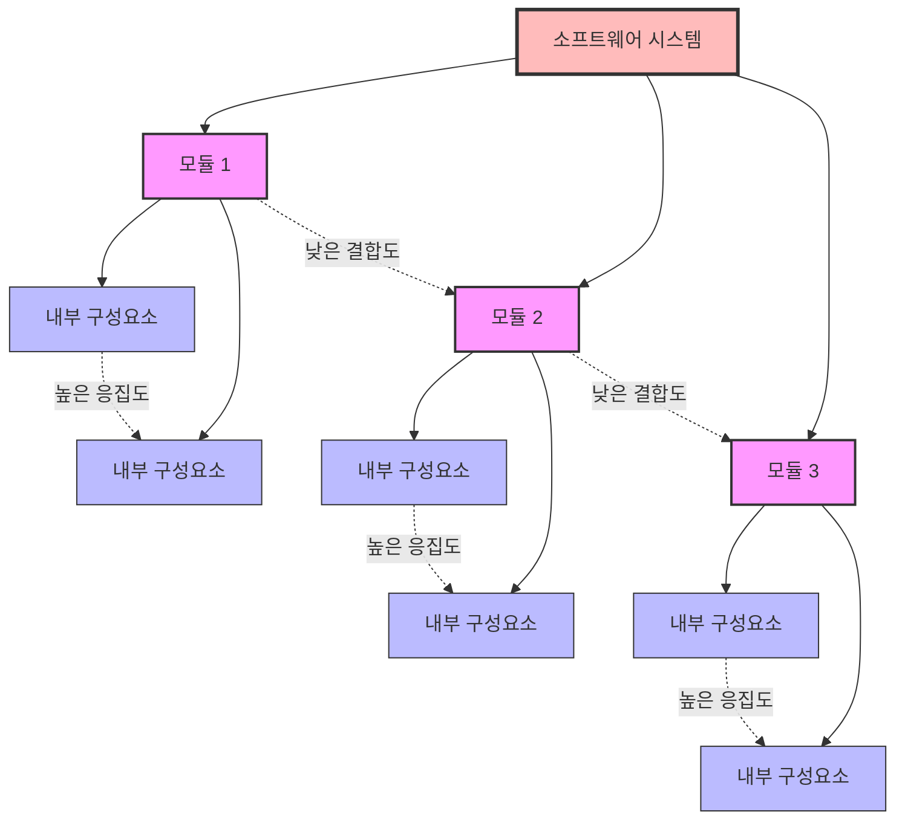

# 모듈화(Modularization): 소프트웨어 품질과 재사용성 향상을 위한 핵심 설계 기법

<!-- mtoc-start -->

- [정의 및 개념](#정의-및-개념)
- [주요 특징](#주요-특징)
- [모듈화 구조도](#모듈화-구조도)
- [활용 사례](#활용-사례)
- [기대 효과 및 필요성](#기대-효과-및-필요성)
- [마무리](#마무리)
- [Keywords](#keywords)

<!-- mtoc-end -->

소프트웨어 개발에서 모듈화는 복잡한 시스템을 관리 가능한 단위로 분해하는 핵심 설계 원칙입니다. 대규모 소프트웨어 시스템을 개발할 때 발생하는 복잡성을 효과적으로 다루기 위해 시스템을 독립적인 모듈로 분할하여 개발, 테스트, 유지보수 과정을 단순화합니다. 특히 정보관리기술 관점에서 모듈화는 소프트웨어의 품질, 유연성, 확장성을 결정짓는 중요한 요소로 작용합니다.

## 정의 및 개념

- 모듈화: 프로그램을 기능적으로 독립된 단위로 분해하고 추상화하여 소프트웨어 성능을 향상시키거나, 테스트, 통합 및 수정을 용이하게 하는 설계 및 구현 기법.
- 응집도(Cohesion): 모듈 내부 구성요소들이 하나의 목적을 위해 얼마나 밀접하게 연관되어 있는지를 나타내는 척도로, 높을수록 좋은 설계 특성.
- 결합도(Coupling): 모듈 간의 상호 의존성이나 연관 정도를 나타내는 척도로, 낮을수록 좋은 설계 특성.

## 주요 특징

- **응집도 유형(높음→낮음)**:

  - 기능적 응집도(Functional): 모듈의 모든 요소가 단일 기능을 수행
  - 순차적 응집도(Sequential): 한 활동의 출력이 다음 활동의 입력이 되는 형태
  - 절차적 응집도(Procedural): 관련 기능을 순서에 따라 수행하는 활동들의 그룹
  - 시간적 응집도(Temporal): 특정 시점에 함께 실행되는 기능들의 집합
  - 논리적 응집도(Logical): 논리적으로 유사한 기능들을 그룹화
  - 우연적 응집도(Coincidental): 의미 있는 관련성 없이 무작위로 그룹화

- **결합도 유형(낮음→높음)**:

  - 자료 결합도(Data): 모듈 간 단순 데이터 전달
  - 스탬프 결합도(Stamp): 자료구조를 통한 데이터 전달
  - 제어 결합도(Control): 제어 플래그 전달을 통한 모듈 제어
  - 외부 결합도(External): 외부에서 정의된 데이터 형식에 의존
  - 공통 결합도(Common): 전역 데이터 공유를 통한 상호작용
  - 내용 결합도(Content): 다른 모듈의 내부 동작이나 데이터 직접 참조

- **모듈화 원리**:
  - 분할과 정복(Divide and Conquer): 복잡한 문제를 작은 단위로 분할하여 해결
  - 정보 은폐(Information Hiding): 모듈 내부 구현 상세를 외부로부터 숨김
  - 모듈 독립성(Module Independence): 높은 응집도와 낮은 결합도 추구

## 모듈화 구조도

모듈화 구조도는 복잡한 시스템을 독립적인 모듈로 분해하고, 각 모듈 내부는 높은 응집도를 유지하며 모듈 간에는 낮은 결합도로 연결되는 이상적인 설계 원칙을 보여줍니다. 이러한 구조는 시스템의 복잡성을 관리하고 유지보수성을 향상시키는 핵심입니다.

## 활용 사례

- **마이크로서비스 아키텍처**: 독립적으로 배포 가능한 서비스 단위로 시스템 구성
- **컴포넌트 기반 개발(CBD)**: 재사용 가능한 컴포넌트를 조합하여 시스템 구축
- **서비스 지향 아키텍처(SOA)**: 비즈니스 기능을 독립적인 서비스로 분리하여 구현
- **객체 지향 프로그래밍(OOP)**: 클래스와 객체를 통한 모듈화 구현
- **프론트엔드 개발**: React, Vue 등의 프레임워크에서 컴포넌트 기반 아키텍처 적용

## 기대 효과 및 필요성

- **시스템 복잡성 관리**: 대규모 시스템을 이해하기 쉬운 단위로 분해하여 복잡성 해소
- **유지보수 용이성**: 특정 기능 변경 시 관련 모듈만 수정하여 영향 범위 최소화
- **재사용성 증대**: 독립적인 모듈은 다른 시스템이나 프로젝트에서 재사용 가능
- **병렬 개발 가능**: 다수의 개발자가 독립된 모듈을 동시에 개발하여 개발 기간 단축
- **테스트 용이성**: 독립적인 모듈 단위로 테스트를 수행하여 품질 보증 강화
- **확장성 향상**: 기존 시스템에 영향 없이 새로운 기능 추가 가능

## 마무리

모듈화는 소프트웨어 설계의 기본 원칙으로, 높은 응집도와 낮은 결합도를 지향하는 설계를 통해 소프트웨어의 품질과 유지보수성을 크게 향상시킵니다. 현대 소프트웨어 개발에서는 마이크로서비스, 컴포넌트 기반 개발 등 다양한 형태로 모듈화 원칙이 적용되고 있으며, 이는 복잡한 비즈니스 요구사항을 효과적으로 구현하기 위한 필수적인 접근 방식입니다. 소프트웨어 시스템의 규모와 복잡성이 증가할수록 모듈화의 중요성은 더욱 커지고 있습니다.

## Keywords

Modularization, Cohesion, Coupling, Information Hiding, Component-Based Development, 모듈화, 응집도, 결합도, 정보은폐, 컴포넌트 기반 개발, 분할과 정복, 재사용성
