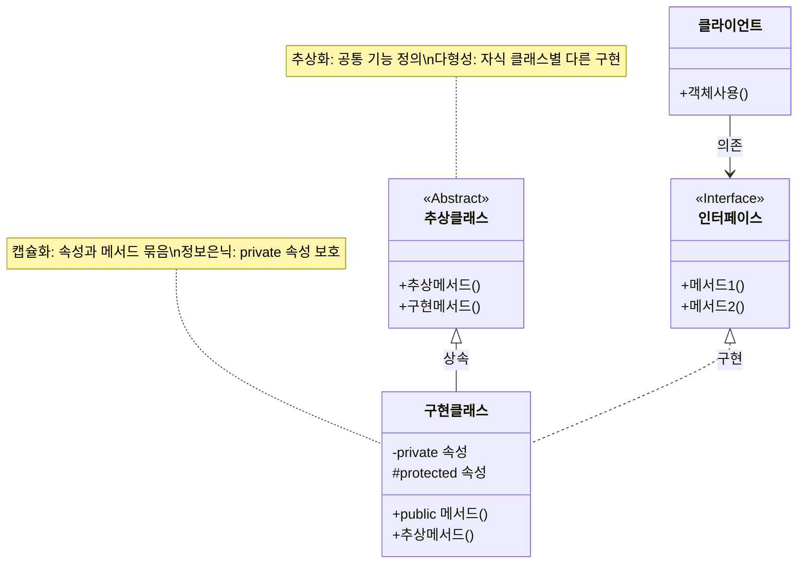

# 객체지향 주요특성: 효율적인 소프트웨어 설계 방법론

<!-- mtoc-start -->

- [정의 및 개념](#정의-및-개념)
- [주요 특징](#주요-특징)
- [객체지향 메커니즘](#객체지향-메커니즘)
- [활용 사례](#활용-사례)
- [기대 효과 및 필요성](#기대-효과-및-필요성)
- [마무리](#마무리)
- [Keywords](#keywords)

<!-- mtoc-end -->

객체지향 프로그래밍(OOP)은 현대 소프트웨어 개발의 핵심 패러다임으로, 복잡한 시스템을 객체 단위로 모델링하여 개발 효율성과 코드 재사용성을 높입니다. 객체지향적 접근법은 실세계의 개념을 프로그래밍에 자연스럽게 접목시켜 직관적인 설계를 가능하게 하며, 대규모 시스템 개발에서 특히 그 가치가 돋보입니다.

## 정의 및 개념

- 객체지향 프로그래밍: 데이터와 해당 데이터를 처리하는 메서드를 하나의 객체로 묶어 소프트웨어를 구성하는 방법론.
- 객체(Object): 실세계의 개체를 프로그램에서 표현한 것으로, 상태(속성)와 행위(메서드)를 가진 소프트웨어 단위.

- 특징: 캡슐화, 추상화, 다형성, 정보은닉, 상속성 등 5가지 핵심 특성 보유.
- 목적: 코드의 재사용성 증대, 유지보수 용이성 확보, 확장성 있는 시스템 설계.
- 필요성: 복잡한 비즈니스 로직을 체계적으로 구조화하고 변화에 유연하게 대응.

## 주요 특징

1. **캡슐화(Encapsulation)**: 관련된 데이터와 메서드를 하나의 클래스로 묶어 외부로부터 데이터를 보호하고 인터페이스를 통해서만 상호작용하도록 설계. 코드의 모듈성을 높이고 결합도를 낮추는 효과 제공.

2. **추상화(Abstraction)**: 공통적인 속성과 기능을 추출하여 복잡한 시스템을 단순화하고 필수 요소만 남김. 현실 세계의 개체를 프로그램에서 표현할 때 핵심 특성만을 모델링.

3. **정보은닉(Information Hiding)**: 내부 구현 세부사항을 외부에 노출하지 않고 private 속성을 활용하며, getter와 setter 메서드를 통해 제어된 접근 제공. 객체의 무결성 보장.

4. **다형성(Polymorphism)**: 같은 인터페이스를 사용하여 다양한 객체 타입을 처리할 수 있는 능력. 오버로딩과 오버라이딩을 통해 구현되며, 코드 유연성 향상.

5. **상속성(Inheritance)**: 기존 클래스의 속성과 메서드를 새로운 클래스가 물려받아 재사용하고 확장. 코드 중복을 방지하고 계층적 구조화 가능.

## 객체지향 메커니즘

객체지향 프로그래밍은 추상클래스와 인터페이스를 통해 다형성을 구현하며, 클래스 간 상속과 구현 관계를 형성합니다. 캡슐화와 정보은닉은 클래스 내부 속성을 보호하고 메서드를 통한 제어된 접근을 제공합니다.

## 활용 사례

1. **대규모 엔터프라이즈 시스템**: 비즈니스 도메인을 객체 모델로 구조화하여 복잡한 업무 로직을 체계적으로 관리. 확장성과 유지보수성 향상.

2. **프레임워크 개발**: Spring, Django 등 널리 사용되는 프레임워크는 객체지향 원칙을 기반으로 설계되어 재사용 가능한 컴포넌트 제공.

3. **게임 개발**: 캐릭터, 아이템, 환경 요소 등을 객체로 모델링하여 상호작용을 구현하고 코드 재사용성 극대화.

4. **GUI 애플리케이션**: 사용자 인터페이스 요소를 객체로 설계하여 이벤트 처리와 상태 관리를 효율적으로 구현.

5. **데이터베이스 시스템**: ORM(Object-Relational Mapping) 기술을 통해 데이터베이스 테이블과 객체 간의 매핑 자동화.

## 기대 효과 및 필요성

1. **코드 재사용성 향상**: 상속과 다형성을 통해 기존 코드를 효과적으로 재활용하여 개발 시간 단축.

2. **유지보수 용이성**: 캡슐화와 정보은닉으로 코드 변경 시 영향 범위를 최소화하고 버그 발생 가능성 감소.

3. **시스템 확장성**: 새로운 기능 추가 시 기존 코드 수정 없이 클래스 확장만으로 구현 가능.

4. **협업 효율성**: 객체 단위로 업무 분담이 가능하여 대규모 팀 개발 환경에서 효율적인 협업 지원.

5. **비즈니스 모델링 용이성**: 실세계 개념을 직관적으로 프로그램에 반영할 수 있어 비즈니스 요구사항을 코드로 표현하기 용이.

## 마무리

객체지향 프로그래밍의 핵심 특성인 캡슐화, 추상화, 다형성, 정보은닉, 상속성은 현대 소프트웨어 개발에서 필수적인 요소입니다. 이러한 특성을 적절히 활용함으로써 유지보수가 용이하고, 확장성 있는 시스템을 구축할 수 있습니다. 특히 대규모 시스템 개발에서는 객체지향적 접근법이 복잡성을 관리하고 지속 가능한 코드베이스를 유지하는 데 큰 도움이 됩니다.

## Keywords

Object-Oriented Programming, 객체지향 프로그래밍, Encapsulation, 캡슐화, Abstraction, 추상화, Information Hiding, 정보은닉, Polymorphism, 다형성, Inheritance, 상속성, Class Hierarchy, 클래스 계층구조
