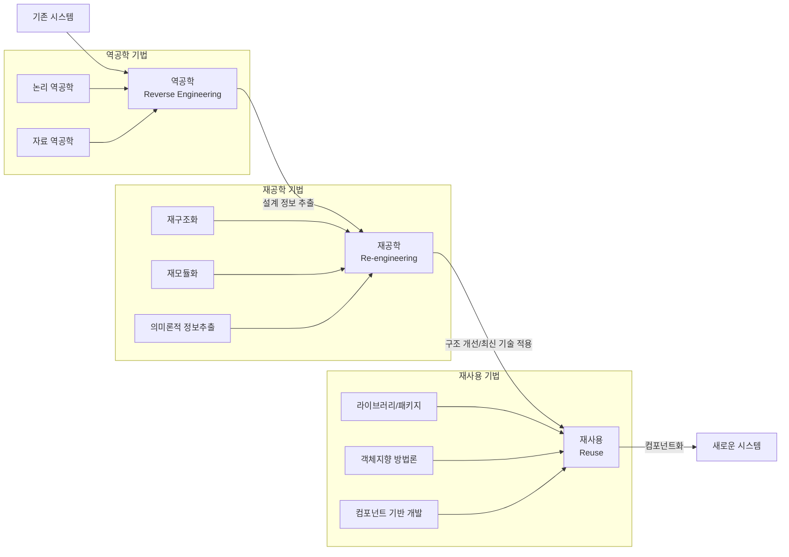

# SW 재사용 원리 - 3R: 소프트웨어 생산성 극대화 기법

<!-- mtoc-start -->

- [정의 및 개념](#정의-및-개념)
- [주요 특징](#주요-특징)
- [SW 3R 프로세스](#sw-3r-프로세스)
- [활용 사례](#활용-사례)
- [기대 효과 및 필요성](#기대-효과-및-필요성)
- [마무리](#마무리)
- [Keywords](#keywords)

<!-- mtoc-end -->

소프트웨어 개발에서 재사용성은 개발 시간 단축과 품질 향상의 핵심 요소입니다. SW 재사용 원리인 3R(Reverse Engineering, Re-engineering, Reuse)은 기존 소프트웨어의 가치를 극대화하고 비가시성을 극복하는 체계적인 접근 방식을 제공합니다. 소프트웨어 분석부터 재구현까지의 전체 과정을 포괄하는 3R은 현대 소프트웨어 개발 환경에서 생산성 향상의 필수 요소로 자리잡고 있습니다.

## 정의 및 개념

- 3R: 소프트웨어 역공학(Reverse Engineering), 재공학(Re-engineering), 재사용(Reuse)을 통합적으로 활용하여 소프트웨어 생산성을 극대화하는 원리.
- 목적: 기존 소프트웨어 자산에서 가치 있는 정보를 추출하여 새로운 시스템 구현에 활용함으로써 개발 비용 절감과 품질 향상 달성.

## 주요 특징

- **역공학(Reverse Engineering)**: 이미 개발된 시스템을 분석하여 설계 정보와 지식을 추출하는 기술로, 논리 역공학(소스코드→문서화)과 자료 역공학(데이터베이스 구조 분석) 등으로 구분.

- **재공학(Re-engineering)**: 역공학으로 추출한 정보를 바탕으로 순공학 과정을 통해 시스템을 재구현하는 기술로, 재구조화, 재모듈화, 의미론적 정보 추출(코드 수준이 아닌 문서 수준 정보 추출) 등의 방법 포함.

- **재사용(Reuse)**: 검증된 소프트웨어 구성요소를 다시 활용하는 기술로, Copy & Paste, 전처리(Pre-Processing), 라이브러리, 패키지, 객체지향 기법(상속성, 다형성), 컴포넌트 기반 개발 등의 방법 적용.

- **비가시성 극복**: 소프트웨어의 추상적 특성으로 인한 이해 난이도를 구조화된 문서와 설계 정보 추출을 통해 해소.

## SW 3R 프로세스

3R 프로세스는 기존 시스템에서 역공학을 통해 설계 정보를 추출하고, 재공학을 통해 구조를 개선한 후 재사용 가능한 형태로 변환하여 새로운 시스템에 통합하는 순환적 흐름을 보여줍니다. 각 단계별 특화된 기법을 적용하여 소프트웨어의 가치를 최대화합니다.

## 활용 사례

- **레거시 시스템 현대화**: 오래된 메인프레임 기반 애플리케이션을 웹 기반 시스템으로 마이그레이션할 때 3R 원리를 적용하여 핵심 비즈니스 로직 보존 및 기술 업그레이드.

- **소프트웨어 품질 개선**: 구조가 복잡해진 소프트웨어를 재공학하여 유지보수성과 확장성 향상.

- **컴포넌트 라이브러리 구축**: 조직 내에서 자주 사용되는 기능을 재사용 가능한 컴포넌트로 추출하여 표준화된 컴포넌트 저장소 구축.

- **오픈소스 소프트웨어 활용**: 기존 오픈소스 솔루션의 구조를 분석하고 필요한 부분만 선택적으로 수정하여 새로운 요구사항에 맞게 재구성.

- **소프트웨어 이전(Migration)**: 노후화된 플랫폼에서 최신 플랫폼으로 소프트웨어를 이전할 때 원본 소스코드의 구조와 논리를 유지하면서 효율적인 전환 지원.

## 기대 효과 및 필요성

- **개발 비용 절감**: 기존 자산의 재활용을 통한 개발 시간 및 비용 감소.

- **품질 향상**: 검증된 컴포넌트 활용으로 신뢰성과 안정성 향상.

- **시장 출시 시간 단축**: 재사용 가능한 컴포넌트 활용으로 신속한 제품 개발 및 출시(Time to Market) 가능.

- **유지보수 효율성**: 표준화된 구조와 문서화를 통한 시스템 이해도 향상 및 유지보수 용이성 확보.

- **지식 보존**: 암묵적 지식을 명시적 문서로 전환하여 조직 내 지식 자산 보존.

- **신기술 적용 용이성**: 기존 시스템의 구조 이해를 바탕으로 새로운 기술 도입 및 적용 부담 감소.

## 마무리

소프트웨어 3R 원리는 개발 생산성 향상과 비용 절감을 위한 핵심 접근법입니다. 역공학을 통한 지식 추출, 재공학을 통한 구조 개선, 그리고 재사용을 통한 검증된 품질 확보는 현대 소프트웨어 개발에서 필수적인 요소입니다. 조직 내 소프트웨어 자산의 가치를 극대화하고 비가시성을 극복하기 위해 3R 원리의 체계적인 도입과 실천이 권장됩니다.

## Keywords

Reverse Engineering, Re-engineering, Reuse, 역공학, 재공학, 재사용, Component-Based Development, 비가시성 극복, 소프트웨어 생산성, 유지보수성
