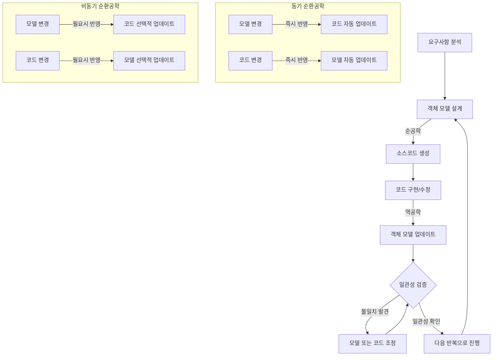

# 순환공학: 일관성 유지를 위한 설계 모델과 소스코드의 반복적 적용

<!-- mtoc-start -->

- [정의 및 개념](#정의-및-개념)
- [주요 특징](#주요-특징)
- [프로세스](#프로세스)
- [활용 사례](#활용-사례)
- [기대 효과 및 필요성](#기대-효과-및-필요성)
- [마무리](#마무리)
- [Keywords](#keywords)

<!-- mtoc-end -->

소프트웨어 개발에서 설계 모델과 실제 구현된 코드 간의 일관성을 유지하는 것은 큰 도전과제입니다. 순환공학(Roundtrip Engineering)은 이러한 도전에 대응하기 위한 방법론으로, 순공학과 역공학을 반복적으로 적용하여 모델과 코드 간의 동기화를 지속적으로 유지합니다. 이 접근법은 소프트웨어의 품질과 유지보수성을 크게 향상시키며, 복잡한 시스템 개발에서 특히 중요한 역할을 합니다.

## 정의 및 개념

- 개념: 설계 모델(객체 모델)과 소스코드 간의 일관성 유지를 위해 순공학과 역공학을 반복적으로 적용하여 시스템을 설계하고 구현하는 방법론.
- 구성: 순공학(Forward Engineering)과 역공학(Reverse Engineering)의 반복적 적용을 통한 모델-코드 간 지속적 동기화.
- 목적: 소프트웨어 설계와 구현 간의 격차 해소 및 지속적인 품질 유지.
- 유형: 동기 순환공학(모델과 코드의 즉시 동기화), 비동기 순환공학(필요에 따른 선택적 동기화)으로 구분.

## 주요 특징

- **모델-코드 일관성**: 설계 모델과 실제 코드 간의 불일치를 최소화하여 소프트웨어의 무결성을 보장합니다.
- **반복적 프로세스**: 순공학과 역공학을 지속적으로 반복 적용하여 변화하는 요구사항에 유연하게 대응합니다.
- **도구 지원**: UML 모델링 도구, IDE와의 통합을 통해 자동화된 코드 생성 및 모델 추출을 지원합니다.
- **변경 관리 용이성**: 설계나 코드의 변경이 발생할 때 상호 영향을 즉시 파악하고 반영할 수 있습니다.
- **품질 향상**: 코드와 모델 간 불일치로 인한 오류 감소 및 시스템 이해도 향상으로 품질이 개선됩니다.

## 프로세스

순환공학은 설계 모델에서 코드 생성(순공학)과 코드에서 모델 추출(역공학)의 반복적인 사이클로 구성됩니다. 동기 방식은 변경사항을 즉시 반영하여 일관성을 유지하고, 비동기 방식은 필요에 따라 선택적으로 동기화를 수행합니다.

## 활용 사례

- **대규모 기업 애플리케이션 개발**: 복잡한 비즈니스 로직을 포함한 엔터프라이즈 시스템 개발 시 모델과 코드의 일관성 유지에 활용됩니다.
- **레거시 시스템 현대화**: 기존 코드를 역공학하여 모델을 추출하고, 이를 개선한 후 순공학을 통해 새로운 시스템으로 구현합니다.
- **애자일 개발 환경**: 빠른 개발 주기에서 모델과 코드의 동기화를 통해 지속적인 품질 관리를 지원합니다.
- **분산 팀 협업**: 지리적으로 분산된 개발 팀 간의 설계 모델 공유와 코드 일관성 유지에 활용됩니다.
- **품질 인증 시스템**: 소프트웨어 품질 인증이 필요한 산업(의료, 금융, 항공 등)에서 설계-구현 일치성 검증에 활용됩니다.

## 기대 효과 및 필요성

- **설계 품질 향상**: 객체 모델과 코드의 지속적 동기화를 통한 설계 무결성 확보 및 품질 향상.
- **유지보수성 개선**: 코드와 설계 모델 간 일관성 유지로 시스템 이해도 향상 및 유지보수 비용 절감.
- **생산성 증대**: 자동화된 코드 생성과 모델 추출을 통한 개발 시간 단축 및 생산성 향상.
- **문서화 자동화**: 코드에서 역공학을 통해 최신 상태의 설계 문서를 지속적으로 유지할 수 있음.
- **오류 감소**: 모델과 코드 간 불일치로 인한 설계 결함 및 구현 오류 최소화.
- **협업 효율성**: 개발자와 설계자 간의 의사소통 개선 및 효율적인 협업 지원.

## 마무리

순환공학은 소프트웨어 개발에서 모델과 코드 간의 간극을 효과적으로 해소하는 핵심 방법론입니다. 특히 복잡한 시스템 개발이나 장기적인 유지보수가 필요한 프로젝트에서는 이러한 접근법을 도입하여 일관성을 유지하는 것이 매우 중요합니다. 적절한 도구와 프로세스를 활용한 순환공학의 적용은 소프트웨어의 품질과 유지보수성을 크게 향상시키며, 궁극적으로 비즈니스 가치 창출에 기여합니다.

## Keywords

Roundtrip Engineering, Forward Engineering, Reverse Engineering, 순환공학, 역공학, 객체 모델링, 코드 일관성, 모델 동기화, UML, 소프트웨어 품질
