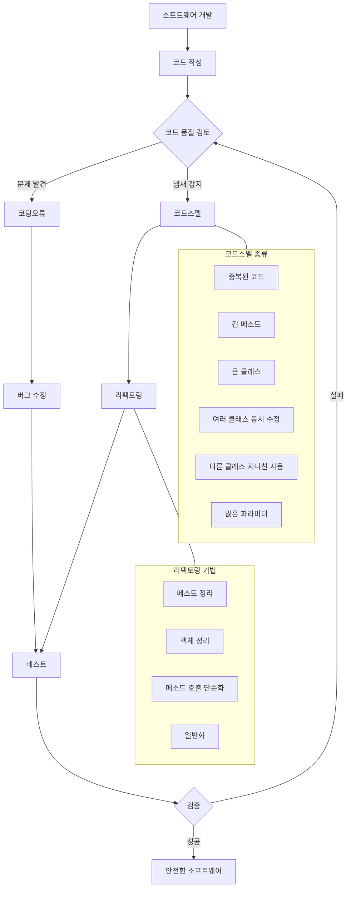

# 코딩오류, 코드스멜, 리팩토링: 안전한 소프트웨어 개발을 위한 기반 요소

<!-- mtoc-start -->

- [정의 및 개념](#정의-및-개념)
- [주요 특징](#주요-특징)
- [관계도](#관계도)
- [코드스멜의 종류](#코드스멜의-종류)
- [리팩토링 기법](#리팩토링-기법)
- [활용 사례](#활용-사례)
- [기대 효과 및 필요성](#기대-효과-및-필요성)
- [마무리](#마무리)
- [Keywords](#keywords)

<!-- mtoc-end -->

소프트웨어 개발 과정에서 코드의 품질은 프로젝트의 성공과 지속가능성을 결정짓는 핵심 요소입니다. 코딩오류와 코드스멜은 소프트웨어의 안정성과 유지보수성을 저해하는 주요 원인이 되며, 리팩토링은 이러한 문제점들을 해결하여 코드 품질을 향상시키는 중요한 실무 기법입니다. 본 글에서는 소프트웨어 개발 과정에서 발생하는 문제점들과 이를 개선하기 위한 방법론을 살펴보겠습니다.

## 정의 및 개념

- 코딩오류: 프로그램 실행 시 오작동이나 충돌을 일으키는 소스코드 내의 결함.
- 코드스멜: 가독성이 나쁘거나 중복된 로직을 포함하는 등 코드 품질을 저하시키는 요인들을 총칭.
- 리팩토링: 소프트웨어의 행위(behavior)를 보전하면서 프로그램의 가독성, 구조, 성능, 유지보수성 등을 향상시키는 품질향상 기법.

## 주요 특징

- **코드스멜의 존재**: 코드의 품질 저하를 암시하는 징후로, 즉각적인 버그를 유발하지는 않지만 유지보수성을 크게 저하시킴
- **리팩토링의 목적성**: 기능 변경 없이 코드 구조를 개선하여 이해도와 확장성을 향상시키는 데 중점
- **지속적 품질 관리**: 개발 초기부터 꾸준한 코드 리뷰와 리팩토링으로 기술부채 누적 방지
- **테스트 기반 접근**: 리팩토링 전후 동일한 동작을 보장하기 위한 자동화된 테스트의 중요성

## 관계도

코딩오류, 코드스멜, 리팩토링 간의 관계와 소프트웨어 개발 품질 관리 프로세스를 보여줍니다. 코드 품질 검토를 통해 발견된 문제점들이 적절한 수정 과정을 거쳐 안전한 소프트웨어로 발전하는 순환 구조를 나타냅니다.

## 코드스멜의 종류

- **중복된 코드**: 동일하거나 유사한 코드가 여러 곳에 산재하여 변경 시 일관성 유지가 어려움
- **긴 메소드**: 한 메소드가 너무 많은 기능을 담당하여 이해와 유지보수가 어려움
- **큰 클래스**: 단일 책임 원칙에 위배되는 너무 많은 필드와 메소드를 가진 클래스
- **여러 클래스 동시 수정**: 한 가지 변경을 위해 여러 클래스를 함께 수정해야 하는 상황
- **다른 클래스 지나친 사용**: 다른 클래스의 데이터에 빈번히 접근하는 의존성 문제
- **많은 파라미터**: 메소드가 너무 많은 파라미터를 받아 복잡도와 오류 가능성 증가

## 리팩토링 기법

- **메소드 정리**

  - Extract Method: 코드 일부를 별도 메소드로 추출하여 재사용성과 가독성 향상
  - Replace Temp with Query: 임시 변수 대신 메소드 호출로 대체하여 중복 제거

- **객체 정리**

  - Move Method: 메소드를 적절한 클래스로 이동하여 응집도 향상
  - Extract Class: 관련 기능을 새로운 클래스로 분리하여 단일 책임 원칙 준수

- **메소드 호출 단순화**

  - Rename Method: 메소드 이름을 목적에 맞게 직관적으로 변경
  - Remove Parameter: 불필요한 파라미터 제거로 인터페이스 단순화

- **일반화**
  - Pull Up Field: 공통 필드를 상위 클래스로 이동
  - Pull Up Method: 공통 메소드를 상위 클래스로 이동

## 활용 사례

- **대규모 레거시 시스템 현대화**: 기존 기능을 유지하면서 점진적으로 코드 품질 개선
- **지속적 통합/배포(CI/CD) 환경**: 자동화된 테스트와 함께 정기적인 리팩토링 수행
- **애자일 개발 방법론**: 스프린트마다 기술부채 해소를 위한 리팩토링 시간 할당
- **코드 리뷰 프로세스**: 코드스멜 식별 및 리팩토링 권장사항 제시
- **품질 게이트 설정**: 정적 코드 분석 도구를 활용한 코드스멜 감지 및 빌드 프로세스 연동

## 기대 효과 및 필요성

- **유지보수성 향상**: 코드 이해도 증가로 수정 및 확장 작업 효율화
- **버그 감소**: 코드 구조 개선으로 잠재적 오류 발생 가능성 감소
- **개발 생산성 향상**: 깨끗한 코드로 인한 개발자 작업 효율 증대
- **비용 절감**: 장기적 관점에서 유지보수 비용 감소
- **팀 협업 강화**: 일관되고 이해하기 쉬운 코드 작성으로 팀원 간 지식 공유 용이

## 마무리

코딩오류, 코드스멜, 리팩토링은 안전하고 유지보수하기 쉬운 소프트웨어 개발을 위한 핵심 개념입니다. 개발 초기부터 코드 품질에 관심을 기울이고, 코드스멜을 조기에 발견하여 적절한 리팩토링 기법을 적용함으로써 소프트웨어의 장기적인 건강성을 확보할 수 있습니다. 리팩토링을 일상적인 개발 프로세스에 통합하여 지속적인 개선 문화를 조성하는 것이 중요합니다.

## Keywords

Coding Errors, 코드스멜(Code Smell), 리팩토링(Refactoring), Technical Debt, 기술부채, Extract Method, Move Method, 소프트웨어 품질, 유지보수성, Clean Code
