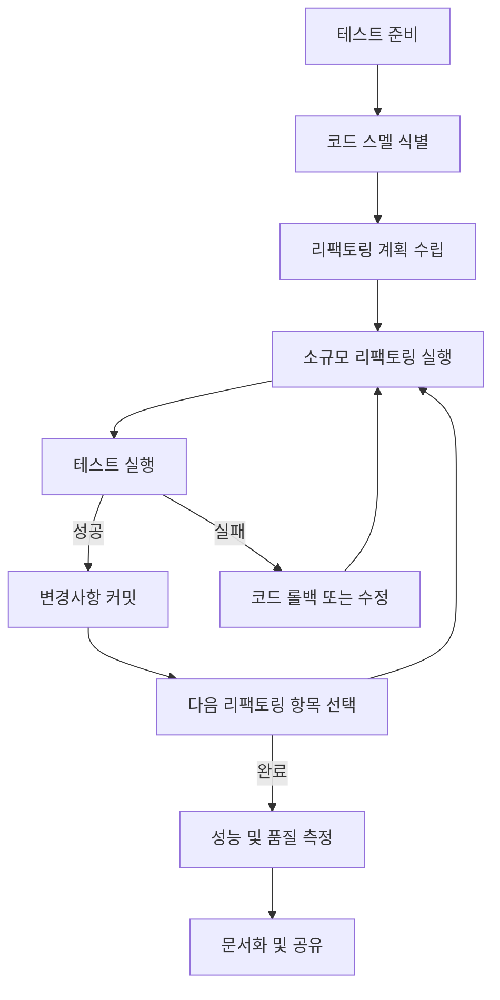

# 리팩토링(Refactoring): 코드 품질 향상을 위한 체계적 접근

<!-- mtoc-start -->

- [정의 및 개념](#정의-및-개념)
- [주요 특징](#주요-특징)
- [프로세스](#프로세스)
- [활용 사례](#활용-사례)
- [기대 효과 및 필요성](#기대-효과-및-필요성)
- [마무리](#마무리)
- [Keywords](#keywords)

<!-- mtoc-end -->

리팩토링은 소프트웨어 개발 과정에서 외부 동작은 변경하지 않으면서 내부 구조를 개선하는 체계적인 프로세스입니다. 마틴 파울러가 체계화한 이 기법은 코드의 가독성을 높이고 유지보수성을 향상시키며, 버그 발생 가능성을 줄입니다. 익스트림 프로그래밍(XP), 테스트 주도 개발(TDD)과 같은 애자일 방법론에서 핵심 실천법으로 자리잡았으며, 지속적인 코드 개선을 통해 소프트웨어의 수명과 품질을 높이는 데 기여합니다.

## 정의 및 개념

- 정의: 외부 동작을 변경하지 않으면서 내부 코드 구조를 재구성하는 기법. 소프트웨어의 기능적 동작은 유지하며 비기능적 품질을 개선하는 과정.
- 목적: 코드의 가독성 향상, 복잡성 감소, 유지보수성 개선, 확장성 증대, 버그 발생 가능성 최소화.
- 필요성: 소프트웨어의 진화 과정에서 발생하는 기술 부채 해소, 코드 스멜 제거, 지속적인 개선 문화 구축.

## 주요 특징

- 코드 변경 없는 기능 보존: 리팩토링은 외부에서 관찰 가능한 소프트웨어의 동작을 변경하지 않고 내부 구조만 개선하는 것이 핵심.
- 점진적이고 체계적인 변경: 작은 단위의 리팩토링을 연속적으로 적용하여 위험을 최소화하고 중간 과정에서도 항상 정상 작동하는 상태 유지.
- 테스트 주도적 접근: 단위 테스트와 통합 테스트를 통해 리팩토링 전후의 동일한.기능 보장 검증.
- 코드 스멜 식별: 더 큰 문제를 일으킬 수 있는 코드의 징후(중복 코드, 과도하게 긴 메소드, 대규모 클래스 등)를 식별하고 제거.
- 설계 패턴 적용: 검증된 디자인 패턴을 활용하여 코드 구조 개선 및 문제 해결 방식 표준화.

## 프로세스

리팩토링은 테스트 준비부터 시작하여 코드 스멜 식별, 계획 수립, 실행, 검증의 순환적 과정을 거칩니다. 각 단계는 작은 단위로 진행되며, 지속적인 테스트를 통해 기능 보존을 확인합니다.

## 활용 사례

- 레거시 시스템 현대화: 오래된 시스템의 코드 구조를 개선하여 유지보수성 향상 및 새로운 기능 추가 용이성 확보.
- 기술 부채 해소: 단기간 해결책으로 인해 누적된 코드 문제를 체계적으로 개선하여 장기적 유지보수 비용 절감.
- 성능 최적화: 알고리즘 개선, 불필요한 연산 제거, 메모리 사용 최적화 등을 통한 시스템 성능 향상.
- 팀 온보딩 개선: 코드 가독성과 구조 개선을 통해 새로운 개발자가 프로젝트를 더 빠르게 이해하고 기여할 수 있는 환경 조성.
- 품질 검사 연계: 코드 인스펙션이나 정적 분석 도구 결과를 바탕으로 체계적인 코드 개선 진행.

## 기대 효과 및 필요성

- 유지보수성 향상: 코드 이해도와 변경 용이성이 높아져 유지보수 비용 감소 및 효율성 증대.
- 버그 감소: 복잡성 감소와 명확한 구조로 인한 버그 발생 가능성 최소화.
- 개발 속도 증가: 장기적으로 기능 추가와 변경이 용이해져 개발 생산성 향상.
- 기술 부채 관리: 지속적인 리팩토링을 통해 코드 품질 저하 방지 및 시스템 수명 연장.
- 팀 협업 개선: 표준화된 코드 패턴과 가독성 향상으로 팀 내 지식 공유 및 협업 효율성 증대.
- 비즈니스 민첩성: 변화하는 요구사항에 더 빠르게 대응할 수 있는 유연한 코드베이스 확보.

## 마무리

리팩토링은 단순한 코드 정리 이상의 가치를 제공하는 체계적인 소프트웨어 개선 방법론입니다. 외부 기능 변경 없이 내부 구조를 개선함으로써 장기적인 소프트웨어 품질과 개발 생산성을 높이는 투자라 할 수 있습니다. 지속적인 리팩토링 문화를 조직에 정착시키고, TDD나 코드 리뷰와 같은 실천법과 연계하여 시너지 효과를 창출할 것을 권장합니다.

## Keywords

Refactoring, Code Smell, Technical Debt, Clean Code, Design Pattern, 코드 개선, 기술 부채, 코드 품질, 내부 구조 재구성, 지속적 개선
