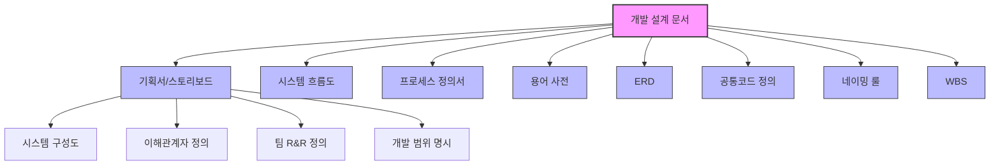

# 개발 설계 문서: 체계적인 시스템 구축의 토대

<!-- mtoc-start -->

- [정의 및 개념](#정의-및-개념)
- [주요 특징](#주요-특징)
- [문서 구조도](#문서-구조도)
- [활용 사례](#활용-사례)
- [기대 효과 및 필요성](#기대-효과-및-필요성)
- [마무리](#마무리)
- [Keywords](#keywords)

<!-- mtoc-end -->

개발 설계 문서(Development Design Document)는 요구사항 분석과 설계 단계에서 식별된 내용을 어떻게 컴포넌트와 시스템으로 개발할지 기술한 일련의 문서입니다. 이는 개발 프로젝트의 로드맵 역할을 하며, 이해관계자 간 명확한 의사소통과 개발 방향성 유지에 핵심적인 역할을 합니다. 개발 설계 문서는 개발 과정의 체계화와 품질 보장을 위한 필수적인 자산으로, 프로젝트의 성공적인 완수를 위한 기반을 제공합니다.

## 정의 및 개념

- 개발 설계 문서: 요구사항 분석 및 설계 단계에서 도출된 정보를 바탕으로 시스템 구현 방향과 상세 개발 지침을 정의한 문서 체계.
- 목적: 개발 프로세스의 표준화와 일관성 유지, 효율적인 개발 진행 지원, 품질 관리 기준 제시.
- 필요성: 복잡한 시스템 개발 시 오류 최소화, 이해관계자 간 명확한 의사소통 지원, 유지보수 용이성 향상.

## 주요 특징

- **체계적 문서화**: 요구사항부터 기술적 구현까지의 모든 단계를 체계적으로 문서화하여 프로젝트 전체 맥락 유지
- **표준화된 형식**: 일관된 문서 형식과 구조를 통해 이해관계자 간 의사소통 효율성 향상 및 혼란 방지
- **추적성 확보**: 요구사항에서 구현까지의 추적성을 확보하여 검증 및 확인 과정의 신뢰성 보장
- **재사용성**: 표준화된 문서는 유사 프로젝트에서 재활용이 가능하여 생산성 향상과 일관성 유지 기여
- **위험 관리**: 사전에 잠재적 이슈를 식별하고 해결책을 문서화하여 개발 과정의 위험 최소화

## 문서 구조도

개발 설계 문서는 기획서, 시스템 흐름도, 프로세스 정의서 등 다양한 문서로 구성되며, 각 문서는 개발 과정의 특정 측면을 명확히 기술합니다. 이러한 체계적 구조는 복잡한 개발 과정을 관리 가능한 단위로 분해하여 효율적인 프로젝트 관리를 지원합니다.

## 활용 사례

- **엔터프라이즈 시스템 개발**: 대규모 기업 시스템 개발 시 다양한 이해관계자 간 의사소통과 개발 방향성 유지를 위한 핵심 도구로 활용
- **금융 시스템 구축**: 높은 신뢰성과 보안이 요구되는 금융 시스템 개발 시 표준화된 개발 설계 문서를 통한 품질 관리 및 규제 준수 보장
- **공공 서비스 플랫폼**: 공공 서비스 개발 시 명확한 요구사항 정의와 투명한 개발 과정 기록을 위한 문서체계 구축
- **의료정보시스템**: 복잡한 데이터 구조와 프로세스가 요구되는 의료정보시스템 개발 시 세부 사항을 명확히 정의하고 관리
- **글로벌 협업 프로젝트**: 여러 국가의 개발팀이 협업하는 프로젝트에서 표준화된 문서를 통한 효율적인 의사소통 지원

## 기대 효과 및 필요성

- **개발 품질 향상**: 체계적인 문서화를 통해 요구사항 누락 방지 및 일관된 개발 품질 확보
- **개발 기간 단축**: 명확한 개발 지침으로 재작업 최소화 및 효율적인 자원 활용으로 전체 개발 기간 단축
- **유지보수 효율성**: 상세 문서화로 시스템 이해도 향상 및 유지보수 작업의 효율성과 정확성 증대
- **지식 자산화**: 프로젝트 경험과 지식을 문서화하여 조직의 지적 자산으로 보존 및 활용 가능
- **위험 관리**: 잠재적 문제점의 사전 식별과 대응 방안 수립을 통한 프로젝트 위험 최소화
- **의사소통 개선**: 이해관계자 간 명확한 의사소통 기반 제공으로 오해와 갈등 감소

## 마무리

개발 설계 문서는 단순한 문서 작성 이상의 의미를 가집니다. 이는 개발 프로젝트의 성공을 위한 필수적인 기반으로, 체계적인 개발 과정과 높은 품질의 결과물을 보장하는 핵심 요소입니다. 현대의 복잡한 IT 환경에서는 표준화된 개발 설계 문서 체계를 도입하고 지속적으로 개선함으로써, 조직의 개발 역량을 강화하고 비즈니스 가치를 극대화할 수 있습니다.

## Keywords

Development Design Document, 개발 설계 문서, Requirements Traceability, Storyboard, Entity-Relationship Diagram, System Flow Chart, Process Definition, Work Breakdown Structure, 네이밍 룰, 공통코드 정의
