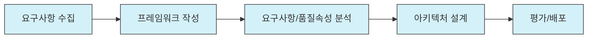

# SW 아키텍처: 소프트웨어 시스템의 청사진

<!-- mtoc-start -->

- [정의 및 개념](#정의-및-개념)
- [주요 특징](#주요-특징)
- [도출 프로세스(요F요품 아평)](#도출-프로세스요f요품-아평)
- [활용 사례](#활용-사례)
- [기대 효과 및 필요성](#기대-효과-및-필요성)
- [마무리](#마무리)
- [Keywords](#keywords)

<!-- mtoc-end -->

소프트웨어 아키텍처는 현대 IT 시스템 개발에서 가장 핵심적인 요소 중 하나입니다. 복잡한 소프트웨어 시스템을 성공적으로 구축하기 위해서는 탄탄한 아키텍처가 필수적이며, 이는 시스템의 품질, 확장성, 유지보수성에 직접적인 영향을 미칩니다. 소프트웨어 아키텍처는 단순한 설계도를 넘어 시스템의 전체 라이프사이클을 좌우하는 중요한 결정들을 담고 있습니다.

## 정의 및 개념

- 소프트웨어 아키텍처: 소프트웨어 구성요소 간의 유기적 관계를 표현하고, 설계 및 업그레이드를 통제하는 지침과 원칙을 기록한 문서.
- 목적: 복잡한 소프트웨어 시스템의 구조적 이해를 돕고, 이해관계자 간 커뮤니케이션 향상 및 시스템 품질 확보.
- 특징: 설계 결정의 집합, 가시성 제공, 재사용 가능성 향상, 변화 대응력 강화.

## 주요 특징

- **추상화(Abstraction)**: 시스템의 복잡성을 관리하기 위해 핵심 요소만 추출하여 표현하고 불필요한 세부사항은 감춤.
- **모듈성(Modularity)**: 시스템을 독립적으로 개발, 테스트, 유지보수할 수 있는 모듈로 분리하여 복잡성 관리 및 재사용성 향상.
- **관심사 분리(Separation of Concerns)**: 시스템의 다양한 측면(기능, 데이터, 사용자 인터페이스 등)을 분리하여 설계함으로써 변경 영향도 최소화.
- **확장성(Scalability)**: 시스템이 사용자 증가나 데이터 양 증가에 효과적으로 대응할 수 있는 구조 제공.
- **유지보수성(Maintainability)**: 시스템의 변경, 개선, 결함 수정이 용이하도록 설계된 특성.

## 도출 프로세스(요F요품 아평)

SW 아키텍처 도출은 요구사항 수집부터 평가/배포까지 5단계의 체계적인 프로세스를 통해 진행됩니다. 각 단계는 이전 단계의 결과물을 기반으로 진행되며, 지속적인 검증과 개선이 수반됩니다.

## 활용 사례

- **엔터프라이즈 시스템 개발**: 대규모 기업용 애플리케이션에서 다양한 비즈니스 요구사항을 충족하기 위한 계층적 아키텍처 적용.
- **클라우드 기반 서비스**: 마이크로서비스 아키텍처를 활용하여 확장성과 유연성을 확보한 SaaS 플랫폼 구축.
- **실시간 처리 시스템**: 이벤트 기반 아키텍처를 통해 금융 트랜잭션이나 IoT 데이터의 실시간 처리 구현.
- **모바일 애플리케이션**: 클라이언트-서버 아키텍처를 기반으로 효율적인 리소스 관리와 오프라인 기능 지원.

## 기대 효과 및 필요성

- **품질 향상**: 아키텍처 설계 단계에서 품질 속성(성능, 보안, 신뢰성 등)을 체계적으로 고려하여 최종 제품의 품질 제고.
- **비용 절감**: 초기 설계 단계에서 잠재적 문제를 식별하고 해결함으로써 개발 후반부 변경 비용 최소화.
- **개발 효율성**: 명확한 구조와 인터페이스 정의를 통해 개발팀 간 협업 효율성 증대 및 병렬 개발 가능.
- **리스크 관리**: 기술적 불확실성을 조기에 식별하고 프로토타이핑을 통해 검증함으로써 개발 위험 감소.
- **비즈니스 민첩성**: 변화하는 비즈니스 요구사항에 신속하게 대응할 수 있는 유연한 시스템 기반 마련.

## 마무리

소프트웨어 아키텍처는 단순한 기술적 설계를 넘어 비즈니스 목표 달성을 위한 전략적 도구입니다. 요구사항 수집부터 평가/배포까지의 체계적인 프로세스를 통해 도출된 아키텍처는 소프트웨어 시스템의 성공적인 구축과 진화를 위한 탄탄한 기반이 됩니다. 특히 시스템의 복잡도가 높아지고 변화 속도가 빨라지는 현대 IT 환경에서는 견고하면서도 유연한 아키텍처 설계가 그 어느 때보다 중요해지고 있습니다.

## Keywords

SW Architecture, 소프트웨어 구조, Component-based Design, 모듈성, Quality Attributes, 관심사 분리, Architecture Patterns, 요구사항 분석, Scalability, 유지보수성
