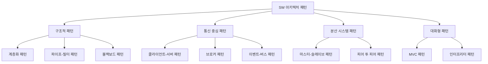

# SW 아키텍처 패턴: 효과적인 시스템 구성을 위한 설계 지침

<!-- mtoc-start -->

- [정의 및 개념](#정의-및-개념)
- [주요 특징](#주요-특징)
- [아키텍처 패턴 분류](#아키텍처-패턴-분류)
- [주요 아키텍처 패턴 상세 설명](#주요-아키텍처-패턴-상세-설명)
  - [계층화 패턴 (Layered Pattern)](#계층화-패턴-layered-pattern)
  - [클라이언트-서버 패턴 (Client-Server Pattern)](#클라이언트-서버-패턴-client-server-pattern)
  - [마스터-슬레이브 패턴 (Master-Slave Pattern)](#마스터-슬레이브-패턴-master-slave-pattern)
  - [파이프-필터 패턴 (Pipe-Filter Pattern)](#파이프-필터-패턴-pipe-filter-pattern)
  - [브로커 패턴 (Broker Pattern)](#브로커-패턴-broker-pattern)
  - [피어 투 피어 패턴 (Peer-to-Peer Pattern)](#피어-투-피어-패턴-peer-to-peer-pattern)
  - [이벤트-버스 패턴 (Event-Bus Pattern)](#이벤트-버스-패턴-event-bus-pattern)
  - [MVC 패턴 (Model-View-Controller Pattern)](#mvc-패턴-model-view-controller-pattern)
  - [블랙보드 패턴 (Blackboard Pattern)](#블랙보드-패턴-blackboard-pattern)
  - [인터프리터 패턴 (Interpreter Pattern)](#인터프리터-패턴-interpreter-pattern)
- [활용 사례](#활용-사례)
- [기대 효과 및 필요성](#기대-효과-및-필요성)
- [마무리](#마무리)
- [Keywords](#keywords)

<!-- mtoc-end -->

소프트웨어 아키텍처 패턴은 시스템 설계의 기본 골격이자 청사진으로, 복잡한 소프트웨어 시스템을 구조화하고 조직화하는 방법을 제공합니다. 이러한 패턴은 수십 년간의 소프트웨어 개발 경험을 통해 검증된 해결책으로, 개발자와 아키텍트가 시스템의 품질, 성능, 유지보수성을 향상시키는 데 도움이 됩니다. 아키텍처 패턴은 시스템 구성요소 간의 관계와 상호작용을 정의하며, 특정 문제 영역에 대한 최적의 접근 방식을 제시합니다.

## 정의 및 개념

- 개념: 시스템에 대한 기본 구성 스키마로써, 하위 시스템과 그 구성요소 간의 관계를 구성하기 위한 규칙과 지침을 패턴으로 분류한 설계 방법론.
- 목적: 검증된 설계 방식을 재사용하여 시스템 개발의 효율성 향상 및 품질 보장.
- 특징: 문제 해결을 위한 일반화된 솔루션 제공, 시스템 구성요소 간 상호작용 정의, 확장성 및 유지보수성 향상, 개발 팀 간 의사소통 촉진.

## 주요 특징

1. **재사용성**: 검증된 설계 패턴을 여러 프로젝트에 적용하여 개발 시간과 비용 절감 가능
2. **표준화**: 개발 팀 내 일관된 아키텍처 언어와 접근 방식 제공으로 의사소통 효율화
3. **확장성**: 시스템 요구사항 변화에 유연하게 대응할 수 있는 구조적 기반 제공
4. **문제-해결 매핑**: 특정 문제 도메인에 최적화된 구조적 솔루션을 제시하여 설계 의사결정 지원
5. **품질 속성 보장**: 성능, 보안, 가용성 등 비기능적 요구사항 달성을 위한 구조적 프레임워크 제공

## 아키텍처 패턴 분류

SW 아키텍처 패턴은 그 특성과 적용 영역에 따라 구조적 패턴, 통신 중심 패턴, 분산 시스템 패턴, 대화형 패턴 등으로 분류 가능. 각 범주의 패턴은 특정 문제 도메인에 최적화된 설계 접근법 제공.

## 주요 아키텍처 패턴 상세 설명

### 계층화 패턴 (Layered Pattern)

- 개념: 기능적 책임에 따라 시스템을 수평적 계층으로 구성하는 방식
- 특징: 각 계층은 하위 계층에 서비스 제공, 상위 계층에 인터페이스 제공
- 적용사례: OSI 7계층, TCP/IP 프로토콜 스택, 엔터프라이즈 애플리케이션(프레젠테이션-비즈니스-데이터 계층)

### 클라이언트-서버 패턴 (Client-Server Pattern)

- 개념: 서비스 요청자(클라이언트)와 제공자(서버)로 역할 분리
- 특징: 중앙 집중식 데이터 관리, 다수 클라이언트 동시 지원, 확장성 제공
- 적용사례: 웹 애플리케이션, 이메일 시스템, 파일 공유 서비스, 데이터베이스 시스템

### 마스터-슬레이브 패턴 (Master-Slave Pattern)

- 개념: 하나의 마스터 컴포넌트가 다수의 슬레이브 컴포넌트 제어
- 특징: 작업 분산처리, 중앙 집중적 제어, 고가용성 지원
- 적용사례: 데이터베이스 복제, 분산 컴퓨팅, 병렬 처리 시스템, 디스크 미러링

### 파이프-필터 패턴 (Pipe-Filter Pattern)

- 개념: 데이터 스트림을 처리하는 필터와 이를 연결하는 파이프로 구성
- 특징: 처리 단계 모듈화, 재구성 용이성, 병렬 처리 가능
- 적용사례: 컴파일러, ETL 프로세스, 텍스트 처리 도구, UNIX 명령줄 파이프라인

### 브로커 패턴 (Broker Pattern)

- 개념: 중앙 브로커가 분산 시스템 간의 통신 및 조정 담당
- 특징: 컴포넌트 간 결합도 감소, 위치 투명성, 상호운용성 향상
- 적용사례: 메시지 큐 시스템, ESB(Enterprise Service Bus), 마이크로서비스 아키텍처

### 피어 투 피어 패턴 (Peer-to-Peer Pattern)

- 개념: 모든 노드가 동등한 권한과 책임을 가지고 분산 작업 수행
- 특징: 중앙 서버 불필요, 높은 가용성, 확장성, 자원 공유 최적화
- 적용사례: 파일 공유 네트워크, 블록체인, 분산 컴퓨팅 프로젝트

### 이벤트-버스 패턴 (Event-Bus Pattern)

- 개념: 이벤트 소스와 이벤트 리스너가 중앙 이벤트 버스를 통해 통신
- 특징: 컴포넌트 간 낮은 결합도, 확장성, 비동기 통신
- 적용사례: GUI 시스템, IoT 애플리케이션, 실시간 모니터링 시스템

### MVC 패턴 (Model-View-Controller Pattern)

- 개념: 데이터(Model), 사용자 인터페이스(View), 비즈니스 로직(Controller) 분리
- 특징: 관심사 분리, 코드 재사용성, 병렬 개발 지원, 유지보수성 향상
- 적용사례: 웹 애플리케이션, 모바일 앱, 데스크톱 GUI 애플리케이션

### 블랙보드 패턴 (Blackboard Pattern)

- 개념: 중앙 지식 저장소와 이를 조작하는 독립적 지식 소스로 구성
- 특징: 복잡한 문제 해결, 진화적 설계, 다양한 알고리즘 통합
- 적용사례: 음성 인식, 이미지 처리, 인공지능 시스템, 복잡한 의사결정 시스템

### 인터프리터 패턴 (Interpreter Pattern)

- 개념: 특정 언어로 작성된 문장을 해석하고 실행하는 구조
- 특징: 문법 규칙 객체화, 언어 해석 모듈화, 확장성
- 적용사례: 스크립트 언어 인터프리터, 쿼리 프로세서, 도메인 특화 언어(DSL)

## 활용 사례

1. **금융 시스템**: 계층화 패턴과 마스터-슬레이브 패턴을 결합하여 트랜잭션 처리와 데이터 중복성 보장
2. **전자상거래 플랫폼**: MVC 패턴과 브로커 패턴을 활용한 사용자 인터페이스와 마이크로서비스 아키텍처 구현
3. **IoT 시스템**: 이벤트-버스 패턴을 활용한 센서 데이터 수집 및 처리
4. **빅데이터 분석 시스템**: 파이프-필터 패턴을 활용한 대용량 데이터 처리 파이프라인 구축
5. **클라우드 인프라**: 피어 투 피어 패턴과 클라이언트-서버 패턴을 혼합한 분산 리소스 관리

## 기대 효과 및 필요성

- **개발 효율성 향상**: 검증된 패턴 활용으로 설계 시간 단축 및 오류 감소
- **시스템 품질 향상**: 확장성, 가용성, 성능 등 품질 속성 보장
- **유지보수 용이성**: 구조적 일관성과 모듈화로 시스템 이해도 및 변경 용이성 증가
- **비용 절감**: 재사용 가능한 설계 접근법으로 개발 및 유지보수 비용 절감
- **위험 감소**: 검증된 설계 방식 활용으로 프로젝트 실패 위험 감소
- **인적 자원 활용 최적화**: 개발자 간 의사소통 향상 및 지식 공유 촉진

## 마무리

소프트웨어 아키텍처 패턴은 복잡한 시스템 설계를 위한 검증된 청사진을 제공합니다. 각 패턴은 고유한 장점과 적용 상황을 가지고 있으며, 종종 여러 패턴을 조합하여 최적의 솔루션을 구성하게 됩니다. 시스템 요구사항과 제약조건을 철저히 분석한 후 적절한 아키텍처 패턴을 선택하는 것이 성공적인 소프트웨어 개발의 핵심입니다. 아키텍처 패턴에 대한 이해는 정보관리기술사로서 대규모 시스템을 설계하고 구현하는 데 있어 필수적인 역량이 될 것입니다.

## Keywords

Architecture Pattern, 구조적 설계, 계층화 패턴, 클라이언트-서버, 마스터-슬레이브, 파이프-필터, 시스템 구성 스키마, 재사용성, 확장성, 모듈화
