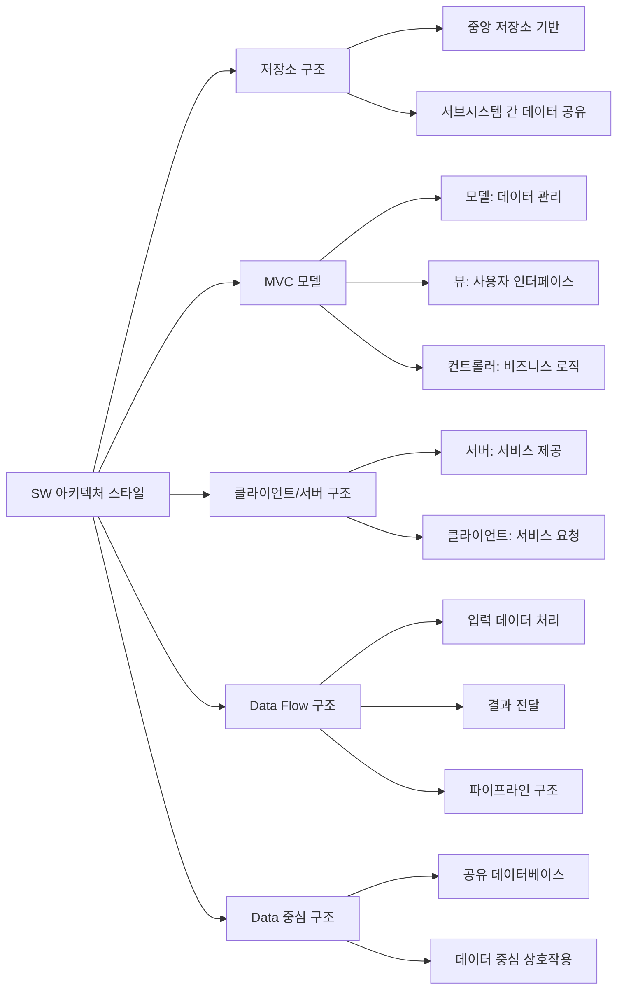

# SW 아키텍처 스타일: 효과적인 시스템 설계 패턴

<!-- mtoc-start -->

- [정의 및 개념](#정의-및-개념)
- [주요 특징](#주요-특징)
- [대표적 아키텍처 스타일](#대표적-아키텍처-스타일)
  - [저장소 구조](#저장소-구조)
  - [MVC(Model-View-Controller) 모델](#mvcmodel-view-controller-모델)
  - [클라이언트/서버 구조](#클라이언트서버-구조)
  - [Data Flow 구조](#data-flow-구조)
  - [Data 중심 구조](#data-중심-구조)
- [활용 사례](#활용-사례)
- [기대 효과 및 필요성](#기대-효과-및-필요성)
- [마무리](#마무리)
- [Keywords](#keywords)

<!-- mtoc-end -->

소프트웨어 아키텍처 스타일(Software Architecture Style)은 시스템 설계에서 반복적으로 발생하는 문제들에 대한 검증된 해결책을 제공합니다. 이러한 스타일은 특정 품질 속성을 달성하기 위한 구성요소들의 조직화 방식을 정의하며, 개발자와 설계자들이 복잡한 시스템을 효율적으로 구축할 수 있도록 안내합니다. 각 아키텍처 스타일은 고유한 장단점을 가지고 있어 시스템 요구사항에 따라 적절한 스타일을 선택하는 것이 중요합니다.

## 정의 및 개념

- 개념: 시스템 구성요소들의 조직화 패턴과 이들 간의 상호작용 메커니즘을 정의한 설계 접근법.
- 목적: 반복적으로 발생하는 아키텍처 설계 문제에 대한 검증된 해결책 제공.
- 구성: 아키텍처 구성요소, 상호관계와 구성방식, 구성요소들의 정확한 의미와 한계, 구성요소들의 상호작용 메커니즘.
- 특징: 품질 속성 달성을 위한 구체적 지침 제공, 설계 결정사항의 체계적 조직화, 아키텍처 패턴의 재사용성 증대.

## 주요 특징

- **명확한 설계 원칙**: 각 스타일은 시스템 구성요소의 역할과 책임, 상호작용 방식에 대한 명확한 지침 제공.
- **품질 속성 최적화**: 특정 품질 속성(성능, 확장성, 보안, 유지보수성 등)을 향상시키기 위한 구조적 접근법 제시.
- **검증된 해결책**: 실제 프로젝트에서 반복적으로 적용되어 효과가 입증된 설계 패턴으로 구성.
- **재사용 가능성**: 다양한 도메인과 시스템에 적용 가능한 일반화된 설계 패턴 제공.
- **아키텍처 의사소통 촉진**: 개발팀 간의 효과적인 의사소통을 위한 공통 어휘와 참조 모델 제공.

## 대표적 아키텍처 스타일

위 다이어그램은 다섯 가지 대표적인 SW 아키텍처 스타일과 각각의 핵심 특성을 보여줍니다. 각 스타일은 특정 문제 영역과 품질 속성에 최적화되어 있으며, 시스템 요구사항에 따라 적절한 스타일을 선택하거나 여러 스타일을 조합하여 사용할 수 있습니다.

### 저장소 구조

- **정의**: 서브시스템들이 단일 중앙 저장소에 접근하여 데이터를 공유하고 처리하는 구조.
- **특징**: 데이터 일관성 유지 용이, 시스템 간 결합도 감소, 중앙화된 데이터 관리.
- **적용 사례**: 버전 관리 시스템, 지식 기반 시스템, 데이터 웨어하우스.

### MVC(Model-View-Controller) 모델

- **정의**: 애플리케이션을 데이터(모델), 사용자 인터페이스(뷰), 비즈니스 로직(컨트롤러)로 분리하는 구조.
- **특징**: 관심사 분리, 코드 재사용성 향상, UI 변경에 따른 영향 최소화.
- **적용 사례**: 웹 애플리케이션, 모바일 앱, 데스크톱 애플리케이션.

### 클라이언트/서버 구조

- **정의**: 서비스 제공자(서버)와 서비스 요청자(클라이언트)로 구성된 분산 시스템 구조.
- **특징**: 자원 집중화, 역할 분담, 확장성 용이, 네트워크 기반 통신.
- **적용 사례**: 웹 서비스, 이메일 시스템, 데이터베이스 애플리케이션.

### Data Flow 구조

- **정의**: 데이터가 연속적인 처리 단계를 거쳐 변환되는 파이프라인 형태의 구조.
- **특징**: 단계적 데이터 처리, 병렬 처리 가능, 복잡한 연산의 모듈화.
- **적용 사례**: 컴파일러, 미디어 처리 시스템, ETL(추출-변환-적재) 프로세스.

### Data 중심 구조

- **정의**: 공유 데이터베이스를 중심으로 여러 구성요소가 상호작용하는 구조.
- **특징**: 데이터 중심 접근법, 저장소를 통한 간접 통신, 데이터 일관성 강조.
- **적용 사례**: 기업 정보 시스템, 데이터 분석 플랫폼, 트랜잭션 처리 시스템.

## 활용 사례

- **엔터프라이즈 시스템**: 대규모 기업 시스템에서는 데이터 중심 구조와 클라이언트/서버 구조를 결합하여 안정적인 데이터 관리와 분산 처리를 구현.
- **웹 애플리케이션**: MVC 패턴을 활용하여 프론트엔드와 백엔드를 효과적으로 분리하고, 확장성과 유지보수성 향상.
- **실시간 데이터 처리**: Data Flow 구조를 적용하여 센서 데이터나 로그 데이터의 실시간 처리 및 분석 시스템 구축.
- **마이크로서비스 아키텍처**: 클라이언트/서버 구조의 확장된 형태로, 각 서비스가 독립적으로 개발, 배포, 확장될 수 있는 구조 제공.
- **빅데이터 플랫폼**: 저장소 구조와 Data Flow 구조를 조합하여 대용량 데이터의 저장, 처리, 분석을 위한 시스템 구축.

## 기대 효과 및 필요성

- **품질 향상**: 검증된 아키텍처 패턴 적용을 통한 시스템 안정성, 성능, 보안 등의 품질 속성 향상.
- **개발 효율성**: 설계 시간 단축, 검증된 접근법 활용으로 개발 위험 감소.
- **유지보수 용이성**: 명확한 구조와 관심사 분리를 통해 시스템 변경 및 확장 용이성 증대.
- **기술부채 감소**: 체계적인 아키텍처 접근법 적용을 통한 임시방편적 설계 방지.
- **표준화**: 개발팀 내 일관된 설계 관행 확립을 통한 협업 효율성 증대.
- **확장성**: 비즈니스 요구사항 변화에 유연하게 대응할 수 있는 확장 가능한 구조 제공.

## 마무리

소프트웨어 아키텍처 스타일은 시스템 설계의 근간을 이루는 중요한 개념으로, 적절한 스타일 선택과 적용은 프로젝트의 성공에 결정적인 영향을 미칩니다. 각 아키텍처 스타일은 고유한 장단점을 가지고 있으므로, 시스템 요구사항과 품질 속성을 고려하여 최적의 스타일을 선택하거나 여러 스타일을 조합하는 접근법이 필요합니다. 또한, 지속적인 아키텍처 리뷰와 개선을 통해 변화하는 요구사항에 대응할 수 있는 유연한 시스템 구조를 유지해야 합니다.

## Keywords

Software Architecture Style, 아키텍처 패턴, Repository Architecture, MVC 모델, Client-Server Architecture, Data Flow Architecture, Data-Centric Architecture, 설계 패턴, 품질 속성, 시스템 구성, 아키텍처 설계
