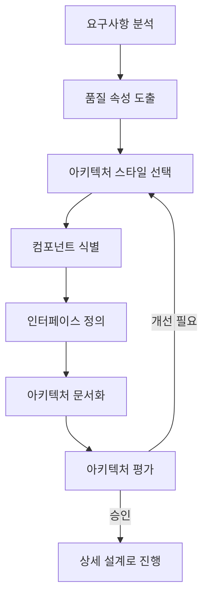

# SW 아키텍처 설계: 성공적인 시스템 구축을 위한 핵심 기반

<!-- mtoc-start -->

- [정의 및 개념](#정의-및-개념)
- [주요 특징](#주요-특징)
- [설계 프로세스](#설계-프로세스)
- [아키텍처 스타일](#아키텍처-스타일)
  - [주요 아키텍처 스타일](#주요-아키텍처-스타일)
- [활용 사례](#활용-사례)
- [기대 효과 및 필요성](#기대-효과-및-필요성)
- [마무리](#마무리)
- [Keywords](#keywords)

<!-- mtoc-end -->

소프트웨어 아키텍처 설계(Software Architecture Design)는 목표 시스템의 주요 요구사항을 만족시키기 위해 품질 속성을 중심으로 구성 요소 간의 관계와 구조를 체계적으로 정의하는 과정입니다. 이는 단순한 구조 설계를 넘어 시스템의 전체적인 청사진을 제시하고 개발 방향을 안내하는 중요한 역할을 합니다.

## 정의 및 개념

- 시스템의 주요 품질 속성을 달성하기 위한 컴포넌트 구성과 상호작용을 정의하는 설계 활동.
- 목표 시스템의 기능적, 비기능적 요구사항을 만족시키는 구조적 솔루션 제공.
- 목적: 시스템의 핵심 요구사항을 충족하는 구조적 프레임워크 확립
- 특징: 추상화, 모듈화, 계층화, 패턴 적용, 품질 속성 중심

## 주요 특징

- **품질 속성 중심 접근**: 성능, 보안, 확장성, 신뢰성 등 비기능적 요구사항을 충족하도록 아키텍처 설계
- **컴포넌트 기반 구성**: 시스템을 독립적이고 재사용 가능한 컴포넌트로 분할하여 복잡성 관리
- **인터페이스 정의**: 컴포넌트 간 통신 방식과 데이터 흐름을 명확히 정의하여 결합도 최소화
- **아키텍처 스타일 적용**: 목적에 맞는 아키텍처 패턴(계층형, 클라이언트-서버, 마이크로서비스 등)을 선택적으로 적용
- **검증 및 평가**: ATAM, SAAM 등의 아키텍처 평가 방법론을 통한 설계 유효성 검증

## 설계 프로세스

이 프로세스는 요구사항 분석부터 시작하여 품질 속성 도출, 아키텍처 스타일 선택, 컴포넌트 식별, 평가까지의 단계를 포함합니다. 각 단계는 반복적으로 수행될 수 있으며 필요에 따라 이전 단계로 돌아가 개선할 수 있습니다.

## 아키텍처 스타일

### 주요 아키텍처 스타일

| 스타일          | 특징                            | 적합 상황                             |
| --------------- | ------------------------------- | ------------------------------------- |
| 계층형          | 기능적으로 분리된 계층으로 구성 | 기능별 분리가 명확한 시스템           |
| 클라이언트-서버 | 서비스 제공자와 소비자로 분리   | 분산 시스템, 네트워크 어플리케이션    |
| 이벤트 기반     | 이벤트 생성과 처리에 중점       | 실시간 처리, 비동기 시스템            |
| 마이크로서비스  | 독립적인 작은 서비스로 구성     | 확장성, 유연성이 핵심인 대규모 시스템 |
| 파이프-필터     | 데이터 흐름 중심의 처리         | 데이터 변환, 처리 파이프라인          |

## 활용 사례

- **금융 시스템**: 보안성과 트랜잭션 무결성을 중심으로 한 아키텍처 설계로 안전한 금융 서비스 구현
- **의료정보 시스템**: 확장성과 보안성을 갖춘 아키텍처로 환자 데이터의 안전한 관리와 접근성 보장
- **대규모 전자상거래**: 마이크로서비스 아키텍처를 통한 트래픽 분산 및 기능별 독립적 확장 구현
- **공공 서비스 플랫폼**: 다양한 서비스를 통합하는 SOA 기반 아키텍처로 시민 서비스 접근성 향상
- **IoT 시스템**: 이벤트 기반 아키텍처를 활용한 실시간 데이터 수집 및 처리 구현

## 기대 효과 및 필요성

- **의사결정 기준 제공**: 향후 개발 과정에서 발생하는 다양한 기술적 의사결정의 기준점 역할
- **비용 효율성**: 초기 설계를 통해 개발 후반부 변경 비용 최소화 및 유지보수 효율성 증대
- **위험 완화**: 주요 품질 속성 관련 리스크를 초기에 식별하고 대응 방안 마련
- **개발팀 소통 개선**: 명확한 설계 문서를 통해 팀 간 이해도 향상 및 효과적인 커뮤니케이션 지원
- **시스템 수명 연장**: 변화에 유연하게 대응할 수 있는 구조 설계로 장기적인 시스템 활용성 증대

## 마무리

SW 아키텍처 설계는 성공적인 시스템 개발의 기반이 되는 핵심 활동입니다. 품질 속성을 중심으로 한 체계적인 설계 접근은 단기적인 개발 효율성뿐만 아니라 장기적인 시스템 유지보수성과 확장성을 보장합니다. 시스템의 규모와 복잡도가 증가할수록 아키텍처 설계의 중요성은 더욱 커지므로, 개발 초기 단계에서부터 충분한 시간과 리소스를 투자하여 견고한 아키텍처 기반을 구축하는 것이 권장됩니다.

## Keywords

Software Architecture Design, 품질 속성(Quality Attributes), 컴포넌트 구성, 아키텍처 스타일, 아키텍처 평가, 설계 검증, 모듈화, 인터페이스 정의, 비기능적 요구사항, 구조적 설계
