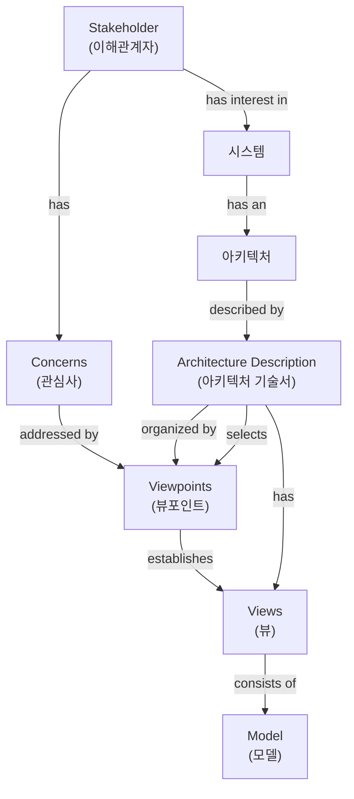

# IEEE1471: 유연성과 확장성을 가진 아키텍처 기술 표준

<!-- mtoc-start -->

- [정의 및 개념](#정의-및-개념)
- [주요 특징](#주요-특징)
- [프레임워크 구조](#프레임워크-구조)
- [구성요소](#구성요소)
  - [Architecture Description (아키텍처 기술서)](#architecture-description-아키텍처-기술서)
  - [Stakeholder (이해관계자)](#stakeholder-이해관계자)
  - [Concerns (관심사)](#concerns-관심사)
  - [View & Viewpoint (뷰 & 뷰포인트)](#view--viewpoint-뷰--뷰포인트)
- [활용 사례](#활용-사례)
- [기대 효과 및 필요성](#기대-효과-및-필요성)
- [마무리](#마무리)
- [Keywords](#keywords)

<!-- mtoc-end -->

IEEE1471(Institute of Electrical and Electronics Engineers 1471)은 소프트웨어 중심의 시스템 아키텍처를 기술하기 위한 개념적 프레임워크입니다. 이 표준은 다양한 이해관계자들의 요구사항과 관점을 체계적으로 반영하여 시스템의 구조를 명확하게 문서화하는 방법을 제공합니다. 특히 유연성(Flexibility)과 확장성(Expansibility)을 중심으로 시스템 아키텍처의 기술(description)을 표준화하여 효과적인 의사소통과 시스템 개발을 지원합니다.

## 정의 및 개념

- IEEE1471: 소프트웨어 중심 시스템의 아키텍처를 명확하게 기술하기 위한 개념적 프레임워크. 다양한 이해관계자의 관점을 체계적으로 통합하는 접근 방식.
- 목적: 아키텍처 기술의 표준화를 통한 의사소통 향상 및 시스템 개발 프로세스 개선.
- 특징: 표준화, 독립성, 범용성, 의사소통, 가이드라인.

## 주요 특징

- **표준화된 접근방식**: 아키텍처를 기술하는 방법론과 용어를 표준화하여 일관성 있는 문서화 가능
- **이해관계자 중심**: 다양한 이해관계자들의 관점을 체계적으로 반영하는 프레임워크 제공
- **유연한 적용성**: 다양한 규모와 유형의 소프트웨어 시스템에 적용 가능한 유연한 구조
- **다중 관점 지원**: 하나의 시스템에 대해 여러 관점(Viewpoint)을 통합하여 종합적인 이해 촉진
- **아키텍처 품질 향상**: 체계적인 문서화를 통한 시스템 아키텍처의 품질 및 신뢰성 향상

## 프레임워크 구조

IEEE1471 프레임워크는 시스템 아키텍처를 다양한 이해관계자의 관점에서 체계적으로 기술하기 위한 구조를 제공합니다. 이해관계자의 관심사(Concerns)가 뷰포인트(Viewpoints)를 통해 뷰(Views)로 구체화되며, 이를 통해 종합적인 아키텍처 기술서(Architecture Description)가 완성됩니다.

## 구성요소

### Architecture Description (아키텍처 기술서)

- 시스템 아키텍처를 문서화한 공식적인 산출물
- 이해관계자들 간의 의사소통과 아키텍처 분석의 기반

### Stakeholder (이해관계자)

- 시스템 개발과 관련된 모든 사람과 조직
- 개발자, 사용자, 관리자, 투자자 등 다양한 역할 포함

### Concerns (관심사)

- 각 이해관계자들이 시스템에 대해 가지는 서로 다른 관점과 목표
- 성능, 보안, 사용성, 유지보수성 등의 품질 속성 포함

### View & Viewpoint (뷰 & 뷰포인트)

- 뷰포인트: 특정 관심사를 다루기 위한 패턴이나 템플릿
- 뷰: 뷰포인트에 따라 생성된 시스템 아키텍처의 표현

## 활용 사례

- **대규모 엔터프라이즈 시스템 개발**: 복잡한 조직 구조와 다양한 이해관계자가 있는 대규모 시스템 개발 시 효과적인 의사소통 지원
- **분산 시스템 아키텍처 설계**: 다양한 구성요소와 인터페이스를 가진 분산 시스템의 아키텍처를 체계적으로 기술
- **소프트웨어 시스템 마이그레이션**: 레거시 시스템에서 신규 시스템으로 마이그레이션할 때 기존 아키텍처의 이해와 새로운 아키텍처의 설계에 활용
- **글로벌 개발 팀 협업**: 지리적으로 분산된 개발 팀 간의 효과적인 의사소통을 위한 표준화된 아키텍처 기술 방법론 제공

## 기대 효과 및 필요성

- **의사소통 향상**: 이해관계자 간 명확한 의사소통을 통한 오해와 갈등 감소
- **품질 향상**: 체계적인 아키텍처 설계 및 문서화를 통한 시스템 품질 향상
- **의사결정 지원**: 아키텍처 관련 의사결정을 위한 명확한 기준과 근거 제공
- **유지보수성 향상**: 시스템의 구조와 의존성을 명확히 이해함으로써 유지보수 효율성 증대
- **재사용성 증가**: 아키텍처 구성요소의 명확한 정의를 통한 재사용성 향상
- **위험 관리**: 초기 단계에서의 아키텍처 검토를 통한 잠재적 위험 식별 및 관리

## 마무리

IEEE1471은 소프트웨어 중심 시스템의 아키텍처를 체계적으로 기술하기 위한 효과적인 프레임워크를 제공합니다. 다양한 이해관계자의 관점을 통합하고 표준화된 접근 방식을 통해 보다 명확하고 일관된 아키텍처 문서화가 가능해집니다. 복잡한 시스템 개발 환경에서 IEEE1471의 도입은 의사소통 향상, 품질 개선, 그리고 궁극적으로 프로젝트 성공률 향상에 기여할 수 있습니다. 체계적인 아키텍처 관리를 위해 IEEE1471의 적극적인 활용을 권장합니다.

## Keywords

IEEE1471, Architecture Description, Viewpoint, 아키텍처 기술 표준, 이해관계자 관점, 관심사 기반 설계, 시스템 뷰, 소프트웨어 아키텍처, 표준화 프레임워크, 아키텍처 문서화
