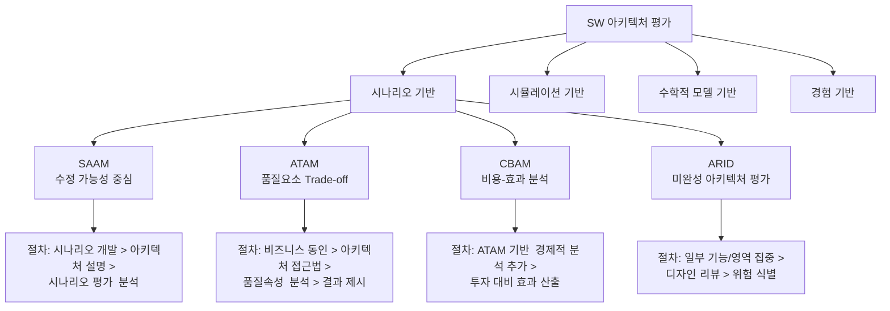

# SW 아키텍처 평가: 적합성 판단을 통한 위험 사전 제거

<!-- mtoc-start -->

- [정의 및 개념](#정의-및-개념)
- [주요 특징](#주요-특징)
- [평가 방법론](#평가-방법론)
  - [SAAM (Software Architecture Analysis Method)](#saam-software-architecture-analysis-method)
  - [ATAM (Architecture Tradeoff Analysis Method)](#atam-architecture-tradeoff-analysis-method)
  - [CBAM (Cost Benefit Analysis Method)](#cbam-cost-benefit-analysis-method)
  - [ARID (Active Reviews for Intermediate Designs)](#arid-active-reviews-for-intermediate-designs)
- [활용 사례](#활용-사례)
- [기대 효과 및 필요성](#기대-효과-및-필요성)
- [마무리](#마무리)
- [Keywords](#keywords)

<!-- mtoc-end -->

소프트웨어 아키텍처 평가(Software Architecture Evaluation)는 개발 중이거나 기존 시스템의 아키텍처가 요구되는 품질 특성을 충족할 수 있는지 체계적으로 판단하는 중요한 과정입니다. 이는 프로젝트 초기 단계에서 잠재적 위험을 식별하고, 설계 결정의 타당성을 검증함으로써 개발 비용 절감과 품질 향상에 기여합니다.

## 정의 및 개념

- 소프트웨어 아키텍처 평가: 제시된 SW 아키텍처가 개발될 SW에 대해 요구되는 품질 특성을 충족시킬 수 있는가를 아키텍처 수준에서 평가하는 작업.
- 목적: 개발 초기 단계에서 아키텍처의 품질 속성 적합성 판단을 통한 위험 사전 제거 및 비용 효율적 의사결정 지원.
- 장점: 비용적 이익, 검토준비 강화, 문제 조기 발견, 요구사항 검증.

## 주요 특징

- 시기적 접근: 아키텍처 구축 전(Early), 초기 미니 평가(Discovery Review), 구현 후 평가(Late) 등 다양한 시점에서 수행 가능
- 평가 유형: 시나리오 기반, 시뮬레이션 기반, 수학적 모델 기반, 경험 기반 평가 방법론 적용
- 품질 속성 중심: 성능, 보안, 가용성, 확장성 등 다양한 품질 속성들에 대한 체계적 평가
- 이해관계자 참여: 아키텍트, 개발자, 품질 담당자, 사용자 등 다양한 이해관계자의 관점 반영
- 문서화된 결과물: 평가 결과, 발견된 위험 요소, 개선 권고사항 등을 체계적으로 문서화

## 평가 방법론

주요 평가 방법론은 시나리오 기반의 접근법이 널리 사용되며, 각 방법론은 서로 다른 관점과 목적에 초점을 맞추고 있습니다. SAAM은 수정 가능성에, ATAM은 품질 요소 간 상충관계에, CBAM은 비용-효과 분석에, ARID는 미완성 아키텍처 평가에 특화되어 있습니다.

### SAAM (Software Architecture Analysis Method)

- 최초로 정리된 체계적인 아키텍처 평가 방법
- 다양한 수정 가능성 관점에서 아키텍처 분석
- 기능성과 수정 용이성에 초점
- 절차: 시나리오 개발 → 아키텍처 설명 → 시나리오 평가 → 상호작용 식별 → 종합 평가

### ATAM (Architecture Tradeoff Analysis Method)

- 모든 품질 요소를 평가하고 품질 속성 간 Trade-off 관계 분석
- 민감점(Sensitivity Points)과 절충점(Tradeoff Points) 식별
- 비즈니스 목표와 아키텍처 결정 사이의 연관성 분석
- 9단계 평가 프로세스로 체계적 접근

### CBAM (Cost Benefit Analysis Method)

- ATAM의 경제적 평가 부분을 보강한 프로세스
- 비용 대비 효과가 좋은 아키텍처 선택에 중점
- 아키텍처 대안의 ROI(투자수익률) 계산
- 경제적 관점에서의 의사결정 지원

### ARID (Active Reviews for Intermediate Designs)

- ATAM, SAAM과 ADR의 혼합 방식
- 완성되지 않은 아키텍처 또는 특정 부분에 집중 평가
- 일부 기능이나 영역에 대한 집중적 검토
- 디자인 리뷰와 아키텍처 평가의 결합

## 활용 사례

- 대규모 엔터프라이즈 시스템 개발 시 초기 아키텍처 검증
- 레거시 시스템 현대화 프로젝트에서 기존 아키텍처 평가
- 클라우드 마이그레이션 시 아키텍처 적합성 평가
- 오픈소스 프레임워크 도입 전 아키텍처 통합 가능성 검증
- 시스템 성능 개선을 위한 아키텍처 병목 지점 식별
- 보안 인증 획득을 위한 아키텍처 보안성 평가

## 기대 효과 및 필요성

- 개발 초기 단계에서의 결함 발견으로 인한 비용 절감 효과
- 품질 요구사항과 아키텍처 간의 정렬을 통한 고객 만족도 증가
- 시스템 진화 과정에서의 예측 가능성 향상
- 아키텍처 결정에 대한 객관적 근거 확보
- 이해관계자 간 아키텍처에 대한 공통 이해 형성
- 개발팀의 아키텍처 인식 및 이해도 향상
- 프로젝트 위험 요소의 조기 식별 및 대응 방안 수립

## 마무리

소프트웨어 아키텍처 평가는 개발 생명주기 초기에 품질 속성을 검증하고 잠재적 위험을 식별하는 비용 효율적인 방법입니다. SAAM, ATAM, CBAM, ARID 등 다양한 평가 방법론을 활용하여 프로젝트의 특성과 목표에 맞는 접근법을 선택하고, 체계적인 평가를 통해 아키텍처의 적합성을 검증하는 것이 중요합니다. 이는 궁극적으로 고품질의 소프트웨어 시스템 구축과 프로젝트 성공 가능성을 높이는 핵심 요소입니다.

## Keywords

Software Architecture Evaluation, Architecture Tradeoff Analysis Method, 아키텍처 적합성 판단, 품질 속성 평가, SAAM, CBAM, 위험 사전 제거, 비용 효율성, 아키텍처 민감점, 아키텍처 절충점
