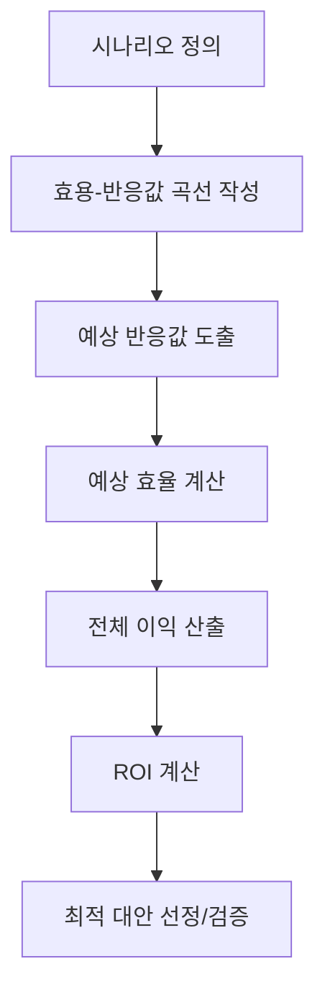

# CBAM: 효과적인 IT 투자 분석 방법론

<!-- mtoc-start -->

- [정의 및 개념](#정의-및-개념)
- [주요 특징](#주요-특징)
- [평가 프로세스](#평가-프로세스)
- [활용 사례](#활용-사례)
- [기대 효과 및 필요성](#기대-효과-및-필요성)
- [마무리](#마무리)
- [Keywords](#keywords)

<!-- mtoc-end -->

CBAM(Cost-Benefit Analysis Method)은 정보기술 투자에 있어 비용과 효익을 체계적으로 분석하고 평가하는 방법론입니다. 이 방법론은 기업이 IT 프로젝트의 경제적 가치를 정확히 측정하고 합리적인 의사결정을 내릴 수 있도록 도와주는 중요한 도구입니다.

## 정의 및 개념

- CBAM: IT 투자의 비용과 효익을 정량화하여 투자 효과를 측정하는 분석 방법론.
- 목적: 불확실성이 존재하는 IT 투자 환경에서 시나리오 기반 분석을 통해 최적의 투자 대안을 선정하는 것.
- 특징: 정량적 분석, 시나리오 기반 접근법, 효용-반응값 곡선 활용.

## 주요 특징

- **시나리오 기반 분석**: 다양한 미래 상황을 가정하여 여러 시나리오에서의 투자 효과를 예측하고 분석
- **정량적 평가 체계**: 모든 이익과 비용을 화폐 가치로 환산하여 객관적인 비교 가능
- **불확실성 관리**: 다양한 시나리오를 통해 미래의 불확실성을 체계적으로 관리
- **우선순위 결정**: 제한된 자원 환경에서 최적의 투자 대안 선정을 위한 기준 제공

## 평가 프로세스

CBAM 평가는 시나리오 정의부터 시작하여 효용-반응값 곡선 작성, 예상 반응값과 효율 계산을 거쳐 최종적으로 ROI 계산 및 최적 대안 선정으로 이어지는 체계적인 프로세스를 따릅니다. 각 단계는 투자의 경제적 가치를 정확히 평가하기 위한 핵심 요소입니다.

## 활용 사례

- **엔터프라이즈 애플리케이션 도입**: 신규 ERP 시스템 도입 시 여러 벤더 솔루션의 경제적 가치 비교 분석
- **인프라 업그레이드 결정**: 클라우드 마이그레이션과 온프레미스 업그레이드 간의 비용 효익 분석
- **IT 전략 수립**: 장기적 IT 로드맵 설계 시 투자 우선순위 결정
- **디지털 트랜스포메이션**: 다양한 디지털 혁신 이니셔티브 간의 ROI 비교를 통한 최적 투자 결정

## 기대 효과 및 필요성

- **투자 리스크 감소**: 체계적인 분석을 통해 IT 투자 실패 가능성 최소화
- **자원 최적화**: 제한된 IT 예산을 가장 높은 가치를 창출하는 프로젝트에 할당
- **의사결정 투명성**: 객관적이고 정량적인 평가를 통한 의사결정 정당성 확보
- **비즈니스-IT 연계 강화**: IT 투자가 비즈니스 가치로 연결되는 메커니즘 명확화
- **전략적 일관성**: 조직의 전략적 목표에 부합하는 IT 투자 보장

## 마무리

CBAM은 IT 투자의 복잡성과 불확실성을 체계적으로 관리하면서 경제적 가치를 최대화할 수 있는 효과적인 방법론입니다. 시나리오 기반 접근법과 정량적 평가 체계를 통해 조직은 보다 정확한 의사결정을 내릴 수 있으며, 제한된 자원을 최적으로 활용할 수 있습니다. IT 부서와 경영진 모두에게 투자 결정에 대한 명확한 근거를 제공함으로써 전략적 IT 관리의 핵심 도구로 활용될 수 있습니다.

## Keywords

Cost-Benefit Analysis Method, IT 투자 분석, ROI 계산, 시나리오 기반 분석, 효용-반응값 곡선, 투자 우선순위, 정량적 평가, 의사결정 지원, IT 가치 측정, 경제적 타당성 평가
