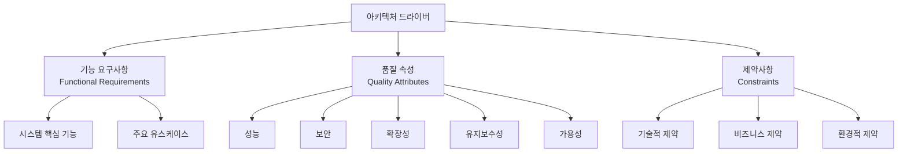

# 아키텍처 드라이버: 효과적인 아키텍처 설계의 핵심 기반

<!-- mtoc-start -->

- [정의 및 개념](#정의-및-개념)
- [주요 특징](#주요-특징)
- [구성요소](#구성요소)
- [활용 사례](#활용-사례)
- [기대 효과 및 필요성](#기대-효과-및-필요성)
- [마무리](#마무리)
- [Keywords](#keywords)

<!-- mtoc-end -->

아키텍처 드라이버(Architecture Driver)는 소프트웨어 시스템의 아키텍처 설계 과정에서 중요한 역할을 하는 핵심 요소입니다. 이는 수많은 아키텍처 요구사항 중에서 아키텍처 설계에 직접적인 영향을 미치는 항목들을 추출하고 정제하여 설계 원칙이나 근거의 형태로 표현한 것입니다. 아키텍처 드라이버는 설계자가 명확한 방향성을 가지고 아키텍처를 구축할 수 있도록 안내하는 나침반과 같은 역할을 수행합니다.

## 정의 및 개념

- 아키텍처 드라이버: 아키텍처 요구사항 중 설계에 직접적인 영향을 미치는 핵심 항목들을 추출하고 정제하여 설계 원칙이나 근거로 표현한 개념.
- 목적: 시스템의 구조적 결정에 가장 큰 영향을 미치는 요소들을 명확히 하여 아키텍처 설계의 방향성 제시 및 의사결정의 근거 제공.

## 주요 특징

- **설계 의사결정의 기준**: 아키텍처 드라이버는 아키텍처 설계 과정에서 발생하는 다양한 의사결정의 기준점으로 작용하여 일관된 설계 방향 유지.
- **우선순위 기반 접근**: 모든 요구사항이 동일한 중요도를 갖지 않으며, 가장 영향력 있는 요구사항을 식별하여 우선순위 부여.
- **트레이드오프 분석 지원**: 상충되는 요구사항 간의 균형을 찾는 과정에서 중요한 기준으로 활용되어 체계적인 트레이드오프 분석 가능.
- **아키텍처 평가의 척도**: 완성된 아키텍처가 초기 목표와 요구사항을 충족하는지 평가하는 기준으로 활용.

## 구성요소

아키텍처 드라이버는 기능 요구사항, 품질 속성, 제약사항의 세 가지 주요 구성요소로 이루어져 있으며, 각 요소는 아키텍처 설계에 고유한 영향을 미치고 상호 연관되어 있습니다.

## 활용 사례

- **엔터프라이즈 시스템 개발**: 확장성과 보안이 중요한 엔터프라이즈 애플리케이션에서 이러한 품질 속성을 아키텍처 드라이버로 설정하여 마이크로서비스 아키텍처 채택.
- **금융 시스템**: 트랜잭션 처리의 정확성과 실시간 성능이 핵심 드라이버로 작용하여 데이터 일관성과 처리 속도를 최적화하는 아키텍처 구축.
- **IoT 플랫폼**: 대량의 장치 연결과 데이터 처리가 주요 드라이버로 작용하여 확장 가능한 클라우드 기반 아키텍처 설계.
- **레거시 시스템 현대화**: 기존 시스템과의 호환성과 점진적 마이그레이션이 드라이버로 작용하여 단계적 아키텍처 전환 전략 수립.

## 기대 효과 및 필요성

- **설계 의사결정의 합리화**: 명확한 근거에 기반한 아키텍처 설계 결정으로 이해관계자 간 공감대 형성.
- **리소스 최적화**: 중요한 요구사항에 집중함으로써 개발 리소스의 효율적 할당 및 활용.
- **품질 향상**: 핵심 품질 속성에 초점을 맞춘 설계로 전반적인 시스템 품질 향상.
- **비즈니스-IT 연계 강화**: 비즈니스 목표와 기술적 구현 간의 명확한 연결고리 제공.
- **프로젝트 위험 감소**: 초기 단계에서 핵심 요구사항과 제약을 식별함으로써 후기 변경으로 인한 위험 최소화.

## 마무리

아키텍처 드라이버는 소프트웨어 시스템 설계의 방향성을 결정하는 핵심 요소로, 기능 요구사항, 품질 속성, 제약사항을 포괄적으로 고려하여 최적의 아키텍처 설계를 위한 기반을 제공합니다. 복잡한 시스템 개발에서는 이러한 드라이버를 명확히 식별하고 우선순위화하는 과정이 매우 중요하며, 이를 통해 비즈니스 목표에 부합하는 효과적인 아키텍처를 구축할 수 있습니다. 아키텍처 드라이버 중심의 접근 방식은 단순한 기술적 구현을 넘어, 전략적 비즈니스 가치를 창출하는 시스템 구축의 토대가 됩니다.

## Keywords

Architecture Driver, 아키텍처 드라이버, Functional Requirements, 기능 요구사항, Quality Attributes, 품질 속성, Constraints, 제약사항, Trade-off Analysis, 설계 의사결정, 아키텍처 평가
