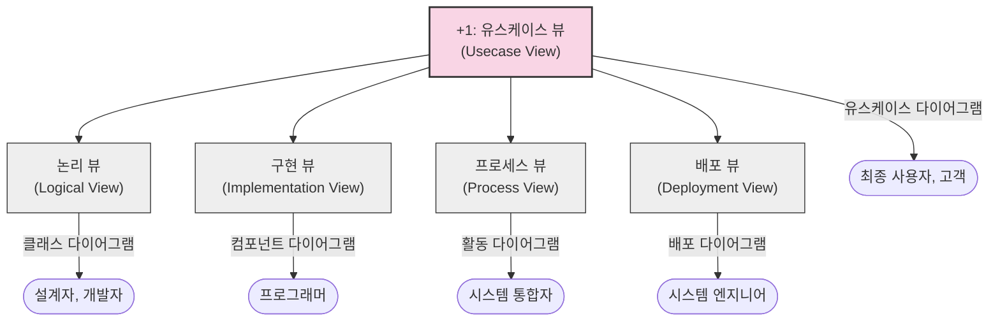

# 4+1 View: 이해관계자 중심의 아키텍처 표현 모델

<!-- mtoc-start -->

- [정의 및 개념](#정의-및-개념)
- [주요 특징](#주요-특징)
- [아키텍처 구조](#아키텍처-구조)
  - [뷰별 특징 및 용도](#뷰별-특징-및-용도)
    - [1. 논리 뷰 (Logical View)](#1-논리-뷰-logical-view)
    - [2. 구현 뷰 (Implementation View)](#2-구현-뷰-implementation-view)
    - [3. 프로세스 뷰 (Process View)](#3-프로세스-뷰-process-view)
    - [4. 배포 뷰 (Deployment View)](#4-배포-뷰-deployment-view)
    - [+1. 유스케이스 뷰 (Usecase View)](#1-유스케이스-뷰-usecase-view)
- [활용 사례](#활용-사례)
- [기대 효과 및 필요성](#기대-효과-및-필요성)
- [마무리](#마무리)
- [Keywords](#keywords)

<!-- mtoc-end -->

소프트웨어 아키텍처 뷰(Software Architecture View)는 복잡한 소프트웨어 시스템을 이해관계자들의 다양한 관심사에 맞춰 체계적으로 표현하는 방법입니다. 그중에서도 4+1 뷰 모델은 필립 크루흐텐(Philippe Kruchten)이 1995년에 제안한 것으로, 서로 다른 관점에서 시스템을 바라볼 수 있는 프레임워크를 제공합니다.

## 정의 및 개념

- 소프트웨어 시스템을 이해관계자의 관심사에 따라 다양한 관점으로 표현한 아키텍처 모델.
- 유스케이스 뷰를 중심으로 논리, 구현, 프로세스, 배포 뷰의 4가지 뷰를 통해 시스템을 종합적으로 표현.
- 특징: 다양한 관점 제공, 체계적 문서화, 이해관계자 중심 접근법
- 목적: 복잡한 시스템의 이해도 향상, 이해관계자 간 효과적인 의사소통 지원, 시스템 설계 검증

## 주요 특징

- **다중 관점 접근법**: 단일 관점이 아닌 여러 관점에서 시스템을 바라봄으로써 복잡한 시스템의 이해도를 높임
- **이해관계자 중심**: 각 뷰는 특정 이해관계자(개발자, 시스템 엔지니어, 프로젝트 관리자 등)의 관심사에 맞게 설계됨
- **상호 보완적 뷰**: 각 뷰는 독립적이면서도 상호 보완적인 관계를 가지며, 함께 시스템의 전체 아키텍처를 표현
- **유스케이스 중심**: 중앙의 유스케이스 뷰가 다른 4개의 뷰를 연결하고 검증하는 역할 수행
- **표준화된 문서화**: UML(Unified Modeling Language)을 활용하여 각 뷰를 표준화된 방식으로 문서화

## 아키텍처 구조

4+1 뷰 모델은 중앙의 유스케이스 뷰를 중심으로 4개의 주요 뷰가 연결된 구조를 가집니다. 각 뷰는 특정 이해관계자의 관심사에 맞춰 설계되어 있으며, 모든 뷰가 함께 시스템의 완전한 아키텍처를 구성합니다.

### 뷰별 특징 및 용도

#### 1. 논리 뷰 (Logical View)

- **대상**: 설계자, 개발자
- **내용**: 시스템의 기능적 요구사항을 지원하는 객체 모델
- **표현 방법**: UML 클래스 다이어그램, 상태 다이어그램
- **관심사**: 시스템이 제공하는 주요 서비스와 기능

#### 2. 구현 뷰 (Implementation View)

- **대상**: 프로그래머
- **내용**: 소프트웨어 모듈, 라이브러리, 서브시스템 구성
- **표현 방법**: UML 컴포넌트 다이어그램, 패키지 다이어그램
- **관심사**: 소프트웨어 구성요소 간의 의존성, 재사용성

#### 3. 프로세스 뷰 (Process View)

- **대상**: 시스템 통합자
- **내용**: 시스템의 동적 측면, 프로세스 간 통신
- **표현 방법**: UML 활동 다이어그램, 시퀀스 다이어그램
- **관심사**: 병렬 처리, 동시성, 성능, 확장성

#### 4. 배포 뷰 (Deployment View)

- **대상**: 시스템 엔지니어, 인프라 담당자
- **내용**: 물리적 노드와 소프트웨어 컴포넌트의 매핑
- **표현 방법**: UML 배포 다이어그램
- **관심사**: 분산 시스템의 물리적 배치, 하드웨어 요구사항

#### +1. 유스케이스 뷰 (Usecase View)

- **대상**: 최종 사용자, 고객, 기획자
- **내용**: 시스템의 행위와 기능에 대한 시나리오
- **표현 방법**: UML 유스케이스 다이어그램
- **관심사**: 시스템이 해결해야 할 비즈니스 문제, 사용자 요구사항

## 활용 사례

- **대규모 엔터프라이즈 시스템 개발**: 복잡한 비즈니스 로직과 다양한 이해관계자가 있는 대규모 시스템 설계 시 활용
- **분산 시스템 아키텍처**: 클라우드 기반 분산 시스템의 다양한 측면을 효과적으로 문서화
- **레거시 시스템 현대화**: 기존 시스템의 구조를 다양한 관점에서 분석하고 개선 방향 도출
- **마이크로서비스 아키텍처**: 서비스 간 관계와 배포 전략을 다양한 관점에서 설계 및 문서화
- **DevOps 환경 구축**: 개발 및 운영 관점을 모두 고려한 통합된 아키텍처 설계

## 기대 효과 및 필요성

- **이해관계자 간 소통 개선**: 각 이해관계자가 관심 있는 관점에서 시스템을 이해하고 소통할 수 있음
- **복잡성 관리**: 대규모 시스템의 복잡성을 관리 가능한 뷰로 분리하여 효과적으로 다룰 수 있음
- **요구사항 추적성 향상**: 유스케이스부터 배포까지 요구사항이 어떻게 구현되는지 추적 가능
- **품질 속성 검증**: 다양한 뷰를 통해 성능, 확장성, 보안 등 품질 속성을 검증할 수 있음
- **문서화 표준화**: 일관된 방식으로 시스템을 문서화하여 지식 전파와 유지보수 용이성 향상

## 마무리

4+1 뷰 모델은 다양한 이해관계자의 관점을 체계적으로 표현함으로써 복잡한 소프트웨어 시스템의 설계와 개발을 효과적으로 지원합니다. 특히 대규모 시스템 개발이나 여러 이해관계자가 참여하는 프로젝트에서는 이러한 다중 관점 접근법이 의사소통과 시스템 이해도를 크게 향상시킬 수 있습니다. 조직에서 소프트웨어 아키텍처를 설계하고 문서화할 때 4+1 뷰 모델을 적용하면 더 체계적이고 종합적인 접근이 가능할 것입니다.

## Keywords

Software Architecture View, 아키텍처 뷰, Logical View, Implementation View, Process View, Deployment View, Usecase View, 다중 관점 설계, 이해관계자 중심 설계, UML
