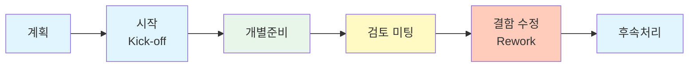

# SW 품질보증: 정형기술검토(FTR)를 통한 결함 조기 발견과 비용 절감 전략

<!-- mtoc-start -->

- [정의 및 개념](#정의-및-개념)
- [주요 특징](#주요-특징)
- [프로세스](#프로세스)
- [FTR 유형 비교](#ftr-유형-비교)
- [활용 사례](#활용-사례)
- [기대 효과 및 필요성](#기대-효과-및-필요성)
- [마무리](#마무리)
- [Keywords](#keywords)

<!-- mtoc-end -->

소프트웨어 품질보증(Software Quality Assurance)의 핵심 기법인 정형기술검토(Formal Technical Review, FTR)는 개발 생명주기 초기에 결함을 발견하고 제거함으로써 테스트 비용을 절감하는 효과적인 정적 테스트 방법론입니다. 코드뿐만 아니라 요구사항 명세서, 설계 문서 등 소프트웨어 개발 중간산출물에 대한 체계적인 검토를 통해 품질을 향상시키는 FTR은 Inspection, Review, Walkthrough와 같은 다양한 방식으로 실행됩니다.

## 정의 및 개념

- 정형기술검토(FTR): 소프트웨어 개발 과정에서 발생하는 결함을 조기에 발견하기 위한 체계적이고 공식적인 검토 기법.
- 목적: 결함의 조기발견, 전체 개발비용 감소, 품질향상, 개발생산성 향상, 로직 오류의 발견.
- 원칙: 사전준비 철저, 의제 제한성, 참가인원 제한성, 제품검토 집중성, 불필요한 논쟁과 반박의 제한.
- 페덱스의 법칙(1:10:100): 초기단계 버그 수정 비용이 1이라면, 개발단계에서는 10, 유지보수 단계에서는 100의 비용이 발생.

## 주요 특징

- **결함 예방 중심**: 테스트보다 결함 예방에 초점을 맞춰 품질을 보증하는 접근법
- **조기 결함 발견**: 개발 초기 단계에서 결함을 발견하여 수정 비용과 시간을 최소화
- **체계적 검토 프로세스**: 계획에서부터 후속조치까지 정형화된 절차에 따라 진행
- **다양한 관점 통합**: 개발자, 테스터, 사용자 등 다양한 역할의 참여자가 각자의 관점에서 검토
- **문서화된 결과물**: 검토 과정과 결과를 문서화하여 지속적인 품질 개선의 기반 제공

## 프로세스

정형기술검토는 계획부터 후속처리까지 6단계로 구성된 체계적인 프로세스입니다. 각 단계는 명확한 목표와 책임을 가지며, 문서화된 결과물을 통해 추적성과 투명성을 확보합니다.

## FTR 유형 비교

| 구분       | Walkthrough              | Review                             | Inspection                   |
| ---------- | ------------------------ | ---------------------------------- | ---------------------------- |
| **주도자** | 작성자 주도              | 관리자/외부전문가                  | 훈련된 중재자                |
| **공식성** | 비공식적                 | 준공식적                           | 매우 공식적                  |
| **참여자** | 개발 참여팀              | 개발자, 관리자, 사용자, 외부전문가 | 전문지식을 갖춘 검토팀       |
| **특징**   | 개방적 분위기, 교육 효과 | 요구명세서와 일치성 검토           | 체크리스트 기반, 엄격한 검토 |
| **목적**   | 오류 발견, 대안 논의     | 적합성 평가, 승인 여부 결정        | 정확한 결함 식별 및 분류     |

## 활용 사례

- **기업 소프트웨어 개발**: 금융 시스템, 의료 시스템 등 고신뢰성이 요구되는 소프트웨어 개발에서 품질 확보
- **오픈소스 프로젝트**: 코드 리뷰를 통한 공동 개발 환경에서의 품질 관리
- **ISO/IEC 25010 인증**: 소프트웨어 품질 인증을 위한 필수 프로세스로 활용
- **애자일 개발 환경**: 스프린트 리뷰, 페어 프로그래밍 등의 형태로 적용
- **정부/국방 프로젝트**: 높은 수준의 품질 요구사항을 충족하기 위한 필수 절차

## 기대 효과 및 필요성

- **비용 효율성**: 페덱스의 법칙에 따라 초기 결함 발견으로 개발 총비용 감소
- **품질 향상**: 체계적인 검토를 통한 결함 감소로 소프트웨어 품질 향상
- **지식 공유**: 팀원 간 코드와 설계에 대한 이해도 증진 및 지식 공유
- **표준화 촉진**: 개발 프로세스와 산출물의 표준화 촉진
- **유지보수성 향상**: 결함이 적은 코드로 인한 유지보수 용이성 확보
- **프로젝트 위험 감소**: 조기 결함 발견으로 인한 일정 지연 및 비용 초과 위험 감소

## 마무리

정형기술검토(FTR)는 소프트웨어 개발에서 품질을 확보하기 위한 필수적인 활동입니다. 초기 단계에서의 결함 발견은 비용 효율성뿐만 아니라 전반적인 소프트웨어 품질 향상에 크게 기여합니다. 개발 조직은 프로젝트 특성과 팀 문화에 맞는 FTR 접근법을 선택하고, 체계적으로 실행함으로써 소프트웨어 품질보증의 효과를 극대화할 수 있습니다. 특히 페덱스의 법칙을 고려할 때, FTR의 도입은 장기적 관점에서 개발 비용을 크게 절감하는 현명한 투자입니다.

## Keywords

Formal Technical Review, Software Quality Assurance, Inspection, Walkthrough, 정형기술검토, 품질보증, 결함예방, 페덱스의 법칙, 정적테스트, 소프트웨어 검토
