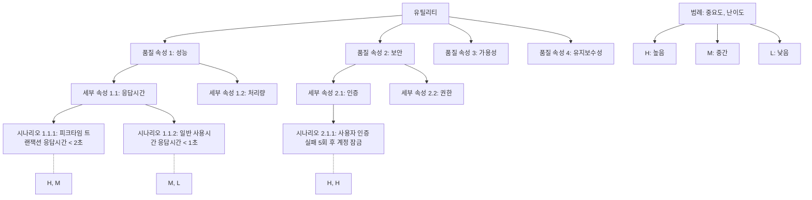

# 유틸리티 트리: 시나리오 기반 아키텍처 평가를 위한 체계적 접근법

<!-- mtoc-start -->

- [정의 및 개념](#정의-및-개념)
- [주요 특징](#주요-특징)
- [유틸리티 트리 구조도](#유틸리티-트리-구조도)
- [활용 사례](#활용-사례)
- [기대 효과 및 필요성](#기대-효과-및-필요성)
- [마무리](#마무리)
- [Keywords](#keywords)

<!-- mtoc-end -->

유틸리티 트리(Utility Tree)는 소프트웨어 아키텍처 평가에서 품질 속성 요구사항을 체계적으로 도출하고 우선순위화하는 기법입니다. 이 방법론은 일반적인 품질 문제로부터 시작하여 특정 시스템의 구체적 상황으로 단계적으로 세분화함으로써, 아키텍처 의사결정을 지원하고 평가 프로세스를 구조화합니다.

## 정의 및 개념

- 개념: 일반적인 품질 속성에서 구체적인 시나리오로 세분화하여 아키텍처 평가의 기준을 체계적으로 도출하는 계층적 구조화 기법.
- 목적: 시스템의 품질 속성 요구사항을 우선순위화하고, 아키텍처 평가에 필요한 구체적인 시나리오를 식별하는 도구.

## 주요 특징

- **계층적 구조**: 품질 속성 → 세부 속성 → 구체적 시나리오의 계층 구조를 통해 체계적인 분석 가능
- **우선순위화 메커니즘**: 각 시나리오에 중요도와 난이도를 할당하여 아키텍처 평가의 우선순위 설정
- **이해관계자 참여**: 다양한 이해관계자가 참여하여 품질 속성 요구사항을 종합적으로 도출
- **반복적 정제**: 초기 유틸리티 트리를 지속적으로 정제하며 평가 과정 진행

## 유틸리티 트리 구조도

유틸리티 트리는 최상위 유틸리티(전체 시스템 효용)에서 시작하여 품질 속성, 세부 속성, 구체적 시나리오로 내려가는 계층적 구조를 갖습니다. 각 시나리오에는 중요도(H/M/L)와 구현 난이도(H/M/L)가 할당되어 우선순위를 결정합니다.

## 활용 사례

- **ATAM(Architecture Tradeoff Analysis Method)**: 소프트웨어 아키텍처 평가 방법론에서 핵심 도구로 활용
- **대규모 엔터프라이즈 시스템 설계**: 복잡한 시스템의 다양한 품질 요구사항을 체계적으로 관리
- **금융 시스템 개발**: 성능, 보안, 신뢰성 등 중요 품질 속성의 균형을 맞추기 위한 의사결정 지원
- **클라우드 마이그레이션 아키텍처 평가**: 기존 시스템의 클라우드 이전 시 품질 속성별 영향 분석

## 기대 효과 및 필요성

- **체계적 품질 요구사항 분석**: 추상적 품질 속성을 구체적 시나리오로 변환하여 명확한 평가 기준 수립
- **우선순위 기반 리소스 할당**: 중요도와 난이도를 고려한 개발 리소스의 효율적 배분
- **이해관계자 간 의사소통 개선**: 다양한 이해관계자가 품질 요구사항에 대한 공통 이해 형성
- **아키텍처 의사결정 지원**: 품질 속성 간 트레이드오프를 분석하여 최적의 아키텍처 선택 지원
- **평가 프로세스 효율화**: 구조화된 접근법으로 아키텍처 평가의 시간과 비용 절감

## 마무리

유틸리티 트리는 소프트웨어 아키텍처 평가에서 품질 속성 요구사항을 체계적으로 도출하고 우선순위화하는 강력한 도구입니다. 일반적인 품질 문제에서 시스템 특화된 구체적 시나리오로 체계적 접근을 가능하게 함으로써, 이해관계자들이 중요한 품질 속성에 집중하고 아키텍처 의사결정을 효과적으로 지원합니다. 복잡한 시스템 개발에서 품질 요구사항의 균형을 맞추려는 조직에게 유틸리티 트리 기법의 도입과 활용을 권장합니다.

## Keywords

Utility Tree, Architecture Evaluation, Quality Attributes, 아키텍처 트레이드오프 분석, 품질 속성 시나리오, 우선순위화 기법, 요구사항 도출, ATAM, 아키텍처 평가, 시나리오 기반 평가
