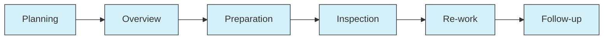
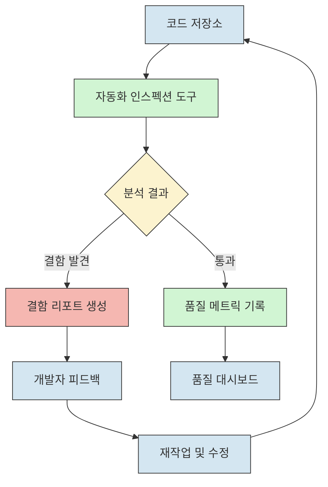

# 인스펙션: 소프트웨어 품질 향상을 위한 정적 테스트 프로세스

<!-- mtoc-start -->

- [정의 및 개념](#정의-및-개념)
- [주요 특징](#주요-특징)
- [인스펙션 프로세스](#인스펙션-프로세스)
- [인스펙션 팀 구성과 역할](#인스펙션-팀-구성과-역할)
- [인스펙션 자동화](#인스펙션-자동화)
- [활용 사례](#활용-사례)
- [기대 효과 및 필요성](#기대-효과-및-필요성)
- [마무리](#마무리)
- [Keywords](#keywords)

<!-- mtoc-end -->

인스펙션(Inspection)은 소프트웨어 개발 과정에서 코드의 신뢰성을 향상시키기 위한 정적 테스트 방법론입니다. 개발된 코드에 내재된 잠재적 결함이나 표준 미준수 사항을 사전에 식별하고 제거하는 체계적인 검토 프로세스로, 초기 단계에서 결함을 발견하여 비용 효율적으로 소프트웨어 품질을 높이는 데 중요한 역할을 합니다.

## 정의 및 개념

- 정의: Rule Set을 활용한 정적 테스트 기반의 코드 검토 프로세스로, 잠재적 결함이나 표준 미준수 사항을 식별하기 위한 체계적 검증 활동
- 목적: 초기 결함 위험 제거, 소스코드 이해도 증진, 유지보수성 향상, 코드 품질 및 보안성 강화

## 주요 특징

- **규칙 기반 접근**: 사전에 정의된 Rule Set을 기준으로 코드를 평가하여 객관적인 검증 수행
- **팀 기반 검토**: 다양한 역할을 가진 전문가들이 참여하여 다각적 관점에서 코드 검증
- **문서화된 프로세스**: 계획부터 후속 조치까지 체계적인 단계와 산출물이 정의된 공식 프로세스
- **예방적 품질 관리**: 테스트 실행 전 단계에서 결함을 식별하여 수정 비용 최소화
- **지속적 개선**: 발견된 결함 패턴을 분석하여 개발 프로세스 자체의 개선점 도출

## 인스펙션 프로세스

인스펙션은 계획 수립부터 후속 조치까지 6단계로 체계화된 프로세스를 따릅니다. 각 단계는 명확한 목표와 산출물을 가지며, 이를 통해 효율적이고 일관된 코드 검증이 가능합니다.

## 인스펙션 팀 구성과 역할

| 역할          | 주요 책임                                              | 필요 역량                         |
| ------------- | ------------------------------------------------------ | --------------------------------- |
| **Moderator** | 인스펙션 팀 관리, 프로세스 진행 조율, 회의 진행        | 프로젝트 관리 능력, 의사소통 기술 |
| **Reader**    | 산출물 검토 및 설명, 개발자 인터뷰를 통한 이해도 향상  | 코드 분석 능력, 요구사항 이해도   |
| **Coder**     | 리더의 지시에 따라 코드 검증 수행, 코딩 표준 준수 확인 | 프로그래밍 전문성, 코딩 표준 지식 |
| **Tester**    | 모듈 테스트 수행, 결함 발견 및 보고                    | 테스트 기법 지식, 문제 해결 능력  |

## 인스펙션 자동화

인스펙션 자동화는 정적 분석 도구를 활용하여 수동 인스펙션의 한계를 보완합니다. 지속적 통합 환경에서 자동화된 코드 검사를 통해 일관된 품질 기준을 적용하고 즉각적인 피드백을 제공합니다.

## 활용 사례

- **항공우주 산업**: 안전 중요 시스템에서 결함 발생 위험을 최소화하기 위한 필수 프로세스로 활용
- **금융 시스템**: 보안 취약점 및 규제 준수 여부를 검증하여 금융 데이터 보호
- **의료기기 소프트웨어**: FDA 인증을 위한 품질 검증 과정에서 공식 인스펙션 프로세스 적용
- **대규모 엔터프라이즈 솔루션**: 다수 개발자가 참여하는 프로젝트에서 코드 일관성 유지
- **오픈소스 프로젝트**: 코드 기여자의 제출물에 대한 체계적 검토를 통해 품질 관리

## 기대 효과 및 필요성

- **비용 절감**: 개발 초기 단계에서 결함 발견으로 수정 비용 최소화(후반 발견 대비 10~100배 절감)
- **품질 향상**: 체계적인 검증을 통한 소프트웨어 신뢰성 및 안정성 강화
- **지식 공유**: 팀 기반 검토 과정에서 코드에 대한 이해도 향상 및 팀 역량 강화
- **표준화 촉진**: 일관된 코딩 표준과 지침 준수를 유도하여 유지보수성 개선
- **보안 강화**: 잠재적 보안 취약점 조기 발견 및 제거를 통한 시스템 보안성 향상
- **감사 대응력**: 품질 관리 프로세스의 증거를 제공하여 규제 준수 및 인증 획득 지원

## 마무리

인스펙션은 단순한 코드 리뷰를 넘어 체계적이고 규범화된 품질 관리 프로세스로, 소프트웨어의 신뢰성과 유지보수성을 크게 향상시킵니다. 자동화 도구와 결합하여 효율성을 높이고, 개발 초기 단계에서 결함을 발견함으로써 비용을 절감하는 효과적인 방법론입니다. 소프트웨어 개발 조직에서는 인스펙션을 정기적인 개발 프로세스의 일부로 통합하여 지속적인 품질 향상을 추구해야 합니다.

## Keywords

Inspection, Static Testing, Rule Set, 정적 테스트, 코드 리뷰, 소프트웨어 품질 보증, 결함 예방, 코딩 표준, 품질 메트릭, 테스팅 프로세스
