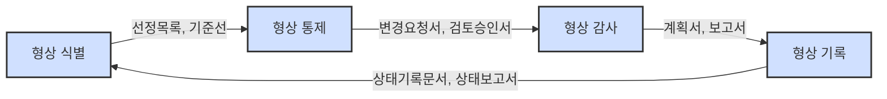

# 형상관리(SCM): 소프트웨어 라이프사이클 산출물의 체계적 관리 방법론

<!-- mtoc-start -->

- [정의 및 개념](#정의-및-개념)
- [주요 특징](#주요-특징)
- [형상관리 프로세스(식통감기)](#형상관리-프로세스식통감기)
- [베이스라인 체계](#베이스라인-체계)
- [활용 사례](#활용-사례)
- [기대 효과 및 필요성](#기대-효과-및-필요성)
- [마무리](#마무리)
- [Keywords](#keywords)

<!-- mtoc-end -->

형상관리(Software Configuration Management, SCM)는 소프트웨어의 비가시적 특성을 극복하고 체계적인 관리 체계를 수립하기 위한 핵심 프로세스입니다. 소프트웨어 개발 라이프사이클(SDLC) 전반에 걸쳐 생성되는 다양한 산출물을 체계적으로 관리함으로써 소프트웨어의 가시성, 추적성, 무결성을 확보하고 산출물 간 정합성을 보장하는 활동입니다.

## 정의 및 개념

- 정의: 소프트웨어 개발 라이프사이클 단계별 산출물을 체계적으로 관리하여 소프트웨어의 가시성, 추적성, 무결성을 확보하고 산출물의 정합성을 보장하는 활동.
- 필요성: 소프트웨어의 비가시성으로 인한 관리 어려움 극복, 잦은 변경에 따른 산출물 간 불일치 해결과 통제.
- 목적: 소프트웨어 산출물의 무결성 확보, 변경 통제 체계 수립, 개발 프로세스 투명성 보장.

## 주요 특징

- **산출물 기준선(Baseline) 관리**: 소프트웨어 개발 단계별로 기준선을 설정하여 산출물의 안정적인 상태를 정의하고 관리함
- **변경 통제 프로세스**: 소프트웨어 및 관련 산출물에 대한 모든 변경사항을 체계적으로 검토, 승인, 구현, 기록하는 프로세스 운영
- **버전 관리**: 소프트웨어 산출물의 변경 이력을 추적하고 필요시 과거 버전으로 롤백할 수 있는
- **추적성 확보**: 요구사항부터 최종 산출물까지 산출물 간 연관관계를 정의하고 추적 가능한 체계 구축
- **통합된 형상관리 환경**: 개발 조직 전체가 일관된 형상관리 체계 내에서 협업할 수 있는 환경 제공

## 형상관리 프로세스(식통감기)

형상관리 프로세스는 식별(Identification), 통제(Control), 감사(Audit), 기록(Status Accounting)의 4단계로 구성됩니다.

형상관리 프로세스는 형상 식별부터 시작하여 통제, 감사, 기록 단계를 순환적으로 반복하며 소프트웨어 산출물의 일관성과 무결성을 지속적으로 유지합니다.

## 베이스라인 체계

베이스라인(Baseline)은 소프트웨어 개발 라이프사이클 각 단계에서 공식적으로 검토되고 합의된 산출물의 기준점입니다.

| SDLC 단계                | 베이스라인 유형 | 주요 산출물                                                                   |
| ------------------------ | --------------- | ----------------------------------------------------------------------------- |
| 계획 단계                | 기능적 기준선   | 프로젝트 수행계획서, 요구사항 관리대장 및 정의서, 어플리케이션 기능구조도     |
| 요구분석                 | 분배적 기준선   | 엔터티 정의서, 데이터 흐름도, DFD, 용어집                                     |
| 설계 단계                | 설계 기준선     | ERD, UI정의서, 프로그램명세서, 인터페이스, 배치명세서                         |
| 구현 단계                | 시험 기준선     | 소스코드, 단위테스트시나리오/관리대장                                         |
| 시스템 통합 및 시험 단계 | 제품 기준선     | 통합테스트 계획서, 통합테스트 시나리오/관리대장, 성능테스트 시나리오/관리대장 |
| 설치 및 운영 단계        | 운용 기준선     | 사용자, 운영자 매뉴얼, 최종 산출물                                            |

각 단계별 베이스라인은 해당 단계의 산출물이 완성되고 승인되었음을 의미하며, 이후 변경 시에는 반드시 형상 통제 프로세스를 거쳐야 합니다.

## 활용 사례

- **대규모 소프트웨어 개발 프로젝트**: 여러 개발팀이 동시에 작업하는 환경에서 소스코드 및 문서의 일관성 유지
- **금융권 시스템 개발**: 엄격한 규제 준수를 위한 변경 이력 관리 및 감사 추적성 확보
- **DevOps 환경**: CI/CD 파이프라인과 연계하여 지속적 통합 및 배포 과정에서의 소프트웨어 품질 보장
- **오픈소스 프로젝트**: 분산된 개발자 커뮤니티에서 소스코드 기여 및 병합 과정의 체계화

## 기대 효과 및 필요성

- **품질 향상**: 체계적인 변경 관리를 통한 결함 감소 및 소프트웨어 품질 향상
- **리스크 감소**: 잘못된 변경으로 인한 시스템 장애 및 비즈니스 영향 최소화
- **감사 대응력 강화**: 변경 이력의 체계적 관리를 통한 규제 준수 및 감사 대응 능력 향상
- **생산성 증대**: 개발팀 간 협업 효율 향상 및 중복 작업 방지
- **비용 절감**: 변경 관리 체계화를 통한 재작업 감소 및 유지보수 비용 절감

## 마무리

형상관리는 소프트웨어 개발의 비가시성과 복잡성을 극복하고 체계적인 산출물 관리 체계를 구축하기 위한 필수적인 프로세스입니다. 특히 대규모 시스템 개발 및 운영 환경에서는 형상관리 체계의 도입을 통해 소프트웨어의 품질과 안정성을 확보할 수 있습니다. 형상관리의 효과적인 구현을 위해서는 조직의 개발 문화와 프로세스에 맞는 적절한 형상관리 도구 및 방법론의 선택이 중요합니다.

## Keywords

Software Configuration Management, 형상관리, Configuration Baseline, 기준선, 형상식별, 형상통제, Change Control, Version Control, 산출물 관리, 추적성, Traceability, 소프트웨어 품질, SDLC
