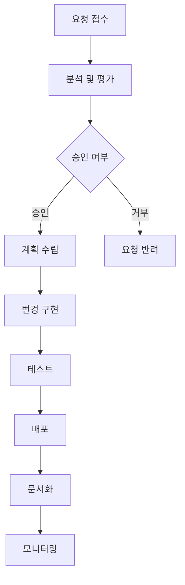

# SW 유지보수: 소프트웨어 생명주기의 핵심 가치 창출 프로세스

<!-- mtoc-start -->

- [정의 및 개념](#정의-및-개념)
- [주요 특징](#주요-특징)
- [유지보수 프로세스](#유지보수-프로세스)
- [활용 사례](#활용-사례)
- [기대 효과 및 필요성](#기대-효과-및-필요성)
- [효율적 유지보수를 위한 3R 원칙](#효율적-유지보수를-위한-3r-원칙)
- [마무리](#마무리)
- [Keywords](#keywords)

<!-- mtoc-end -->

소프트웨어 유지보수(Software Maintenance)는 소프트웨어의 효율적 운영과 지속적인 가치 창출을 위한 필수적인 활동입니다. 소프트웨어 생명주기에서 개발 이후 폐기 전까지의 단계로, 오류 수정, 요구사항 정정, 기능 개선 및 성능 향상을 위한 모든 활동을 포함합니다. ITSM(IT Service Management)과 ITIL(IT Infrastructure Library) 프레임워크 내에서 중요한 위치를 차지하며, 전체 소프트웨어 개발 생명주기(SDLC) 비용의 70~80%를 차지할 정도로 그 중요성이 큽니다.

## 정의 및 개념

- 소프트웨어 유지보수: 소프트웨어 제품의 오류 수정, 성능 개선, 변화하는 환경에 대한 적응을 위해 시스템 인도 후 수행되는 모든 활동.
- 목적: 소프트웨어의 생명 연장, 사용자 요구사항 충족, 시스템 신뢰성 확보, 변화하는 비즈니스 환경에 대응.
- 특징: 원인/시점/대상에 따른 분류, 유지보수성과 신뢰성 향상 추구, Lehman의 SW 변화 원리 적용.

## 주요 특징

- **수정 유지보수(Corrective Maintenance)**: 소프트웨어 운영 중 발견된 오류 수정 활동으로, 예상치 못한 결함이나 장애에 대응하는 즉각적 대응 활동.
- **적응 유지보수(Adaptive Maintenance)**: 변화하는 하드웨어, 운영체제, 환경 등 외부 요인에 소프트웨어를 적응시키기 위한 활동.
- **완전화 유지보수(Perfective Maintenance)**: 소프트웨어의 기능 향상, 성능 개선, 유지보수성 강화를 위한 활동으로 사용자 요구사항 반영.
- **예방 유지보수(Preventive Maintenance)**: 잠재적 문제를 사전에 식별하고 해결하여 미래의 유지보수 비용을 절감하는 활동.

## 유지보수 프로세스

유지보수 요청은 SCR(SW Change Report), MRF(Modification Request Form), CR(Change Request) 등의 형태로 접수되며, 체계적인 프로세스를 통해 관리됩니다.

유지보수 프로세스는 요청 접수부터 모니터링까지 체계적인 단계를 거치며, 각 단계별 산출물과 승인 절차를 통해 변경사항이 안정적으로 적용됩니다.

## 활용 사례

- **금융 시스템**: 법규 변경에 따른 적응 유지보수와 보안 취약점 개선을 위한 수정 유지보수 병행 수행
- **ERP 시스템**: 비즈니스 프로세스 변화에 따른 완전화 유지보수와 성능 최적화를 위한 예방 유지보수 실시
- **공공 서비스 플랫폼**: 접근성 향상과 새로운 디바이스 지원을 위한 적응 유지보수 수행
- **의료 정보 시스템**: 환자 데이터 처리 오류 수정과 새로운 의료 표준 적용을 위한 수정 및 적응 유지보수 진행

## 기대 효과 및 필요성

- **비용 효율성**: 초기 개발 비용보다 유지보수 비용이 SDLC의 70~80%를 차지하므로 효율적 관리를 통한 비용 절감 가능
- **시스템 안정성**: 지속적인 오류 수정과 개선을 통한 시스템 신뢰성 및 가용성 향상
- **비즈니스 연속성**: 변화하는 비즈니스 요구사항과 환경에 신속하게 대응하여 업무 연속성 보장
- **사용자 만족도**: 사용자 요구사항을 지속적으로 반영하여 시스템 사용성과 만족도 향상
- **규제 준수**: 변화하는 법규 및 규제 요구사항에 대응하여 컴플라이언스 유지

## 효율적 유지보수를 위한 3R 원칙

| 원칙                | 설명                 | 적용 방안                                     |
| ------------------- | -------------------- | --------------------------------------------- |
| Restructuring       | 소프트웨어 구조 개선 | 모듈화, 코드 리팩토링, 설계 패턴 적용         |
| Reengineering       | 시스템 재설계        | 아키텍처 개선, 기술 스택 현대화, 성능 최적화  |
| Reverse Engineering | 기존 시스템 분석     | 문서화되지 않은 시스템 이해, 레거시 코드 분석 |

## 마무리

소프트웨어 유지보수는 단순한 오류 수정 활동을 넘어 소프트웨어의 지속적인 가치 창출과 비즈니스 연속성을 보장하는 핵심 프로세스입니다. 효율적인 유지보수 체계를 구축하고 관리함으로써 소프트웨어 투자 가치를 극대화하고, 변화하는 비즈니스 환경에 유연하게 대응할 수 있습니다. Lehman의 SW 변화 원리를 고려한 체계적인 접근과 3R 원칙의 적용을 통해 유지보수 생산성과 효율성을 높이는 것이 중요합니다.

## Keywords

Software Maintenance, 수정유지보수, 적응유지보수, 완전화 유지보수, 예방 유지보수, Change Request, SDLC, 3R 원칙, 유지보수성, 소프트웨어 생명주기
