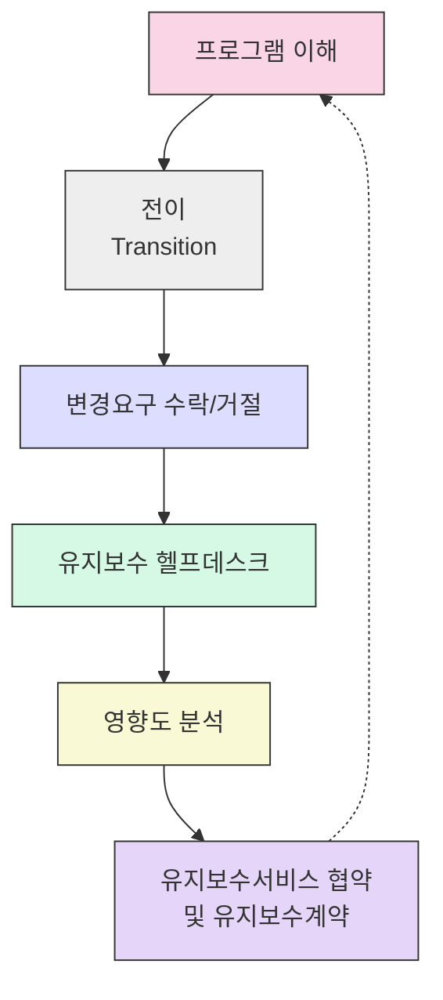

# SW 유지보수 활동: 효과적인 소프트웨어 수명주기 관리 전략

<!-- mtoc-start -->

- [정의 및 개념](#정의-및-개념)
- [주요 특징](#주요-특징)
- [6가지 핵심 활동](#6가지-핵심-활동)
  - [1. 프로그램 이해](#1-프로그램-이해)
  - [2. 전이(Transition)](#2-전이transition)
  - [3. 변경요구 수락/거절](#3-변경요구-수락거절)
  - [4. 유지보수 헬프데스크](#4-유지보수-헬프데스크)
  - [5. 영향도 분석](#5-영향도-분석)
  - [6. 유지보수서비스 협약 및 유지보수계약](#6-유지보수서비스-협약-및-유지보수계약)
- [활용 사례](#활용-사례)
- [기대 효과 및 필요성](#기대-효과-및-필요성)
- [마무리](#마무리)
- [Keywords](#keywords)

<!-- mtoc-end -->

소프트웨어 유지보수 활동(Software Maintenance Activities)은 애플리케이션의 전체 생명주기 중 가장 긴 기간을 차지하는 중요한 단계입니다. 개발이 완료된 소프트웨어가 지속적으로 가치를 제공하고 변화하는 비즈니스 요구사항에 대응하기 위해서는 체계적인 유지보수 프로세스가 필수적입니다. 이러한 유지보수 활동은 단순한 오류 수정을 넘어 시스템의 안정성, 확장성 및 효율성을 보장하는 종합적인 관리 체계를 의미합니다.

## 정의 및 개념

- SW 유지보수: 소프트웨어 시스템이 배포된 후 결함 수정, 성능 개선, 변화하는 환경에 적응시키기 위한 모든 활동.
- 목적: 소프트웨어의 가용성과 신뢰성 유지, 사용자 요구사항 변화 대응, 시스템 수명 연장을 통한 투자 가치 극대화.
- 특징: 전체 소프트웨어 생명주기 비용의 약 60~80%를 차지하는 핵심 활동으로, 체계적인 관리 필요.

## 주요 특징

1. **지속적인 프로세스**: 소프트웨어 배포 이후부터 시작되어 시스템 폐기 시점까지 계속되는 순환적 활동
2. **변경 중심 접근법**: 오류 수정, 기능 개선, 환경 적응, 예방적 유지보수 등 다양한 변경 유형 관리
3. **복잡성 관리**: 기존 시스템 구조와 기능에 대한 깊은 이해를 바탕으로 변경 영향도 최소화
4. **이해관계자 관리**: 사용자, 관리자, 개발자 등 다양한 이해관계자 요구사항의 균형 있는 반영과 협업 체계 구축
5. **문서화와 추적성**: 모든 변경사항과 결정에 대한 체계적인 기록과 추적을 통한 지식 관리

## 6가지 핵심 활동

SW 유지보수 6가지 핵심 활동은 순환적 프로세스로 구성되어 있으며, 각 단계는 상호 연결되어 효과적인 유지보수 체계를 구축합니다. 이러한 활동들은 소프트웨어의 지속적인 개선과 안정적인 운영을 위한 기반을 제공합니다.

### 1. 프로그램 이해

- 기존 시스템의 구조, 기능, 관계 및 코드에 대한 포괄적 분석과 이해
- 유지보수 작업의 기초가 되는 역공학(Reverse Engineering) 및 문서화 활동 수행
- 시스템 복잡성을 관리하기 위한 지식 구축 및 공유 메커니즘 구현

### 2. 전이(Transition)

- 개발팀에서 유지보수팀으로의 원활한 책임 이전 및 지식 전달 과정
- 필요 문서, 소스코드, 개발 환경, 테스트 케이스 등 모든 관련 자산의 체계적 이관
- 개발자와 유지보수 담당자 간의 명확한 커뮤니케이션 체계 확립

### 3. 변경요구 수락/거절

- 사용자 요구사항, 오류 보고, 기능 개선 제안에 대한 체계적 평가 프로세스
- 비즈니스 가치, 기술적 실현 가능성, 비용, 일정, 리스크 등을 고려한 변경 우선순위 결정
- 명확한 변경 요청 처리 워크플로우 및 의사결정 기준 수립

### 4. 유지보수 헬프데스크

- 사용자 문의, 오류 보고, 서비스 요청 등을 일원화하여 관리하는 창구
- 문제 유형별 분류, 우선순위 부여, 담당자 배정 등 체계적 티켓 관리
- 반복적 문제에 대한 지식 데이터베이스 구축 및 사용자 자가 해결 지원

### 5. 영향도 분석

- 제안된 변경이 시스템의 다른 부분에 미치는 영향을 식별하고 평가하는 과정
- 종속성 매핑, 리스크 분석, 테스트 범위 결정을 통한 안전한 변경 관리
- 변경 실행 전 잠재적 부작용 예측 및 완화 전략 수립

### 6. 유지보수서비스 협약 및 유지보수계약

- 서비스 수준, 응답 시간, 해결 시간, 비용 등에 관한 명확한 계약 조건 정의
- SLA(서비스수준협약) 및 KPI 설정을 통한 유지보수 서비스 품질 관리
- 정기적 서비스 검토, 성과 평가 및 서비스 개선 체계 구축

## 활용 사례

1. **금융권 레거시 시스템 현대화**: 30년 이상 운영된 코어뱅킹 시스템의 단계적 현대화 과정에서 6가지 유지보수 활동을 체계적으로 적용하여 서비스 중단 없이 시스템 전환 성공

2. **공공 서비스 플랫폼 확장**: 증가하는 사용자 요구에 대응하기 위해 영향도 분석과 유지보수 헬프데스크를 강화하여 연간 다운타임 50% 감소 및 사용자 만족도 향상

3. **의료정보시스템 규제 대응**: 변화하는 의료 데이터 규제에 신속히 대응하기 위한 변경요구 관리 프로세스 개선을 통해 컴플라이언스 리스크 최소화

4. **글로벌 ERP 시스템 운영**: 다국적 기업의 ERP 시스템에 대한 명확한 유지보수 서비스 협약 수립으로 지역별 요구사항 대응 및 일관된 서비스 품질 유지

## 기대 효과 및 필요성

- **비용 효율성**: 체계적인 유지보수 활동을 통해 소프트웨어 생명주기 비용의 40~60% 절감 가능
- **시스템 안정성**: 잘 설계된 유지보수 프로세스로 예기치 않은 장애 및 다운타임 최소화
- **비즈니스 연속성**: 변화하는 비즈니스 요구와 규제 환경에 신속하게 대응하여 경쟁력 유지
- **지식 관리**: 시스템에 대한 지식과 노하우의 체계적 축적 및 공유를 통한 인적 의존도 감소
- **투자 가치 극대화**: 소프트웨어 자산의 수명 연장과 지속적인 가치 창출로 ROI 향상
- **리스크 관리**: 영향도 분석 및 체계적 변경 관리를 통한 잠재적 문제 예방

## 마무리

SW 유지보수 6가지 활동은 소프트웨어의 안정적 운영과 지속적 개선을 위한 필수적인 프레임워크입니다. 개발 단계에 비해 상대적으로 주목받지 못하지만, 실제로는 소프트웨어의 총 소유비용과 비즈니스 가치에 더 큰 영향을 미치는 중요한 활동입니다. 조직은 단순한 문제 해결을 넘어 전략적인 유지보수 체계를 구축함으로써 IT 자산의 가치를 극대화하고 디지털 혁신의 기반을 마련할 수 있습니다. 특히 디지털 전환이 가속화되는 현재 환경에서, 체계적인 유지보수 활동은 기존 시스템과 새로운 기술 간의 원활한 통합을 지원하는 핵심 역량이 될 것입니다.

## Keywords

Software Maintenance, 유지보수 활동, Program Understanding, Transition, 변경요구 관리, Maintenance Helpdesk, Impact Analysis, 유지보수서비스협약(MSA), 소프트웨어 수명주기, SLA 관리
