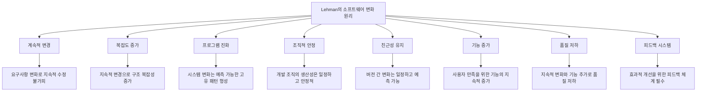

# Lehman의 소프트웨어 변화원리: 효율적 SW 유지관리 전략

<!-- mtoc-start -->

- [정의 및 개념](#정의-및-개념)
- [주요 특징](#주요-특징)
- [Lehman의 소프트웨어 변화 원리](#lehman의-소프트웨어-변화-원리)
- [활용 사례](#활용-사례)
- [기대 효과 및 필요성](#기대-효과-및-필요성)
- [마무리](#마무리)
- [Keywords](#keywords)

<!-- mtoc-end -->

소프트웨어 유지보수(Software Maintenance)는 개발 이후 소프트웨어의 생명주기에서 가장 많은 비용과 시간이 소요되는 활동입니다. Lehman의 소프트웨어 변화원리는 이러한 유지보수 과정에서 발생하는 필연적인 패턴과 원칙을 체계화하여, 효과적인 유지보수 전략 수립의 기반을 제공합니다.

## 정의 및 개념

- 소프트웨어 변화원리: 진화하는 소프트웨어 시스템에서 나타나는 보편적인 패턴과 법칙을 설명하는 Meir M. Lehman이 제시한 이론적 프레임워크.
- 적용 시스템: E-타입(Evolving-type) 시스템을 중심으로 실세계 문제를 해결하기 위해 지속적으로 변화하는 소프트웨어에 적용되는 원리.

## 주요 특징

- **계속적 변경의 불가피성**: 소프트웨어는 요구사항 변화, 환경 변화, 기술 발전 등으로 인해 지속적인 변경이 필요하며, 변경되지 않는 소프트웨어는 점차 유용성이 감소함
- **시스템 구조의 변화**: 계속된 변경으로 인해 소프트웨어의 구조는 점차 복잡해지고, 이는 유지보수 비용 증가와 품질 저하로 이어짐
- **변화 패턴의 예측 가능성**: 소프트웨어의 변화는 고유한 패턴과 추세를 따르며, 이를 이해함으로써 효율적인 유지보수 전략 수립 가능
- **개발 조직의 안정성 중요**: 소프트웨어의 진화 속도는 개발 조직의 안정성과 역량에 의해 제한되므로 조직 역량 관리가 중요함

## Lehman의 소프트웨어 변화 원리

Lehman의 8가지 소프트웨어 변화원리(계복진조 친기품피)는 소프트웨어의 진화 과정에서 발생하는 자연스러운 현상들을 체계화한 것으로, 각 원리는 유지보수 과정에서 발생하는 도전과제와 이에 대응하기 위한 전략적 시사점을 제공합니다.

## 활용 사례

- **IBM 메인프레임 운영체제**: Lehman이 초기 연구를 진행한 대상으로, 20년 이상의 진화 과정에서 발견된 패턴을 통해 원리 도출
- **기업 ERP 시스템**: 계속적 변경과 복잡도 증가 원리에 기반하여 모듈화 설계와 주기적 리팩토링을 통한 복잡도 관리
- **은행 코어뱅킹 시스템**: 조직적 안정과 품질 저하 원리를 고려한 점진적 현대화 전략 적용으로 시스템 안정성 유지
- **통신사 고객관리 시스템**: 피드백 시스템 원리를 적용한 사용자 피드백 기반 개선 프로세스 구축으로 품질 향상

## 기대 효과 및 필요성

- **변화 예측 및 계획 수립**: 소프트웨어 변화의 본질적 패턴을 이해함으로써 장기적 유지보수 전략 및 자원 계획 수립 가능
- **복잡도 관리**: 지속적인 변경에 따른 복잡도 증가를 예상하고 이에 대응하는 아키텍처 설계 및 리팩토링 전략 수립
- **품질 관리 강화**: 품질 저하 원리를 인식하여 지속적인 품질 모니터링 및 개선 활동 체계화
- **조직 역량 최적화**: 조직적 안정 원리를 고려한 개발팀 구성 및 역량 강화를 통해 유지보수 효율성 증대
- **사용자 만족도 향상**: 기능 증가와 친근성 유지 원리를 활용한 사용자 중심 기능 개선 및 인터페이스 일관성 유지

## 마무리

Lehman의 소프트웨어 변화원리는 소프트웨어 유지보수의 본질적 특성을 이해하는 중요한 이론적 틀을 제공합니다. 이 원리들을 인식하고 적용함으로써 조직은 소프트웨어 시스템의 지속적인 변화에 효과적으로 대응하고, 유지보수 비용과 노력을 최적화하며, 시스템의 장기적 가치를 보존할 수 있습니다. 복잡도 관리, 품질 보장, 사용자 만족도 향상을 위한 전략 수립 시 Lehman의 원리를 고려하는 것이 효과적인 소프트웨어 유지보수의 핵심입니다.

## Keywords

Software Evolution, Lehman's Laws, 계속적 변경, 복잡도 증가, 프로그램 진화, 조직적 안정, 친근성 유지, 기능 증가, 품질 저하, 피드백 시스템
