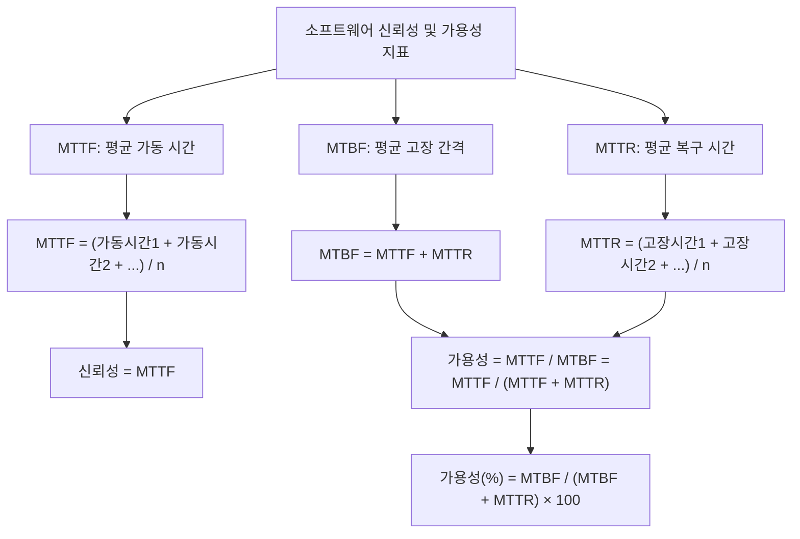

# 소프트웨어 신뢰성과 가용성: 시스템 안정성 평가를 위한 핵심 지표

<!-- mtoc-start -->

- [정의 및 개념](#정의-및-개념)
- [주요 특징](#주요-특징)
- [핵심 측정 지표](#핵심-측정-지표)
- [확률 분포 모델](#확률-분포-모델)
  - [지수 분포 모델](#지수-분포-모델)
  - [와이블 분포 모델](#와이블-분포-모델)
  - [라무스-모델](#라무스-모델)
- [활용 사례](#활용-사례)
- [기대 효과 및 필요성](#기대-효과-및-필요성)
- [마무리](#마무리)
- [Keywords](#keywords)

<!-- mtoc-end -->

소프트웨어 신뢰성과 가용성(Software Reliability and Availability)은 시스템의 안정적인 운영과 서비스 품질 보장을 위한 핵심 지표입니다. 이 두 가지 요소는 소프트웨어 품질 측정에 있어 상호 보완적인 역할을 하며, 시스템 장애 발생 빈도와 복구 능력을 정량적으로 평가할 수 있는 기준을 제공합니다. 특히 금융, 의료, 국방 등 고신뢰성이 요구되는 시스템에서는 이러한 지표의 관리가 더욱 중요한 의미를 가집니다.

## 정의 및 개념

- 소프트웨어 신뢰성: 주어진 환경에서 지정된 시간 동안 소프트웨어가 장애 없이 의도된 기능을 수행할 확률. 장애 발생까지의 시간(MTTF)을 통해 정량적 측정 가능.
- 소프트웨어 가용성: 시스템이 필요할 때 정상적으로 작동할 확률. MTTF/(MTTR+MTTF) 또는 MTBF/(MTBF+MTTR)\*100으로 계산되며 백분율로 표현.

## 주요 특징

- **확률적 접근**: 신뢰성과 가용성은 모두 확률적 개념으로, 특정 기간 동안의 시스템 동작 예측에 활용
- **상호 연관성**: 신뢰성이 높으면 가용성도 향상되나, 동일한 개념은 아님. 복구 시간(MTTR)이 가용성에 추가적으로 영향
- **측정 가능성**: 명확한 수학적 공식을 통해 정량적 측정 가능. 이를 통해 객관적인 품질 평가 지표로 활용
- **시간 기반 분석**: 고장 간격(MTBF), 가동 시간(MTTF), 복구 시간(MTTR) 등 시간 기반 지표를 통해 분석

## 핵심 측정 지표

소프트웨어 신뢰성과 가용성 측정을 위한 핵심 지표들의 관계를 보여줍니다. MTBF, MTTF, MTTR은 상호 연관되어 있으며, 이를 통해 시스템의 신뢰성과 가용성을 정량적으로 계산할 수 있습니다.

## 확률 분포 모델

소프트웨어 신뢰성은 다양한 확률 분포 모델을 통해 예측할 수 있습니다:

### 지수 분포 모델

- 가장 기본적인 신뢰성 모델로, 일정한 고장률 가정
- 신뢰도 함수: R(t) = e^(-λt), λ는 고장률

### 와이블 분포 모델

- 비일정 고장률 상황에 적합한 모델
- 형상 모수(β)와 척도 모수(η)를 통해 다양한 고장 패턴 표현 가능
- 신뢰도 함수: R(t) = e^(-(t/η)^β)

### 라무스-모델

- 소프트웨어 고유의 신뢰성 예측 모델
- 잔존 결함 수와 발견 속도를 기반으로 신뢰성 예측

## 활용 사례

- **임무 중요 시스템**: 항공 우주, 의료기기, 국방 시스템 등에서 안전성 보장을 위한 핵심 지표로 활용
- **클라우드 서비스**: SLA(서비스 수준 협약) 설정 및 모니터링에 활용하여 고객에게 서비스 품질 보장
- **데브옵스 환경**: CI/CD 파이프라인에서 릴리스 결정을 위한 품질 게이트로 활용
- **금융 시스템**: 거래 처리 시스템의 안정성 보장 및 장애 복구 계획 수립에 활용

## 기대 효과 및 필요성

- **장애 예측 가능성**: 정량적 지표를 통해 시스템 장애 발생 가능성 예측 및 선제적 대응 가능
- **자원 최적화**: 적절한 시스템 이중화 및 복구 전략 수립을 통한 비용 효율적 운영
- **품질 보증**: 개발 단계별 명확한 품질 기준 제시를 통한 제품 완성도 향상
- **비즈니스 연속성**: 시스템 가용성 보장을 통한 서비스 중단 최소화 및 비즈니스 연속성 확보
- **규제 준수**: 금융, 의료 등 규제 산업에서 요구하는 시스템 신뢰성 기준 충족

## 마무리

소프트웨어 신뢰성과 가용성 지표는 시스템의 안정적 운영을 위한 핵심 척도입니다. MTTF, MTBF, MTTR과 같은 정량적 지표를 활용하여 소프트웨어의 품질을 객관적으로 평가하고, 이를 통해 시스템 장애 위험을 최소화할 수 있습니다. 특히 비즈니스 중요도가 높은 시스템일수록 이러한 지표의 체계적인 관리가 반드시 필요하며, 개발 초기 단계부터 신뢰성과 가용성 목표를 설정하고 지속적으로 모니터링하는 것이 중요합니다.

## Keywords

Software Reliability, Software Availability, MTTF(Mean Time To Failure), MTBF(Mean Time Between Failures), MTTR(Mean Time To Repair), 신뢰성 확률 분포, 가용성 측정, 고장률, 시스템 안정성, 품질 지표
