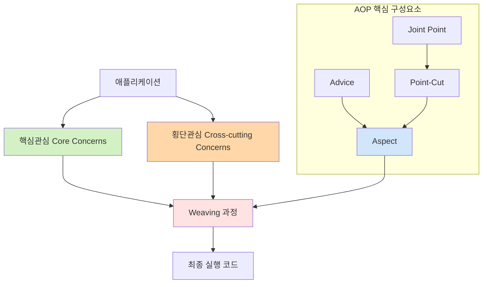

# AOP (Aspect-Oriented Programming): 관점지향의 새로운 객체지향 방식

<!-- mtoc-start -->

- [정의 및 개념](#정의-및-개념)
- [주요 특징](#주요-특징)
- [아키텍처](#아키텍처)
- [구성요소](#구성요소)
- [활용 사례](#활용-사례)
- [기대 효과 및 필요성](#기대-효과-및-필요성)
- [마무리](#마무리)
- [Keywords](#keywords)

<!-- mtoc-end -->

AOP(Aspect-Oriented Programming)는 관심사의 분리 원칙에 기반하여 시스템의 구성요소를 핵심관심사와 횡단관심사로 명확히 구분하고, 이를 Weaving이라는 특별한 프로세스를 통해 결합하는 프로그래밍 패러다임입니다. 기존 객체지향 프로그래밍의 한계를 보완하여 코드의 모듈화와 재사용성을 향상시키는 방법론으로, 특히 로깅, 보안, 트랜잭션 관리와 같은 공통 기능을 효과적으로 구현할 수 있게 해줍니다.

## 정의 및 개념

- AOP: 시스템의 기능을 핵심관심사(Core Concerns)와 횡단관심사(Cross-cutting Concerns)로 분리하고, Weaving 과정을 통해 이들을 결합하는 프로그래밍 방법론.
- 목적: 관심사의 분리를 통한 코드 중복 제거, 모듈화 향상, 유지보수성 증대 및 프로그램 구조의 단순화.
- 특징: 모듈화, 캡슐화, 단순화를 통한 코드 품질 향상과 개발 생산성 증대.

## 주요 특징

- **관심사 분리**: 핵심 비즈니스 로직과 공통 기능을 명확히 구분하여 코드의 가독성과 유지보수성 향상
- **코드 중복 제거**: 횡단관심사를 한 곳에서 관리함으로써 코드 중복을 최소화하고 일관된 구현 보장
- **비침투적 개발**: 기존 코드 수정 없이 새로운 기능을 추가할 수 있어 개발 유연성 증대
- **동적 적용 가능**: 런타임 시점에 Aspect를 적용할 수 있어 시스템 확장성 및 유연성 제공
- **디자인 패턴 활용**: Visitor 패턴과 Proxy 패턴을 활용하여 효과적인 구현 지원

## 아키텍처

AOP는 핵심관심사와 횡단관심사를 분리한 후, Weaving 과정을 통해 이들을 결합합니다. Joint Point에서 Point-Cut으로 삽입 위치를 결정하고, Advice를 통해 횡단관심 코드가 실행되며, 이 모든 요소가 Aspect로 캡슐화됩니다.

## 구성요소

- **핵심관심(Core Concerns)**: 시스템이 추구하는 핵심 비즈니스 로직으로, 애플리케이션의 주요 기능 구현
- **횡단관심(Cross-cutting Concerns)**: 핵심관심에 공통적으로 적용되는 부가 기능(로깅, 보안, 트랜잭션 등)
- **Joint Point**: 횡단관심의 기능이 삽입될 수 있는 애플리케이션 실행 지점(메소드 호출, 필드 접근 등)
- **Point-Cut**: 어떤 Joint Point를 사용할 것인지 선택하는 표현식으로, 관심 분리점 지정
- **Advice**: Joint Point에 삽입되어 동작하는 코드로, 실제 횡단관심 구현체
- **Aspect**: Point-Cut과 Advice를 합쳐놓은 모듈로, AOP의 핵심 단위
- **Weaving**: Joint-Point에 Advice를 삽입하는 과정으로, 컴파일 시점, 로드 시점, 런타임 시점에 수행 가능

## 활용 사례

- **엔터프라이즈 애플리케이션**: 트랜잭션 관리, 보안, 로깅 등의 공통 기능을 핵심 비즈니스 로직과 분리하여 구현
- **프레임워크 개발**: Spring Framework에서 AOP를 활용한 선언적 트랜잭션 관리 및 보안 기능 제공
- **모니터링 시스템**: 성능 측정, 에러 추적 등의 모니터링 기능을 기존 코드 변경 없이 추가
- **테스트 환경 구축**: 단위 테스트를 위한 Mock 객체 주입이나 테스트 환경 설정을 AOP로 처리
- **레거시 시스템 확장**: 기존 코드 수정 없이 새로운 기능을 횡단관심으로 추가하여 시스템 확장

## 기대 효과 및 필요성

- **코드 품질 향상**: 관심사 분리를 통해 코드의 가독성, 유지보수성, 재사용성 증대
- **개발 생산성 증가**: 공통 기능의 중복 코드 제거로 개발 시간 단축 및 오류 감소
- **변경 용이성**: 횡단관심사의 변경이 핵심 비즈니스 로직에 영향을 주지 않아 변경 관리 용이
- **일관성 보장**: 공통 기능이 일관되게 적용되어 시스템 전반의 품질 향상
- **확장성 개선**: 새로운 횡단관심사를 기존 코드 수정 없이 추가할 수 있어 시스템 확장성 증대

## 마무리

AOP는 객체지향 프로그래밍의 한계를 보완하여 관심사를 효과적으로 분리함으로써 코드의 모듈화와 유지보수성을 크게 향상시키는 프로그래밍 패러다임입니다. 특히 엔터프라이즈 애플리케이션 개발에서 횡단관심사를 효율적으로 관리할 수 있게 해주며, Spring과 같은 프레임워크의 핵심 개념으로 자리 잡았습니다. 복잡한 시스템을 구현할 때 AOP의 도입을 고려한다면 코드 품질과 개발 생산성을 동시에 향상시킬 수 있을 것입니다.

## Keywords

Aspect-Oriented Programming, Core Concerns, Cross-cutting Concerns, Joint Point, Point-Cut, Advice, Weaving, 관점지향 프로그래밍, 핵심관심사, 횡단관심사, 관심사 분리, 모듈화
