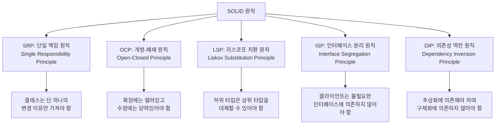

# OOP 5대 원칙(SOLID): 소프트웨어 유지보수성을 혁신하는 객체지향 설계 원리

<!-- mtoc-start -->

- [정의 및 개념](#정의-및-개념)
- [주요 특징](#주요-특징)
- [SOLID 원칙](#solid-원칙)
- [SOLID 원칙 상세 설명](#solid-원칙-상세-설명)
- [활용 사례](#활용-사례)
- [기대 효과 및 필요성](#기대-효과-및-필요성)
- [마무리](#마무리)
- [Keywords](#keywords)

<!-- mtoc-end -->

객체지향 프로그래밍(Object-Oriented Programming, OOP)의 핵심 설계 원칙인 SOLID는 소프트웨어 개발에 있어 코드의 유지보수성, 확장성, 그리고 재사용성을 극대화하기 위한 지침입니다. 로버트 마틴(Robert C. Martin)에 의해 정립된 이 5가지 원칙은 복잡한 소프트웨어 시스템의 설계 과정에서 발생할 수 있는, 주여러운 구조적 문제를 방지하는 데 크게 기여합니다. SOLID 원칙을 적용함으로써 소프트웨어 엔지니어는 변경에 유연하게 대응할 수 있는 시스템을 구축할 수 있으며, 장기적인 관점에서 개발 비용 절감과 품질 향상을 실현할 수 있습니다.

## 정의 및 개념

- 정의: 객체지향 설계의 5가지 핵심 원칙을 하나로 묶은 약어로, 유지보수가 용이하고 확장성 높은 소프트웨어 개발을 위한 설계 지침.
- 목적: 코드 품질 향상, 버그 발생 감소, 소프트웨어 수명 연장, 개발자 간 협업 효율화를 통한 장기적 개발 비용 절감.
- 특징: 인터페이스를 통한 메시징, 단일 책임 부여, 구현보다 추상화에 의존하는 설계 패턴 적용.

## 주요 특징

- **강결합 방지**: 각 모듈 간 의존성을 최소화하여 한 부분의 변경이 다른 부분에 미치는 영향을 감소시킴.
- **모듈화 증진**: 작고 독립적인 모듈로 시스템을 구성하여 재사용성을 높이고 테스트 용이성 확보.
- **확장성 향상**: 기존 코드 수정 없이 새로운 기능 추가가 가능한 구조로 설계하여 확장에 유리한 아키텍처 구현.
- **코드 가독성 개선**: 명확한 책임 분리를 통해 코드의 의도를 분명히 하고 유지보수 효율성 증대.
- **애자일 개발 지원**: 빠른 변경과 반복적 개발에 적합한 구조를 제공하여 민첩한 개발 방법론 지원.

## SOLID 원칙

SOLID 원칙은 단일 책임, 개방-폐쇄, 리스코프 치환, 인터페이스 분리, 의존성 역전의 5가지 핵심 원칙으로 구성되며, 각 원칙은 소프트웨어 설계의 특정 측면을 다루어 전체적인 시스템 품질을 향상시킵니다. 이 원칙들은 서로 상호보완적으로 작용하여 견고한 객체지향 설계를 가능하게 합니다.

## SOLID 원칙 상세 설명

| 원칙    | 원칙명                                                     | 정의                                                                                                                                                                 | 핵심 개념                                                                                                        | 적용 방법                                                                                                                                     | 위반 사례                                                                                                      | 적용 이점                                                                                            | 코드 예시                                                                |
| ------- | ---------------------------------------------------------- | -------------------------------------------------------------------------------------------------------------------------------------------------------------------- | ---------------------------------------------------------------------------------------------------------------- | --------------------------------------------------------------------------------------------------------------------------------------------- | -------------------------------------------------------------------------------------------------------------- | ---------------------------------------------------------------------------------------------------- | ------------------------------------------------------------------------ |
| **SRP** | **단일 책임 원칙** (Single Responsibility Principle)       | 클래스는 단 하나의 책임만 가져야 하며, 클래스를 변경하는 이유는 오직 하나뿐이어야 한다.                                                                              | • 하나의 클래스는 하나의 목적만 가져야 함 • 클래스 변경의 이유는 오직 하나뿐이어야 함 • 책임 = 변경의 이유 | • 기능별로 클래스 분리 • 관심사 분리(Separation of Concerns) • 응집도 높은 클래스 설계 • 대규모 클래스 리팩토링                      | • 만능 클래스(God Class) 생성 • 여러 책임이 하나의 클래스에 혼합 • 클래스가 여러 이유로 변경됨           | • 코드 가독성 향상 • 유지보수 용이 • 테스트 단순화 • 재사용성 증가 • 버그 영향 범위 축소 | 사용자 정보 관리와 인증을 별도 클래스로 분리                             |
| **OCP** | **개방-폐쇄 원칙** (Open-Closed Principle)                 | 소프트웨어 개체(클래스, 모듈, 함수 등)는 확장에 대해 열려 있어야 하고, 수정에 대해서는 닫혀 있어야 한다.                                                             | • 기존 코드 변경 없이 기능 확장 가능 • 인터페이스와 추상화를 통한 설계 • 구현보다 추상화에 의존            | • 추상 클래스/인터페이스 활용 • 상속 또는 합성 패턴 적용 • 전략 패턴 활용 • 플러그인 아키텍처 구현                                   | • 기능 추가 시 기존 코드 수정 필요 • if-else 또는 switch 문 남용 • 확장 지점이 없는 폐쇄적 설계          | • 위험 없는 기능 확장 • 유연한 아키텍처 • 코드 재사용성 향상 • 유지보수 비용 감소           | 도형 클래스 계층에서 새 도형 추가 시 기존 코드 변경 불필요               |
| **LSP** | **리스코프 치환 원칙** (Liskov Substitution Principle)     | 프로그램의 객체는 프로그램의 정확성을 깨뜨리지 않으면서 하위 타입의 인스턴스로 바꿀 수 있어야 한다.                                                                  | • 하위 클래스는 상위 클래스의 계약을 준수해야 함 • 행동 호환성 보장 • IS-A 관계의 진정한 의미              | • 상속보다 합성 고려 • 계약에 의한 프로그래밍 • 행동 호환성 검증 • 파생 클래스 설계 시 주의                                          | • 하위 클래스가 상위 클래스 메서드 동작 변경 • 예외 추가 또는 리턴 타입 변경 • 기대하지 않은 부작용 발생 | • 다형성 올바르게 활용 • 코드 재사용성 향상 • 유지보수 용이 • 확장 가능한 설계              | Rectangle과 Square 관계에서 Square가 Rectangle의 행동을 완전히 대체 가능 |
| **ISP** | **인터페이스 분리 원칙** (Interface Segregation Principle) | 클라이언트는 자신이 사용하지 않는 메서드에 의존하도록 강제되어서는 안 된다.                                                                                          | • 인터페이스는 클라이언트 관점에서 설계 • 최소한의 인터페이스 제공 • 역할별 인터페이스 분리                | • 큰 인터페이스를 작은 단위로 분리 • 클라이언트별 인터페이스 설계 • 단일 책임 인터페이스 생성 • 선택적 기능은 별도 인터페이스로 분리 | • 비대한 인터페이스 설계 • 클라이언트가 불필요한 메서드에 의존 • 한 인터페이스에 여러 책임 혼합          | • 불필요한 의존성 제거 • 시스템 결합도 감소 • 인터페이스 변경 영향 최소화 • 유연한 설계     | 프린터 인터페이스를 인쇄, 스캔, 팩스 등 기능별로 분리                    |
| **DIP** | **의존성 역전 원칙** (Dependency Inversion Principle)      | 고수준 모듈은 저수준 모듈에 의존해서는 안 되며, 둘 모두 추상화에 의존해야 한다. 추상화는 구체적인 사항에 의존해서는 안 되며, 구체적인 사항은 추상화에 의존해야 한다. | • 구현보다 인터페이스에 의존 • 구체적인 것보다 추상적인 것에 의존 • 의존성 방향 역전                       | • 의존성 주입(DI) 활용 • 인터페이스 또는 추상 클래스 정의 • 팩토리 패턴 적용 • IoC 컨테이너 사용                                     | • 구체 클래스에 직접 의존 • 직접 객체 생성 • 구현 세부사항에 의존                                        | • 모듈 간 결합도 감소 • 테스트 용이성 향상 • 유연한 시스템 구조 • 코드 재사용성 증가        | 데이터베이스 구현체가 아닌 저장소 인터페이스에 의존하는 서비스 계층      |

## 활용 사례

- **엔터프라이즈 애플리케이션**: 대규모 기업용 소프트웨어에서 SOLID 원칙을 적용하여 복잡한 비즈니스 로직을 관리하고 시스템 확장성 확보.
- **프레임워크 개발**: Spring, Angular 등 많은 현대적 프레임워크는 SOLID 원칙을 기반으로 설계되어 유연한 구조와 플러그인 방식의 확장 메커니즘 제공.
- **마이크로서비스 아키텍처**: 각 서비스가 단일 책임을 가지고 독립적으로 운영되는 마이크로서비스 구축에 SOLID 원칙 적용.
- **레거시 시스템 리팩토링**: 유지보수가 어려운 레거시 코드를 SOLID 원칙에 따라 재구성하여 기술 부채 감소 및 시스템 수명 연장.
- **모바일 애플리케이션**: 다양한 기기와 화면 크기에 적응해야 하는 모바일 앱에서 유연성과 확장성을 위해 SOLID 원칙 활용.

## 기대 효과 및 필요성

- **유지보수 비용 감소**: 명확한 책임 분리와 낮은 결합도로 인해 코드 변경 시 영향 범위가 제한되어 유지보수 비용 절감.
- **버그 감소**: 각 컴포넌트의 책임이 명확하게 정의되어 있어 예측 가능한 동작과 버그 발생 가능성 감소.
- **팀 협업 효율화**: 모듈화된 설계로 인해 개발자들이 독립적으로 작업할 수 있어 병렬 개발 및 협업 효율성 향상.
- **테스트 용이성**: 단일 책임과 의존성 분리로 인해 단위 테스트 작성이 용이해지고 테스트 커버리지 증가.
- **비즈니스 변화 대응력 강화**: 변경에 유연한 구조로 인해 빠르게 변화하는 비즈니스 요구사항에 신속하게 대응 가능.
- **코드 재사용성 증가**: 잘 설계된 인터페이스와 컴포넌트로 인해 코드 재사용이 용이해지고 개발 생산성 향상.

## 마무리

SOLID 원칙은 객체지향 소프트웨어 개발에 있어 단순한 이론적 개념을 넘어 실질적인 가치를 제공하는 핵심 설계 지침입니다. 단일 책임, 개방-폐쇄, 리스코프 치환, 인터페이스 분리, 의존성 역전이라는 5가지 원칙을 통해 개발자들은 변경에 강건하고 유지보수가 용이한 시스템을 구축할 수 있습니다. 소프트웨어의 복잡성이 증가하고 비즈니스 환경이 빠르게 변화하는 현대 IT 환경에서, SOLID 원칙의 적용은 지속 가능한 소프트웨어 개발을 위한 필수적인 요소로 자리잡고 있습니다.

## Keywords

SOLID Principles, 객체지향 설계, Single Responsibility Principle, 개방-폐쇄 원칙, Liskov Substitution, 인터페이스 분리, 의존성 역전, 소프트웨어 유지보수성, 코드 응집도, 느슨한 결합
