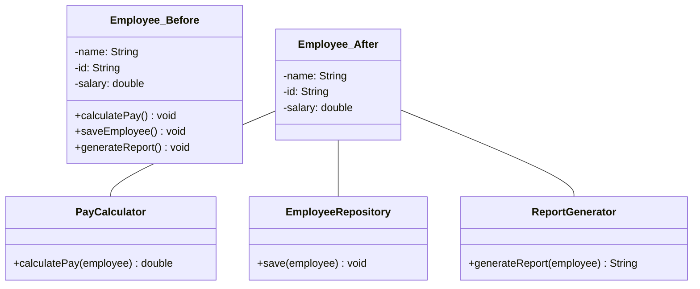

# SRP(Single Responsibility Principle): 단일책임의 원칙

소프트웨어 개발에서 견고하고 유지보수가 용이한 시스템을 구축하기 위한 핵심 원칙 중 하나인 단일 책임 원칙(Single Responsibility Principle, SRP)은 객체 지향 프로그래밍의 기본이 되는 SOLID 원칙의 첫 번째 원칙입니다. 이 원칙은 모듈, 클래스, 함수가 오직 하나의 책임만을 가져야 한다는 개념으로, 소프트웨어 설계의 품질을 향상시키는 중요한 지침입니다.

## 정의 및 개념

- 정의: 하나의 모듈, 클래스 또는 함수는 단 하나의 책임만을 가지고, 변경해야 할 이유도 오직 하나여야 함.
- 핵심 개념: "클래스를 변경해야 하는 이유는 오직 하나뿐이어야 한다"는 로버트 C. 마틴의 원칙 적용.

## 주요 특징

- **응집도 향상**: 모듈이 단일 책임에 집중함으로써 높은 응집도를 얻을 수 있음
- **결합도 감소**: 모듈 간 의존성이 줄어들어 시스템 유지보수가 용이해짐
- **코드 가독성 증가**: 목적이 명확하게 정의된 코드는 이해하기 쉽고 유지보수성이 향상됨
- **테스트 용이성**: 단일 책임을 가진 코드는 테스트 케이스 작성과 단위 테스트가 간결해짐
- **재사용성 향상**: 명확하게 정의된 책임을 가진 모듈은 다른 시스템에서도 재사용이 쉬움

## 구현 원리

SRP 적용 전 클래스는 급여 계산, 저장, 보고서 생성이라는 여러 책임을 가지고 있으나, 적용 후에는 각 책임이 분리된 전문 클래스로 나뉘어 단일 책임 원칙을 준수함. 이를 통해 변경 시 발생할 수 있는 부작용을 최소화하고 유지보수성을 향상시킴.

## 활용 사례

- **마이크로서비스 아키텍처**: 각 서비스가 단일 비즈니스 기능에 집중하도록 설계
- **레이어드 아키텍처**: 프레젠테이션, 비즈니스 로직, 데이터 액세스 계층을 명확히 분리
- **프론트엔드 개발**: React나 Vue와 같은 컴포넌트 기반 프레임워크에서 컴포넌트의 책임 분리
- **데이터베이스 설계**: 정규화를 통한 테이블 책임 분리
- **API 설계**: 명확한 기능 중심의 엔드포인트 구성

## 기대 효과 및 필요성

- **유지보수 비용 감소**: 변경 영향 범위가 제한되어 전체 시스템 안정성 향상
- **버그 발생 가능성 감소**: 코드 변경 시 다른 기능에 미치는 영향 최소화
- **개발자 생산성 향상**: 책임이 명확한 코드는 새로운 개발자가 이해하기 쉬움
- **병렬 개발 용이성**: 팀 구성원이 독립적으로 다른 책임을 가진 모듈 작업 가능
- **확장성 개선**: 새로운 기능 추가 시 기존 코드 수정 대신 새 모듈 추가 방식 가능

## 마무리

단일 책임 원칙(SRP)은 소프트웨어 설계의 기본이 되는 원칙으로, 시스템의 복잡성을 관리하고 유지보수성을 높이는 데 중요한 역할을 합니다. 각 모듈이 단일 책임에 집중하도록 설계함으로써 코드 품질을 향상시키고, 변경에 유연하게 대응할 수 있는 소프트웨어를 구축할 수 있습니다. 소프트웨어 프로젝트의 초기 단계부터 SRP를 적용하여 지속 가능하고 확장 가능한 아키텍처를 설계하는 것이 바람직합니다.

## Keywords

Single Responsibility Principle, 단일 책임 원칙, SOLID, 객체지향 설계, 응집도, Cohesion, 결합도, Coupling, 소프트웨어 아키텍처, 유지보수성
