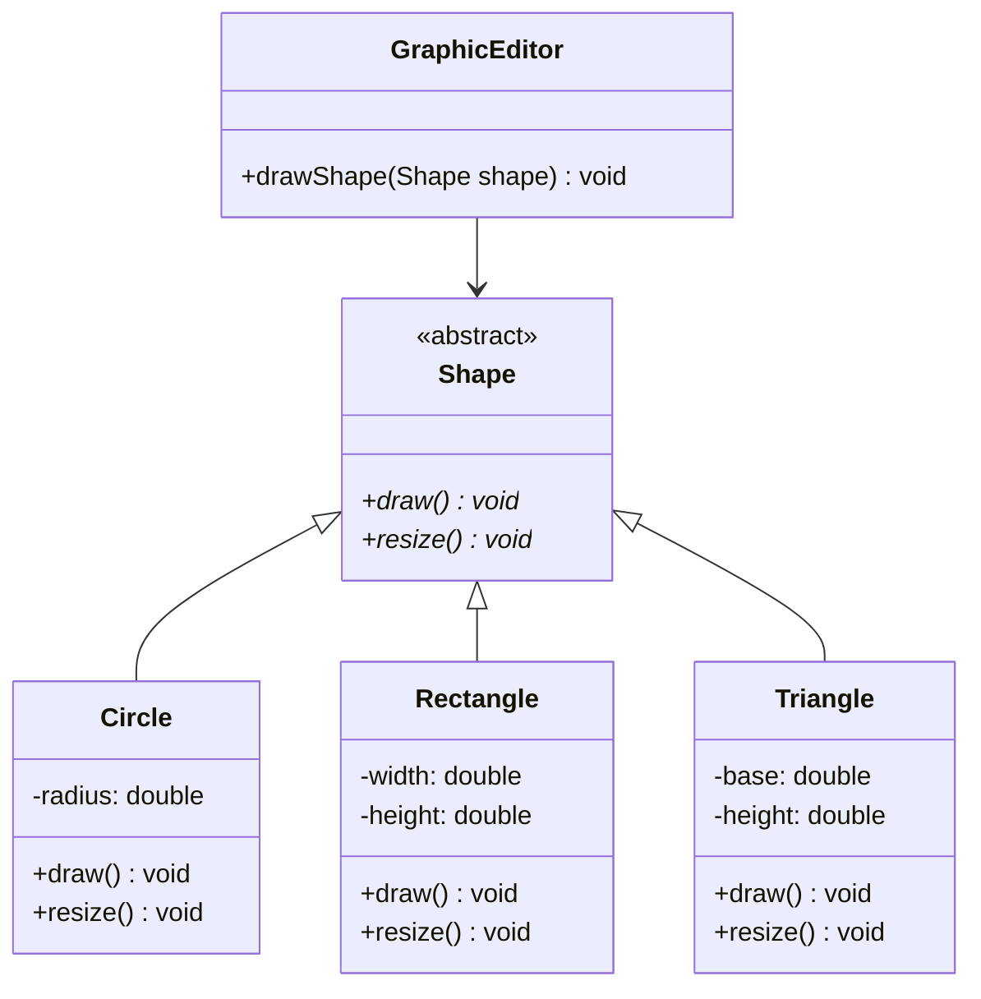

# OCP(Open Closed Principle): 유연한 소프트웨어 설계의 핵심 원칙

<!-- mtoc-start -->

- [정의 및 개념](#정의-및-개념)
- [주요 특징](#주요-특징)
- [구현 원리](#구현-원리)
- [활용 사례](#활용-사례)
- [기대 효과 및 필요성](#기대-효과-및-필요성)
- [마무리](#마무리)
- [Keywords](#keywords)

<!-- mtoc-end -->

개방 폐쇄 원칙(Open Closed Principle)은 소프트웨어 개발에서 가장 중요한 설계 원칙 중 하나로, 객체지향 프로그래밍의 SOLID 원칙 중 두 번째에 해당합니다. 이 원칙은 소프트웨어 엔티티(클래스, 모듈, 함수 등)가 확장에는 열려 있어야 하고, 수정에는 닫혀 있어야 한다는 개념을 제시합니다. 즉, 기존 코드를 변경하지 않고도 시스템의 동작을 확장할 수 있어야 한다는 의미입니다.

## 정의 및 개념

- 확장에 대한 개방(Open for extension): 새로운 기능이나 요구사항이 추가될 때 기존 코드를 확장하여 구현할 수 있는 구조.
- 수정에 대한 폐쇄(Closed for modification): 확장이 일어나도 기존 코드의 변경은 최소화되어 안정성 유지.
- 목적: 소프트웨어의 유연성, 재사용성, 유지보수성 향상.
- 필요성: 요구사항 변경에 따른 리스크와 비용 최소화, 시스템 안정성 보장.

## 주요 특징

- **추상화 활용**: 인터페이스나 추상 클래스를 사용하여 구현 세부사항과 기능 명세를 분리.
- **다형성 기반**: 서브클래스를 통한 확장 메커니즘으로 동일 인터페이스, 다양한 구현 가능.
- **의존성 역전**: 구체적인 구현보다 추상화에 의존하여 결합도 낮춤.
- **코드 변경 최소화**: 기능 추가 시 기존 코드 수정 없이 새로운 클래스 추가만으로 구현.
- **테스트 용이성**: 기존 기능에 대한 재테스트 필요성 감소, 새로운 기능만 집중 테스트 가능.

## 구현 원리

OCP 구현 원리는 추상화를 통해 기능 확장을 가능하게 합니다. 위 다이어그램에서 GraphicEditor는 Shape라는 추상 클래스에만 의존하므로, Triangle과 같은 새로운 도형을 추가해도 GraphicEditor 코드 수정 없이 시스템을 확장할 수 있습니다.

## 활용 사례

- **프레임워크 설계**: Spring, Angular 등 많은 프레임워크가 OCP를 적용하여 플러그인 아키텍처 구현.
- **전략 패턴**: 다양한 알고리즘을 캡슐화하여 런타임에 교체 가능한 구조 설계.
- **데코레이터 패턴**: 기존 객체에 새로운 책임을 동적으로 추가할 수 있는 설계.
- **결제 시스템**: 새로운 결제 방식(신용카드, 페이팔, 암호화폐 등)을 추가할 때 기존 코드 변경 없이 확장.
- **플러그인 아키텍처**: IDE, 브라우저 등에서 새로운 기능을 플러그인으로 추가할 수 있는 구조.

## 기대 효과 및 필요성

- **변경 영향 최소화**: 기존 코드 변경으로 인한 버그 발생 가능성 감소.
- **재사용성 증가**: 잘 설계된 추상화를 통해 코드 재사용성 향상.
- **유지보수 비용 절감**: 코드 변경 범위가 제한되어 유지보수 용이.
- **테스트 부담 경감**: 기존 기능에 대한 회귀 테스트 필요성 감소.
- **시스템 안정성 향상**: 검증된 코드는 그대로 유지하며 새로운 기능만 추가하여 안정성 보장.
- **확장성 개선**: 미래의 요구사항 변화에 유연하게 대응 가능한 시스템 구축.

## 마무리

개방 폐쇄 원칙은 소프트웨어의 진화 과정에서 안정성과 유연성을 동시에 확보할 수 있는 핵심 설계 원칙입니다. 이 원칙을 적용함으로써 기존 코드의 안정성을 해치지 않으면서도 새로운 기능을 지속적으로 추가할 수 있는 확장 가능한 시스템을 구축할 수 있습니다. 특히 대규모 시스템이나 장기적으로 유지보수가 필요한 프로젝트에서는 OCP를 기반으로 한 설계가 필수적이며, 다른 SOLID 원칙들과 함께 적용할 때 더욱 효과적인 소프트웨어 아키텍처를 구현할 수 있습니다.

## Keywords

Open Closed Principle, 개방 폐쇄 원칙, SOLID 원칙, Extension, Modification, 추상화(Abstraction), 다형성(Polymorphism), 인터페이스 기반 설계, 플러그인 아키텍처, 유연한 설계
