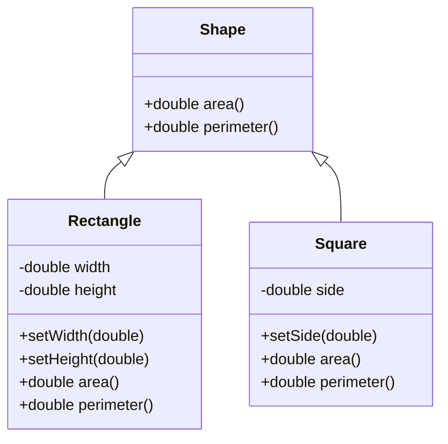

# LSP(Liskov Substitution Principle): 리스코프 치환의 원칙

<!-- mtoc-start -->

- [정의 및 개념](#정의-및-개념)
- [주요 특징](#주요-특징)
- [원리 및 메카니즘](#원리-및-메카니즘)
- [활용 사례](#활용-사례)
- [기대 효과 및 필요성](#기대-효과-및-필요성)
- [마무리](#마무리)
- [Keywords](#keywords)

<!-- mtoc-end -->

리스코프 치환 원칙(Liskov Substitution Principle)은 객체지향 프로그래밍의 5대 원칙인 SOLID 중 하나로, 바버라 리스코프(Barbara Liskov)가 1987년에 제안한 개념입니다. 이 원칙은 상속 관계에서 하위 타입이 상위 타입을 대체할 수 있어야 한다는 것을 의미하며, 소프트웨어 시스템의 유연성과 확장성을 보장하는 중요한 설계 원칙입니다.

## 정의 및 개념

- 정의: 프로그램의 객체는 프로그램의 정확성을 깨뜨리지 않으면서 하위 타입의 인스턴스로 바꿀 수 있어야 하는 것.
- 핵심 사상: 상위 클래스의 인스턴스를 사용하는 코드가 하위 클래스의 인스턴스로 대체되어도 동일하게 작동해야 함.

- 목적: 코드의 일관성을 유지하고 상속 관계에서 발생할 수 있는 예상치 못한 행동을 방지.
- 필요성: 시스템의 확장성과 유지보수성을 높이며, 객체 간 상호작용의 예측 가능성 확보.

## 주요 특징

1. **행동 일관성**: 하위 클래스는 상위 클래스의 기대 행동을 준수해야 함. 상위 클래스에서 정의한 메소드의 의미를 하위 클래스에서 변경하지 않아야 함.

2. **계약 준수**: 상위 클래스가 보장하는 사전조건(precondition)보다 더 강한 사전조건을 요구할 수 없으며, 상위 클래스가 보장하는 사후조건(postcondition)보다 약한 사후조건을 보장해서는 안 됨.

3. **예외 호환성**: 하위 클래스는 상위 클래스가 발생시키지 않는 예외를 발생시켜서는 안 됨. 상위 클래스의 메소드가 예외를 던지지 않는다면, 하위 클래스도 예외를 던지지 않아야 함.

4. **불변조건 유지**: 상위 클래스에서 정의한 불변조건(invariant)은 하위 클래스에서도 유지되어야 함. 하위 클래스에서 상위 클래스의 불변조건을 위반하면 안 됨.

5. **속성 구현 호환성**: 하위 클래스에서 상위 클래스의 속성을 다른 타입으로 재정의하거나 접근 제어를 더 제한적으로 변경해서는 안 됨.

## 원리 및 메카니즘

LSP를 준수하는 상속 구조에서는 프로그램의 어떤 부분에서도 상위 타입 대신 하위 타입을 사용해도 정상적으로 작동합니다. 위 다이어그램에서 Rectangle과 Square는 Shape의 하위 타입으로서 각자의 방식으로 area()와 perimeter() 메소드를 구현하지만, Shape 타입을 기대하는 모든 코드에서 투명하게 대체될 수 있어야 합니다.

## 활용 사례

1. **프레임워크 및 라이브러리 설계**: 다양한 구현체를 지원하는 프레임워크나 라이브러리에서 클라이언트 코드가 구체적인 구현에 종속되지 않도록 할 때 활용.

2. **플러그인 아키텍처**: 핵심 시스템에 다양한 플러그인을 추가할 수 있는 구조에서 플러그인이 시스템의 핵심 기능을 해치지 않도록 보장할 때 사용.

3. **데이터베이스 추상화 계층**: JDBC, Hibernate 등에서 다양한 데이터베이스 구현체가 동일한 인터페이스를 통해 접근 가능하도록 구현.

4. **UI 컴포넌트 라이브러리**: 기본 컴포넌트를 확장하여 다양한 스타일과 기능을 가진 컴포넌트를 만들 때 원래 컴포넌트의 동작 방식을 유지.

5. **테스트 모킹(Mocking)**: 테스트에서 실제 객체 대신 목(mock) 객체를 사용할 때 LSP를 준수해야 동일한 결과를 보장 가능.

## 기대 효과 및 필요성

1. **코드 재사용성 증가**: 상위 클래스의 코드를 변경하지 않고도 하위 클래스에서 재사용할 수 있어 개발 시간과 비용 절감.

2. **시스템 확장성 향상**: 새로운 하위 클래스를 추가해도 기존 코드를 수정할 필요가 없어 시스템 확장이 용이.

3. **유지보수 비용 감소**: 상위 클래스와 하위 클래스 간의 일관된 동작을 보장하여 버그 발생 가능성 최소화.

4. **테스트 용이성**: 다형성을 활용한 테스트가 가능하므로 테스트 코드 작성 및 유지 관리가 쉬워짐.

5. **설계 품질 향상**: 객체 간의 계약을 명확히 함으로써 전체 시스템의 설계 품질과 이해도가 높아짐.

6. **개방-폐쇄 원칙(OCP) 지원**: 코드 변경 없이 기능 확장이 가능하게 함으로써 개방-폐쇄 원칙을 자연스럽게 지원.

## 마무리

리스코프 치환 원칙은 객체지향 프로그래밍에서 상속 관계를 올바르게 설계하기 위한 핵심 지침입니다. 이 원칙을 준수함으로써 소프트웨어의 유연성, 확장성, 유지보수성을 크게 향상시킬 수 있습니다. 특히 대규모 시스템이나 장기간 유지보수가 필요한 프로젝트에서는 LSP의 중요성이 더욱 부각됩니다. 개발자는 클래스 계층 구조를 설계할 때 단순히 코드 재사용이 아닌 행동 호환성을 고려하는 접근 방식을 취해야 합니다.

## Keywords

Liskov Substitution Principle, 리스코프 치환 원칙, SOLID, Object-Oriented Design, 객체지향 설계, Behavioral Subtyping, 행위적 서브타이핑, Inheritance, 상속, Polymorphism, 다형성, 계약 기반 설계, Interface Segregation
