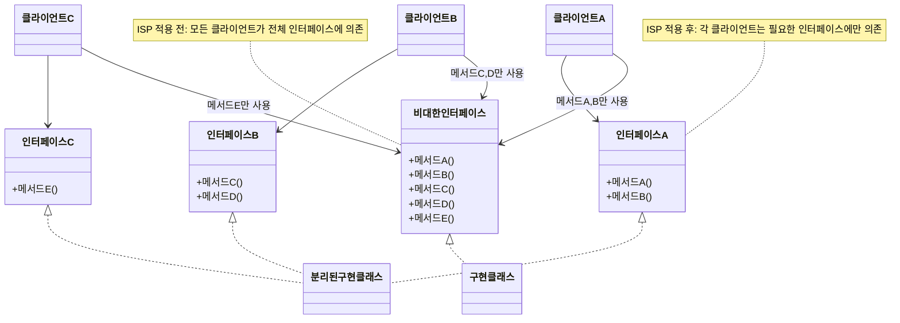

# ISP(Interface Segregation Principle): 인터페이스 분리 원칙

<!-- mtoc-start -->

- [정의 및 개념](#정의-및-개념)
- [주요 특징](#주요-특징)
- [메카니즘](#메카니즘)
- [활용 사례](#활용-사례)
- [기대 효과 및 필요성](#기대-효과-및-필요성)
- [마무리](#마무리)
- [Keywords](#keywords)

<!-- mtoc-end -->

인터페이스 분리 원칙(Interface Segregation Principle, ISP)은 객체지향 설계의 핵심 원칙 중 하나로, SOLID 원칙의 'I'에 해당합니다. 이 원칙은 클라이언트가 자신이 사용하지 않는 메서드에 의존하지 않도록 큰 인터페이스를 여러 개의 작은 인터페이스로 분리해야 한다는 개념을 강조합니다. 효율적인 소프트웨어 설계를 위한 ISP의 적용 방법과 장점에 대해 알아보겠습니다.

## 정의 및 개념

- 정의: 클라이언트는 자신이 사용하지 않는 인터페이스에 의존하지 않아야 하며, 클라이언트의 필요에 맞게 인터페이스를 분리하는 원칙.
- 목적: 시스템의 내부 의존성을 줄이고 리팩토링, 수정, 재배포의 위험을 최소화하는 것.
- 필요성: 비대한 인터페이스는 클라이언트에게 불필요한 메서드 구현을 강제하며, 이는 시스템의 결합도를 높이고 유지보수성을 저하시킴.

## 주요 특징

- **인터페이스 분리**: 큰 인터페이스를 클라이언트별로 필요한 여러 개의 작은 인터페이스로 분리.
- **클라이언트 중심 설계**: 클라이언트가 필요로 하는 메서드만 포함하도록 인터페이스를 설계하여 불필요한 의존성 제거.
- **높은 응집도**: 관련 메서드들만 그룹화하여 인터페이스의 응집도를 높임.
- **의존성 감소**: 클라이언트가 사용하지 않는 메서드에 대한 의존성을 제거하여 시스템의 결합도 감소.
- **유연한 확장성**: 작은 인터페이스는 필요에 따라 조합하여 사용할 수 있어 확장성이 향상됨.

## 메카니즘

인터페이스 분리 원칙은 비대한 인터페이스를 클라이언트별 필요에 맞게 작은 단위로 분리합니다. 이를 통해 각 클라이언트는 자신이 필요로 하는 메서드만 가진 인터페이스에 의존하게 되어 결합도가 낮아지고 시스템의 유연성이 향상됩니다.

## 활용 사례

- **프레임워크 설계**: 스프링, 하이버네이트 등의 프레임워크는 ISP를 적용하여 사용자가 필요한 인터페이스만 구현할 수 있도록 설계.
- **UI 컴포넌트 라이브러리**: 리액트, 앵귤러 등의 UI 라이브러리는 컴포넌트별로 필요한 기능만 제공하는 인터페이스를 설계.
- **마이크로서비스 API**: 각 서비스는 자신의 책임에 맞는 최소한의 API만 노출하여 서비스 간 결합도를 낮춤.
- **플러그인 시스템**: 이클립스, VSCode 등의 IDE는 플러그인 개발을 위한 작은 인터페이스들을 제공.
- **디바이스 드라이버**: 다양한 하드웨어를 지원하기 위해 필요한 기능별로 인터페이스를 분리.

## 기대 효과 및 필요성

- **시스템 유연성 증가**: 작은 인터페이스는 다양한 컨텍스트에서 재사용이 용이함.
- **유지보수성 향상**: 변경 시 영향 범위가 최소화되어 유지보수성이 향상됨.
- **테스트 용이성**: 작고 명확한 인터페이스는 모킹(mocking)이 쉬워 단위 테스트 작성이 용이함.
- **기능 확장 용이**: 기존 코드 변경 없이 새로운 인터페이스를 추가하여 기능 확장 가능.
- **의존성 관리 개선**: 명확한 인터페이스 경계를 통해 의존성 관리가 용이해짐.
- **개발 생산성 향상**: 개발자가 필요한 인터페이스만 파악하면 되므로 학습 곡선이 완만해짐.

## 마무리

인터페이스 분리 원칙(ISP)은 소프트웨어 설계의 품질을 향상시키는 중요한 원칙입니다. 클라이언트에 최적화된 인터페이스를 제공함으로써 시스템의 결합도를 낮추고 유연성과 확장성을 높일 수 있습니다. 특히 대규모 시스템이나 여러 개발자가 협업하는 환경에서는 ISP의 적용이 더욱 중요합니다. 객체지향 설계를 수행할 때 ISP를 고려하여 클라이언트별로 필요한 인터페이스만 제공함으로써 더 견고하고 유지보수하기 쉬운 시스템을 구축할 수 있습니다.

## Keywords

Interface Segregation Principle, 인터페이스 분리 원칙, SOLID Principles, 객체지향 설계, Client-specific Interfaces, 클라이언트 중심 설계, Dependency Management, 의존성 관리, Cohesion, 응집도, Low Coupling, 낮은 결합도
