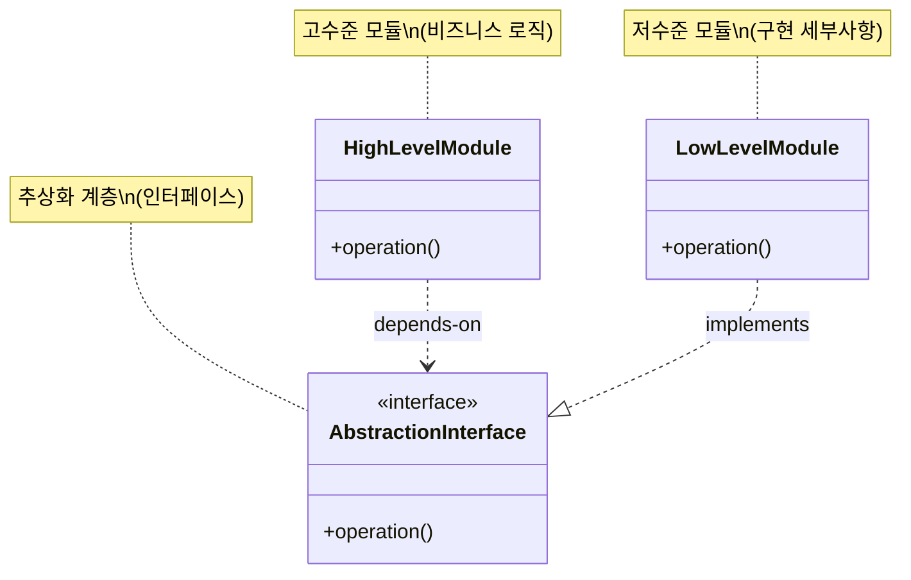

# DIP (Dependency Inversion Principle): 의존성 역전 원칙

<!-- mtoc-start -->

- [정의 및 개념](#정의-및-개념)
- [주요 특징](#주요-특징)
- [아키텍처 구조](#아키텍처-구조)
- [활용 사례](#활용-사례)
- [기대 효과 및 필요성](#기대-효과-및-필요성)
- [마무리](#마무리)
- [Keywords](#keywords)

<!-- mtoc-end -->

DIP(Dependency Inversion Principle)는 객체지향 설계의 핵심 원칙 중 하나로, 소프트웨어 모듈 간의 의존 관계를 효과적으로 관리하는 방법을 제시합니다. 이 원칙은 SOLID 원칙의 마지막 'D'에 해당하며, 로버트 마틴(Robert C. Martin)이 제안한 원칙으로 고수준 모듈과 저수준 모듈 사이의 관계를 재정립하여 시스템의 유연성과 확장성을 높입니다.

## 정의 및 개념

- 핵심 원칙: 고수준 모듈은 저수준 모듈에 의존해서는 안 되며, 둘 모두 추상화에 의존해야 함. 추상화는 구체적인 사항에 의존해서는 안 되며, 구체적인 사항은 추상화에 의존해야 함.
- 의존성 방향: 전통적인 의존 관계를 역전시켜 상위 수준의 모듈이 하위 수준의 구현 세부사항에 종속되지 않도록 함.
- 모듈 간 결합도를 낮추는 설계 원칙

## 주요 특징

- **구현보다 인터페이스에 의존**: 구체적인 구현체가 아닌 추상화된 인터페이스에 의존함으로써 모듈 간 결합도 감소.
- **의존성 주입(DI) 활용**: 외부에서 의존 객체를 주입받아 사용함으로써 모듈의 독립성과 테스트 용이성 향상.
- **IoC(Inversion of Control) 원칙 적용**: 제어의 주체가 개발자에서 프레임워크로 이전되어 객체 생성과 생명주기 관리의 책임이 역전됨.
- **코드 재사용성 증가**: 구체적인 구현에 의존하지 않으므로 다양한 상황에서 코드를 재사용할 수 있음.
- **플러그인 아키텍처 지원**: 새로운 기능이나 모듈을 쉽게 추가하거나 교체할 수 있는 확장 가능한 구조 제공.

## 아키텍처 구조

DIP 아키텍처는 의존성 방향을 역전시켜 고수준 모듈과 저수준 모듈이 모두 추상화 계층에 의존하도록 합니다. 이를 통해 구체적인 구현체가 변경되어도 고수준 모듈에는 영향을 미치지 않는 유연한 구조를 제공합니다.

## 활용 사례

- **프레임워크 개발**: Spring, ASP.NET Core 등의 프레임워크는 DIP를 기반으로 IoC 컨테이너를 제공하여 의존성을 관리.
- **플러그인 아키텍처**: 이클립스, VS Code 등의 개발 도구는 DIP를 활용한 플러그인 시스템으로 기능 확장 가능.
- **데이터베이스 접근 계층**: 서비스 계층이 구체적인 데이터베이스 구현체가 아닌 저장소 인터페이스에 의존하도록 설계.
- **테스트 주도 개발(TDD)**: 실제 구현체 대신 목(Mock) 객체를 주입하여 단위 테스트 용이성 향상.
- **멀티 플랫폼 애플리케이션**: 동일한 비즈니스 로직을 다양한 플랫폼별 구현체와 결합하여 사용.

## 기대 효과 및 필요성

- **유지보수성 향상**: 모듈 간 결합도가 낮아져 한 모듈의 변경이 다른 모듈에 미치는 영향 최소화.
- **확장성 개선**: 기존 코드 수정 없이 새로운 기능이나 구현체를 쉽게 추가할 수 있음.
- **병렬 개발 지원**: 인터페이스가 정의되면 여러 개발자가 동시에 다른 모듈을 개발할 수 있음.
- **테스트 용이성**: 의존 객체를 쉽게 대체할 수 있어 단위 테스트와 통합 테스트가 용이함.
- **기술 부채 감소**: 시스템 구조가 명확해지고 모듈 간 의존성이 감소하여 장기적인 기술 부채 감소.
- **비즈니스 로직 보호**: 기술적 구현 세부사항의 변경으로부터 핵심 비즈니스 로직 보호.

## 마무리

의존성 역전 원칙(DIP)은 객체지향 시스템의 유연성과 확장성을 크게 향상시키는 중요한 설계 원칙입니다. 고수준 모듈과 저수준 모듈 모두 추상화에 의존하게 함으로써 결합도를 낮추고 변경에 강한 시스템을 구축할 수 있습니다. 현대 소프트웨어 개발에서는 의존성 주입 프레임워크와 IoC 컨테이너를 통해 DIP를 쉽게 적용할 수 있으므로, 대규모 엔터프라이즈 애플리케이션부터 작은 모듈까지 이 원칙을 적극적으로 도입하는 것이 권장됩니다.

## Keywords

Dependency Inversion Principle, 의존성 역전 원칙, SOLID Principles, 인터페이스 기반 설계, 의존성 주입(DI), Inversion of Control, 추상화 계층, 결합도 감소, 모듈 독립성, 테스트 용이성
