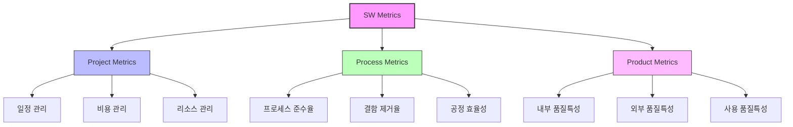

# SW Metrics: 소프트웨어 품질 확보를 위한 체계적 측정 체계

<!-- mtoc-start -->

- [정의 및 개념](#정의-및-개념)
- [주요 특징](#주요-특징)
- [구조도](#구조도)
- [메트릭스 유형](#메트릭스-유형)
  - [1. Project Metrics](#1-project-metrics)
  - [2. Process Metrics](#2-process-metrics)
  - [3. Product Metrics](#3-product-metrics)
- [대표적 SW 복잡도 측정 메트릭스](#대표적-sw-복잡도-측정-메트릭스)
  - [McCabe의 순환복잡도(Cyclomatic Complexity)](#mccabe의-순환복잡도cyclomatic-complexity)
- [활용 사례](#활용-사례)
- [기대 효과 및 필요성](#기대-효과-및-필요성)
- [마무리](#마무리)
- [Keywords](#keywords)

<!-- mtoc-end -->

소프트웨어 메트릭스(Software Metrics)는 소프트웨어의 체계적이고 효율적인 개발과 관리를 위해 품질 특성 등을 수치화하여 측정하고 평가하는 기준입니다. 소프트웨어 개발 프로젝트의 객관적인, 정량적 관리를 가능하게 함으로써 개발 과정의 효율성과 최종 산출물의 품질을 향상시키는 데 중요한 역할을 합니다.

## 정의 및 개념

- 소프트웨어 개발 및 관리에서 품질, 복잡도, 효율성 등을 수치화하여 측정하고 평가하는 기준.
- 객관적이고 정량적인 데이터를 기반으로 소프트웨어 개발 과정 및 결과물의 품질을 관리하는 방법론.

## 주요 특징

- **객관성**: 주관적 판단이 아닌 수치화된 기준을 통해 소프트웨어 품질을 객관적으로 평가
- **정량화**: 복잡한 소프트웨어 특성을 수치로 표현하여 비교 및 분석이 용이
- **추적성**: 개발 단계별로 소프트웨어 품질 변화를 지속적으로 추적하고 관리 가능
- **예측 가능성**: 축적된 메트릭스 데이터를 기반으로 향후 발생 가능한 문제점을 예측

## 구조도

소프트웨어 메트릭스는 프로젝트 진행 과정, 프로세스 성과, 제품 품질이라는 세 가지 차원에서 측정되며, 각 차원은 고유한 특성과 목적을 가지고 소프트웨어 품질 확보에 기여합니다.

## 메트릭스 유형

### 1. Project Metrics

- **정의**: 프로젝트 진행 과정 관리에 대한 측정 지표
- **측정 요소**: 일정 준수율, 예산 대비 실제 비용, 자원 활용도
- **활용**: 프로젝트 진행 상황 모니터링, 위험 요소 식별, 의사결정 지원

### 2. Process Metrics

- **정의**: 프로세스 성과 및 분석 관련 측정 지표
- **측정 요소**: 프로세스 준수율, 결함 제거율, 공정 효율성
- **활용**: 프로세스 개선, 생산성 향상, 품질 향상을 위한 기초 자료

### 3. Product Metrics

- **정의**: 제품 품질 평가 및 추적에 관련된 측정 지표
- **측정 요소**: 기능성, 신뢰성, 사용성, 효율성, 유지보수성, 이식성
- **활용**: 소프트웨어 품질 평가, 사용자 만족도 예측, 유지보수 용이성 판단

## 대표적 SW 복잡도 측정 메트릭스

### McCabe의 순환복잡도(Cyclomatic Complexity)

- **계산식**: V(G) = e - n + 2 (e: edge 수, n: node 수)
- **복잡도 기준**:
  | 복잡도 범위 | 평가 |
  |------------|------|
  | 5 이하 | 간단한 프로그램 |
  | 5~10 | 구조적으로 안정적인 프로그램 |
  | 11~20 | 매우 복잡한 프로그램 |
  | 21~50 | 비구조적이고 불안정한 프로그램 |
  | 50 초과 | 테스트 불가능한 프로그램 |

## 활용 사례

- **품질 관리**: 대규모 소프트웨어 개발 프로젝트에서 결함률 감소와 품질 향상
- **프로세스 개선**: 개발 프로세스의 비효율적인 부분을 식별하고 개선 방향 수립
- **의사결정 지원**: 제품 출시 여부, 추가 테스트 필요성 등의 의사결정에 객관적 기준 제공
- **비용 최적화**: 효율적인 리소스 할당을 통한 개발 비용 절감

## 기대 효과 및 필요성

- **품질 향상**: 소프트웨어 결함 조기 발견 및 수정을 통한 제품 품질 향상
- **비용 절감**: 개발 초기 단계에서의 결함 제거로 유지보수 비용 절감
- **생산성 향상**: 개발 프로세스 효율화를 통한 팀 생산성 증대
- **리스크 관리**: 프로젝트 위험 요소를 조기에 식별하고 대응 방안 마련
- **의사소통 개선**: 객관적인 지표를 통한 이해관계자 간 효과적인 의사소통

## 마무리

소프트웨어 메트릭스는 객관적이고 정량적인 측정을 통해 소프트웨어 개발의 품질과 효율성을 향상시키는 중요한 도구입니다. 프로젝트, 프로세스, 제품이라는 세 가지 차원에서의 측정을 통해 소프트웨어 개발의 전 과정을 체계적으로 관리할 수 있으며, 이는 궁극적으로 고품질의 소프트웨어 제품 생산으로 이어집니다. 소프트웨어 개발 조직은 자신의 환경과 목표에 맞는 메트릭스를 선정하고 지속적으로 측정, 분석하여 개발 프로세스를 개선해 나가는 것이 중요합니다.

## Keywords

Software Metrics, 소프트웨어 측정, Project Metrics, Process Metrics, Product Metrics, 순환복잡도(Cyclomatic Complexity), 품질 측정, 정량적 관리, 소프트웨어 품질 보증(SQA), 메트릭스 분석
