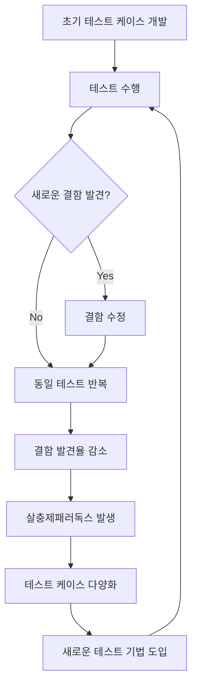

# 살충제패러독스(Pesticide Paradox): 소프트웨어 테스트의 함정

<!-- mtoc-start -->

- [정의 및 개념](#정의-및-개념)
- [주요 특징](#주요-특징)
- [메커니즘](#메커니즘)
- [활용 사례](#활용-사례)
- [기대 효과 및 필요성](#기대-효과-및-필요성)
- [마무리](#마무리)
- [Keywords](#keywords)

<!-- mtoc-end -->

소프트웨어 테스트에서 발생하는 살충제패러독스(Pesticide Paradox)는 테스트 전략 수립과 품질 보증 활동에서 중요한 개념. 해충을 제거하기 위해 동일한 살충제를 계속 사용하면 해충이 내성을 갖게 되는 자연계의 살충제 저항성과 유사한 메커니즘. 소프트웨어 테스트 환경에서도 비슷한 문제 발생.

## 정의 및 개념

- 살충제패러독스: 동일한 테스트 케이스가 반복적으로 수행될 경우, 시간이 지남에 따라 새로운 결함을 발견할 확률이 지속적으로 감소하는 현상.
- 이미 발견된 결함들은 수정되어 동일한 테스트로는 더 이상 새로운 결함을 찾아내기 어려워지는 상황.

- 특징: 테스트 효과 감소, 결함 발견율 저하, 테스트 케이스 다양화 필요성.
- 원인: 테스트 케이스 고정화, 개발자의 테스트 방식 학습, 동일 경로 반복 테스트.

## 주요 특징

1. **테스트 효율성 저하**: 동일한 테스트 케이스를 반복적으로 실행할수록 새로운 결함 발견 효율성 점차 감소. 처음에는 많은 결함 발견하지만, 테스트 반복 시 발견율 현저히 낮아짐.

2. **테스트 내성 발생**: 소프트웨어 개발자들이 특정 테스트 패턴에 익숙해지면서 해당 패턴에서 발생할 수 있는 결함을 미리 예방. 이로 인해 기존 테스트 방식으로는 발견되지 않는 새로운 유형의 결함이 남게 됨.

3. **테스트 케이스 진화 필요성**: 살충제패러독스를 극복하기 위해서는 테스트 케이스와 테스트 기법의 지속적인 진화와 다양화가 필수적. 정적 분석, 동적 분석, 탐색적 테스팅 등 다양한 접근법 병행 필요.

4. **품질 위험 증가**: 테스트 케이스를 다양화하지 않으면 미발견 결함이 증가하여 소프트웨어 품질 리스크 높아짐. 이는 궁극적으로 사용자 만족도와 비즈니스 신뢰성에 부정적 영향.

## 메커니즘

살충제패러독스는 테스트 케이스가 반복될수록 결함 발견율이 감소하는 순환적 현상. 이를 극복하기 위해 테스트 케이스 다양화와 새로운 테스트 기법 도입이 지속적으로 이루어져야 함. 테스트 전략의 주기적 개선 필요.

## 활용 사례

1. **테스트 전략 다각화**: 대규모 금융 시스템 개발 프로젝트에서 기능 테스트, 성능 테스트, 보안 테스트 등 다양한 테스트 기법을 순환적으로 적용하여 살충제패러독스 극복 사례.

2. **DevOps 환경에서의 적용**: CI/CD 파이프라인에서 자동화된 테스트 케이스를 주기적으로 업데이트하고 다양화하여 지속적인 결함 발견 효율성 유지 방법 도입.

3. **테스트 자동화 전략**: 삼성전자, LG전자 등의 기업에서는 테스트 자동화 도구를 이용하여 다양한 테스트 시나리오 생성. 머신러닝을 활용하여 테스트 케이스를 지속적으로 최적화하는 방식으로 살충제패러독스 대응.

4. **오픈소스 프로젝트**: 리눅스 커널과 같은 대규모 오픈소스 프로젝트에서는 다양한 기여자들의 다양한 테스트 접근법을 통해 자연스럽게 살충제패러독스 극복.

## 기대 효과 및 필요성

1. **품질 향상**: 살충제패러독스를 인식하고 대응함으로써 소프트웨어의 전반적인 품질 향상 가능. 다양한 테스트 접근법을 통해 숨겨진 결함을 효과적으로 발견 가능.

2. **비용 절감**: 출시 후 발견되는 결함은 개발 중 발견되는 결함보다 수정 비용이 5~100배 높다는 연구 결과 존재. 살충제패러독스를 극복하여 개발 단계에서 더 많은 결함을 발견하면 전체 프로젝트 비용 절감 가능.

3. **사용자 신뢰 확보**: 안정적이고 신뢰할 수 있는 소프트웨어는 사용자 만족도와 비즈니스 신뢰성을 높이는 데 필수적. 살충제패러독스에 대한 이해와 대응은 이러한 신뢰 구축에 기여.

4. **테스트 프로세스 최적화**: 살충제패러독스를 고려한 테스트 전략은 테스트 자원의 효율적 활용과 테스트 프로세스의 지속적 개선 촉진.

## 마무리

살충제패러독스는 소프트웨어 테스팅의 근본적인 도전 과제 중 하나. 이를 인식하고 적절히 대응하는 것은 효과적인 품질 보증 활동의 핵심. 테스트 케이스와 방법론의 지속적인 다양화, 새로운 테스트 기법의 도입, 그리고 테스트 자동화 전략의 최적화를 통해 살충제패러독스의 함정 극복 가능. 현대 소프트웨어 개발 환경에서는 테스트 전략을 정기적으로 평가하고 개선하는 문화를 조성하여 소프트웨어 품질과 신뢰성을 지속적으로 향상시키는 노력 필요.

## Keywords

Pesticide Paradox, Software Testing, Test Case Evolution, 살충제패러독스, 테스트 내성, 결함 발견율, 테스트 다양화, 테스트 전략, 품질 보증, 테스트 효율성
