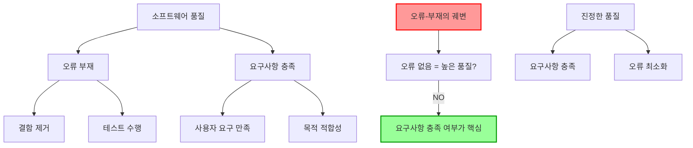

# 오류-부재의 궤변(Absence of Errors Fallacy): 소프트웨어 품질의 오해

<!-- mtoc-start -->

- [정의 및 개념](#정의-및-개념)
- [주요 특징](#주요-특징)
- [개념도](#개념도)
- [활용 사례](#활용-사례)
- [기대 효과 및 필요성](#기대-효과-및-필요성)
- [마무리](#마무리)
- [Keywords](#keywords)

<!-- mtoc-end -->

소프트웨어 품질 보증과 테스팅에서 자주 발생하는 오류-부재의 궤변(Absence of Errors Fallacy)은 소프트웨어 개발 및 품질 관리 프로세스에서 중요한 개념. 단순히 결함이 없다는 사실이 반드시 품질이 높은 소프트웨어를 의미하지 않는다는 점을 강조하는 중요한 원칙.

## 정의 및 개념

- 오류-부재의 궤변: 소프트웨어에서 오류가 발견되지 않았다면 그 소프트웨어는 고품질이라고 가정하는 잘못된 믿음.
- 결함 제거만으로는 소프트웨어가 사용자의 요구사항과 목적에 부합하는지 보장할 수 없다는 품질 관리의 핵심 원칙.

- 특징: 품질과 결함의 관계 오해, 요구사항 충족 중요성 간과, 테스트 효과성 과대평가
- 원인: 품질에 대한 불완전한 정의, 결함 중심 테스트 접근법, 요구사항 검증 부족

## 주요 특징

1. **품질의 이중성**: 소프트웨어 품질은 결함의 부재뿐만 아니라 요구사항 충족 여부로 평가되어야 함. 결함이 없더라도 사용자 요구를 충족시키지 못하면 품질이 낮은 제품으로 간주.

2. **요구사항 중심성**: 진정한 품질은 소프트웨어가 사용자의 요구사항을 얼마나 잘 충족시키는지에 의해 결정. 기능적 요구사항과 비기능적 요구사항(성능, 사용성, 보안 등) 모두 중요한 평가 기준.

3. **결함과 가치의 분리**: 결함 해결은 품질 향상의 필요조건이지만 충분조건은 아님. 사용자에게 가치를 제공하지 않는 완벽한 코드는 품질이 높다고 볼 수 없음.

4. **테스트의 한계성**: 테스트는 존재하는 결함을 발견할 수 있지만, 소프트웨어가 요구사항을 충족하는지 완전히 검증하지는 못함. 테스트 통과는 품질의 일부 측면만 보장.

## 개념도

오류-부재의 궤변은 단순히 결함이 없다는 사실만으로 소프트웨어 품질을 판단하는 오류를 보여줌. 진정한 품질은 요구사항 충족과 결함 최소화의 균형에서 비롯되며, 요구사항 충족이 더 핵심적인 품질 요소.

## 활용 사례

1. **요구 정의 실패**: A사는 기술적으로 완벽한 회계 소프트웨어를 개발했지만, 실제 회계사들의 워크플로우와 맞지 않아 시장에서 실패. 결함은 거의 없었으나 사용자 요구사항 충족 실패.

2. **과잉 최적화**: B기업에서 개발한 데이터 분석 도구는 기술적 오류가 적었지만, 사용자의 실제 데이터 분석 요구 대신 개발자가 생각하는 이상적 분석 방식에 초점. 결과적으로 사용자 채택률 저조.

3. **애자일 방법론 도입**: C기업은 오류-부재의 궤변을 극복하기 위해 애자일 방법론을 도입하여 지속적인 사용자 피드백을 수집하고 요구사항 충족도를 높임. 결함 수는 약간 증가했으나 사용자 만족도와 제품 가치는 크게 향상.

4. **품질 측정 체계 개선**: D기업은 단순 결함 수 대신 요구사항 충족도, 사용자 만족도, 비즈니스 가치 실현도 등 다양한 측면에서 품질을 평가하는 종합적 품질 지표를 도입하여 오류-부재의 궤변 극복.

## 기대 효과 및 필요성

1. **사용자 중심 개발**: 오류-부재의 궤변을 인식함으로써 개발 팀은 결함 수정 외에도 사용자 니즈 충족에 더 많은 관심을 기울이게 됨. 이는 실제 사용 환경에서 더 가치 있는 제품 개발로 이어짐.

2. **효율적 자원 배분**: 단순 결함 제거에만 집중하지 않고 사용자 가치를 극대화하는 기능 개발과 개선에 적절히 자원을 배분함으로써 ROI 향상.

3. **품질 인식 전환**: 개발 조직 내에서 품질에 대한 인식이 '결함 없음'에서 '요구사항 충족'으로 전환되어 더 효과적인 품질 관리 문화 형성.

4. **경쟁 우위 확보**: 사용자 요구를 정확히 충족시키는 제품은 시장에서 높은 경쟁력을 가지며, 단순히 기술적으로 완벽한 제품보다 비즈니스 성공 가능성이 높음.

## 마무리

오류-부재의 궤변은 소프트웨어 품질 관리에서 흔히 발생하는 오해로, 단순히 결함이 없다는 사실만으로 품질을 판단하는 위험성을 경고. 진정한 소프트웨어 품질은 결함의 최소화와 요구사항 충족의 균형에서 찾아야 하며, 특히 사용자의 실제 요구를 얼마나 잘 충족시키는지가 핵심. 개발 팀은 테스트와 결함 관리에 집중하는 동시에, 제품이 의도한 목적에 부합하는지 지속적으로 검증하는 프로세스를 수립해야 함. 이를 통해 기술적으로 완벽할 뿐만 아니라 사용자에게 실질적 가치를 제공하는 고품질 소프트웨어 개발 가능.

## Keywords

Absence of Errors Fallacy, Software Quality, Requirements Fulfillment, 오류-부재의 궤변, 소프트웨어 품질, 요구사항 충족, 결함 관리, 사용자 가치, 품질 보증, 테스트 한계
