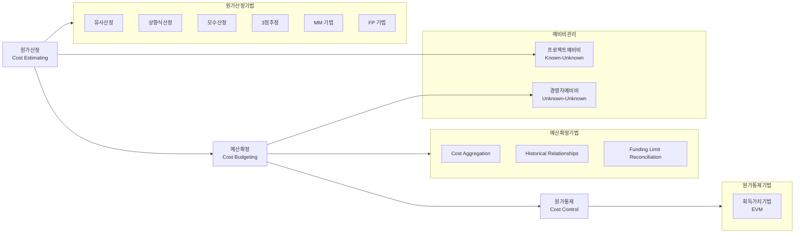

# 원가관리: 프로젝트예비비와 경영자예비비의 효율적 활용 방안

<!-- mtoc-start -->

- [정의 및 개념](#정의-및-개념)
- [주요 특징](#주요-특징)
  - [프로젝트예비비 특징](#프로젝트예비비-특징)
  - [경영자예비비 특징](#경영자예비비-특징)
- [원가관리 프로세스](#원가관리-프로세스)
- [예비비 비교표](#예비비-비교표)
- [원가산정 기법](#원가산정-기법)
- [활용 사례](#활용-사례)
  - [프로젝트예비비 활용 사례](#프로젝트예비비-활용-사례)
  - [경영자예비비 활용 사례](#경영자예비비-활용-사례)
- [기대 효과 및 필요성](#기대-효과-및-필요성)
- [마무리](#마무리)
- [Keywords](#keywords)

<!-- mtoc-end -->

원가관리는 프로젝트 성공을 위한 핵심 요소로, 특히 불확실성에 대비하기 위한 예비비(Contingency Reserve) 관리는 매우 중요합니다. 프로젝트예비비(Project Contingency Reserve)와 경영자예비비(Management Reserve)는 각각 다른 특성과 목적을 가지고 있어 프로젝트 관리자와 경영진이 적절히 이해하고 활용해야 합니다. 이 두 가지 예비비의 차이점과 활용 방안을 통해 효과적인 원가관리 전략을 수립할 수 있습니다.

## 정의 및 개념

- 프로젝트예비비(Project Contingency Reserve): 프로젝트 범위 내에서 식별된 위험(Known-Unknown)에 대응하기 위해 설정된 예비 비용으로, 원가기준선(Cost Baseline)에 포함됨.
- 경영자예비비(Management Reserve): 프로젝트 범위 외의 예상치 못한 위험(Unknown-Unknown)에 대응하기 위해 고위 경영진의 재량으로 설정된 예비 비용으로, 원가기준선에서 제외됨.

## 주요 특징

### 프로젝트예비비 특징

- 프로젝트 관리자(PM)가 재량권을 가지고 관리 및 사용 결정
- 원가산정(Cost Estimating) 단계에서 설정되며 원가기준선에 포함
- 식별된 위험(Known-Unknown)에 대응하기 위한 목적
- 위험등록부에 기록된 위험 발생 시 활용 가능
- 사전 승인된 프로젝트 범위 내에서만 사용 가능

### 경영자예비비 특징

- 고위 경영진이 재량권을 가지고 관리 및 승인
- 원가예산편성(Cost Budgeting) 단계에서 설정되며 원가기준선에서 제외
- 예상치 못한 위험(Unknown-Unknown)에 대응하기 위한 목적
- 프로젝트 범위 변경이 필요한 상황에서 활용
- PM의 권한 밖에서 관리되는 별도의 예산

## 원가관리 프로세스

원가관리는 원가산정, 예산확정, 원가통제의 세 단계로 진행되며, 각 단계에서 적절한 기법을 활용합니다. 프로젝트예비비는 원가산정 단계에서, 경영자예비비는 예산확정 단계에서 설정됩니다.

## 예비비 비교표

| 구분           | 프로젝트예비비               | 경영자예비비                       |
| -------------- | ---------------------------- | ---------------------------------- |
| **프로세스**   | Cost Estimating              | Cost Budgeting                     |
| **재량권자**   | 프로젝트 관리자(PM)          | 고위 경영진                        |
| **대응대상**   | Known-Unknown (식별된 위험)  | Unknown-Unknown (예상치 못한 위험) |
| **설정방식**   | 설정된 사업범위 내에서 설정  | 원가 예산 편성 단계에서 설정       |
| **원가기준선** | 원가기준선에 포함            | 원가기준선에서 제외                |
| **사용승인**   | PM 권한으로 승인 가능        | 경영진 승인 필요                   |
| **변경관리**   | 프로젝트 범위 변경 없이 사용 | 프로젝트 범위 변경 시 사용         |

## 원가산정 기법

- **유사산정(Analogous Estimating)**: 과거 유사 프로젝트의 실제 비용을 기반으로 현재 프로젝트 비용 추정
- **상향식산정(Bottom-up Estimating)**: 개별 작업패키지(WP)별로 비용을 산정한 후 상위 수준으로 합산
- **모수산정(Parametric Estimating)**: 통계적 관계를 활용하여 매개변수와 비용 간의 관계로 추정
- **3점추정(Three-Point Estimating)**: 낙관치, 최빈치, 비관치를 활용한 PERT 분석으로 비용 추정
- **MM(Man-Month) 기법**: 인력 투입 시간을 기준으로 비용 산정
- **FP(Function Point) 기법**: 소프트웨어 기능 복잡도를 측정하여 비용 산정

## 활용 사례

### 프로젝트예비비 활용 사례

- 소프트웨어 개발 프로젝트에서 식별된 기술적 위험에 대응하기 위한 추가 개발 인력 투입
- 식별된 자원 가격 변동성에 대비한 비용 변동 대응
- 일정 지연으로 인한 추가 작업 발생 시 대응 비용
- 품질 이슈 대응을 위한 추가 테스트 비용

### 경영자예비비 활용 사례

- 프로젝트 진행 중 갑작스러운 법규 변경으로 인한 프로젝트 범위 변경
- 예상치 못한 시장 환경 변화에 대응하기 위한 추가 기능 개발
- 자연재해나 불가항력적 상황으로 인한 프로젝트 재구성
- 주요 이해관계자의 요구사항 대폭 변경에 따른 대응

## 기대 효과 및 필요성

- **위험 대응력 강화**: 두 가지 예비비를 적절히 설정하여 다양한 수준의 위험에 효과적으로 대응
- **원가통제 효율화**: 예비비 설정 및 사용에 대한 명확한 프로세스 구축으로 원가 관리 효율성 증대
- **의사결정 프로세스 개선**: 예비비 사용에 대한 명확한 권한과 책임 구분으로 신속한 의사결정 가능
- **이해관계자 신뢰도 향상**: 투명한 예비비 관리를 통한 프로젝트 이해관계자 간 신뢰 구축
- **프로젝트 성공률 제고**: 불확실성에 대한 체계적 대응으로 프로젝트 목표 달성 가능성 증가

## 마무리

프로젝트예비비와 경영자예비비는 각각의 역할과 특성을 가지고 프로젝트의 불확실성에 대응하는 중요한 도구입니다. 프로젝트 관리자는 이 두 가지 예비비의 차이점을 명확히 이해하고, 프로젝트 계획 단계에서부터 적절한 예비비 설정 및 관리 전략을 수립해야 합니다. 효과적인 예비비 관리는 프로젝트의 예산 준수와 동시에 예상치 못한 상황에 유연하게 대응할 수 있는 능력을 제공하여 프로젝트의 성공적인 완수에 기여할 것입니다.

## Keywords

Project Contingency Reserve, Management Reserve, Known-Unknown, Unknown-Unknown, 원가기준선(Cost Baseline), 원가산정(Cost Estimating), 예산확정(Cost Budgeting), 원가통제(Cost Control), 획득가치기법(EVM), 위험대응
