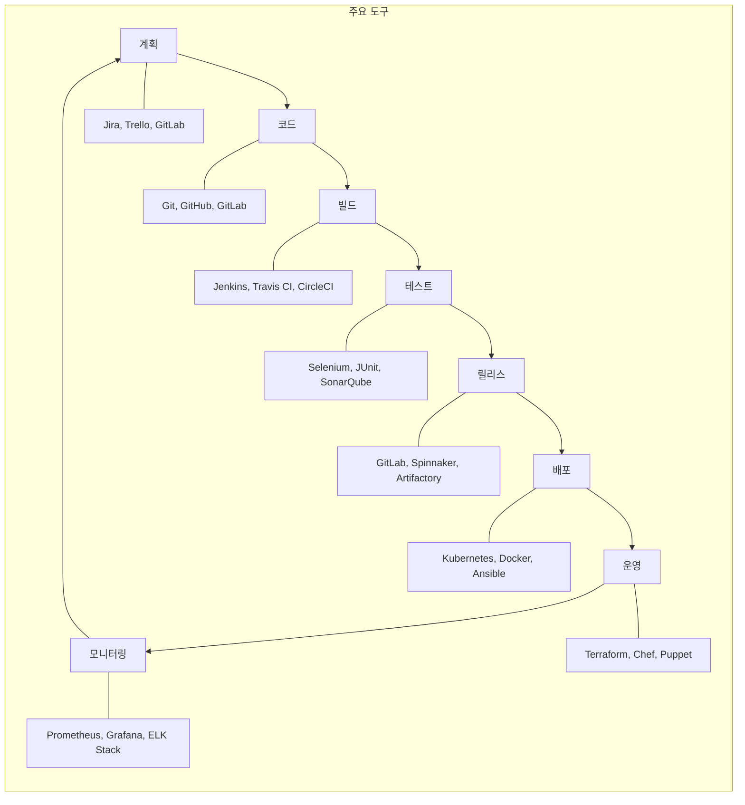

# DevOps 및 개발 도구 동향: IT 환경 변화에 따른 개발 패러다임의 진화

<!-- mtoc-start -->

- [정의 및 개념](#정의-및-개념)
- [주요 특징](#주요-특징)
- [프로세스 및 도구 생태계](#프로세스-및-도구-생태계)
- [최신 개발 도구 동향](#최신-개발-도구-동향)
- [활용 사례](#활용-사례)
- [기대 효과 및 필요성](#기대-효과-및-필요성)
- [마무리](#마무리)
- [Keywords](#keywords)

<!-- mtoc-end -->

DevOps(Development and Operations)는 소프트웨어 개발과 IT 운영을 통합하는 문화적, 기술적 접근 방식으로, 빠르게 변화하는 비즈니스 요구사항에 대응하기 위한 핵심 전략으로 자리잡고 있습니다. 최근 클라우드 컴퓨팅, 마이크로서비스 아키텍처, 컨테이너화 등의 기술 발전과 함께 DevOps 도구와 방법론도 급속히 발전하고 있으며, 이는 소프트웨어 개발 및 배포 방식에 혁신적인 변화를 가져오고 있습니다.

## 정의 및 개념

- DevOps: 개발(Development)과 운영(Operations)의 합성어로, 소프트웨어 개발 라이프사이클 전반에 걸쳐 개발팀과 운영팀 간의 협업을 강화하는 문화 및 방법론.
- 지속적 통합(CI)/지속적 배포(CD): 코드 변경사항을 자동으로 빌드, 테스트, 배포하는 프로세스로 소프트웨어 릴리스 주기 단축 및 품질 향상 목적.
- 특징: 자동화, 협업 강화, 지속적 개선, 반복 가능한 프로세스, 모니터링 체계 구축.
- 목적: 소프트웨어 개발 속도 향상, 릴리스 빈도 증가, 안정적인 배포, 운영 효율성 개선.

## 주요 특징

1. **자동화 중심 접근**: 코드 빌드, 테스트, 배포, 모니터링에 이르는 전체 과정을 자동화하여 인적 오류 감소 및 효율성 향상
2. **지속적 피드백 루프**: 개발-테스트-배포-모니터링-피드백으로 이어지는 순환 구조를 통해 지속적인 개선 도모
3. **인프라스트럭처 as 코드(IaC)**: 인프라 구성을 코드화하여 버전 관리가 가능하고 반복 가능한 환경 구축
4. **마이크로서비스 아키텍처 지원**: 대규모 모놀리식 애플리케이션을 작고 독립적인 서비스로 분할하여 개발 및 배포 유연성 확보
5. **보안 통합(DevSecOps)**: 개발 초기 단계부터 보안을 통합하여 보안 취약점 최소화 및 규정 준수 강화

## 프로세스 및 도구 생태계

DevOps 프로세스는 계획부터 모니터링까지 순환적인 구조를 가지며, 각 단계마다 특화된 도구들이 생태계를 형성하고 있습니다. 전체 과정은 지속적인 피드백을 통해 반복적으로 개선되는 특성을 가지고 있습니다.

## 최신 개발 도구 동향

1. **컨테이너 오케스트레이션**

   - Kubernetes가 사실상 표준으로 자리잡으며 멀티 클라우드 환경에서의 애플리케이션 관리 용이성 제공
   - 서비스 메시(Istio, Linkerd)를 통한 마이크로서비스 간 통신 관리 및 모니터링 강화

2. **서버리스 컴퓨팅**

   - AWS Lambda, Azure Functions, Google Cloud Functions 등 서버리스 플랫폼 활용 증가
   - 인프라 관리 부담 감소 및 사용량 기반 비용 모델로 효율성 향상

3. **GitOps**

   - Git을 단일 진실 공급원(Single Source of Truth)으로 활용하여 인프라 및 애플리케이션 관리
   - 선언적 접근 방식으로 환경 구성의 일관성 및 추적성 확보

4. **AI/ML 통합 도구**

   - 코드 품질 검사, 자동화된 테스트 생성, 성능 최적화를 위한 AI 기반 도구 등장
   - GitHub Copilot 등 개발자 생산성 향상을 위한 AI 코딩 도우미 보편화

5. **로우코드/노코드 플랫폼**
   - 개발 속도 향상 및 비전문가 참여를 위한 시각적 개발 환경 확산
   - 전문 개발자와 시민 개발자 간 협업 모델 등장

## 활용 사례

1. **핀테크 기업의 마이크로서비스 전환**

   - 모놀리식 뱅킹 시스템을 마이크로서비스로 전환하여 서비스별 독립적 개발 및 배포 가능
   - 컨테이너화 및 CI/CD 파이프라인 구축으로 릴리스 주기를 월 단위에서 일 단위로 단축

2. **클라우드 네이티브 전자상거래 플랫폼**

   - Kubernetes 기반 컨테이너 오케스트레이션으로 트래픽 급증 시 자동 확장 구현
   - 카오스 엔지니어링 도구를 활용한 시스템 복원력 테스트 및 개선

3. **의료 정보 시스템의 DevSecOps 적용**

   - 보안 취약점 자동 스캔 및 규정 준수 검증을 개발 파이프라인에 통합
   - 인프라스트럭처 as 코드 접근으로 환경 일관성 유지 및 감사 요구사항 충족

4. **제조업의 IoT 데이터 파이프라인**
   - 서버리스 아키텍처를 활용한 센서 데이터 수집 및 처리 자동화
   - CI/CD를 통한 에지 컴퓨팅 장치의 원격 소프트웨어 업데이트 관리

## 기대 효과 및 필요성

1. **제품 출시 시간 단축**

   - 자동화된 CI/CD 파이프라인을 통해 개발에서 배포까지의 리드 타임 최소화
   - 시장 변화에 신속하게 대응할 수 있는 비즈니스 민첩성 확보

2. **운영 안정성 향상**

   - 인프라 및 애플리케이션 구성의 일관성 보장을 통한 예기치 않은 장애 감소
   - 자동화된 모니터링 및 알림 체계로 문제 조기 감지 및 해결

3. **협업 문화 조성**

   - 개발팀과 운영팀 간 소통 장벽 제거를 통한 조직 효율성 향상
   - 공유 책임 모델을 통한 품질 중심 문화 형성

4. **비용 효율성**

   - 클라우드 리소스의 효율적 활용 및 자동 확장/축소를 통한 인프라 비용 최적화
   - 반복 작업 자동화를 통한 인적 자원의 효율적 배치

5. **혁신 역량 강화**
   - 실험 및 피드백 주기 가속화를 통한 지속적인 학습 및 개선
   - 개발자 경험 향상을 통한 인재 유치 및 유지

## 마무리

DevOps 및 개발 도구의 진화는 단순한 기술적 변화를 넘어 조직 문화와 비즈니스 프로세스의 혁신을 이끌고 있습니다. 클라우드 네이티브 기술, 자동화, 지속적 통합 및 배포는 이제 경쟁력 있는 디지털 비즈니스의 필수 요소로 자리잡았습니다. 조직은 이러한 도구와 방법론을 도입하여 소프트웨어 개발 및 운영의 효율성을 높이고, 궁극적으로 고객 가치 창출 속도를 가속화할 수 있습니다. 특히 디지털 전환이 가속화되는 현 시점에서 DevOps 문화와 최신 개발 도구의 적극적인 도입은 기업 경쟁력 강화를 위한 중요한 전략적 선택이 될 것입니다.

## Keywords

DevOps, 지속적 통합(CI), 지속적 배포(CD), Infrastructure as Code, Microservices, Container Orchestration, 자동화, 협업 문화, 서버리스 컴퓨팅, GitOps
