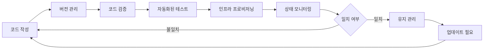

# IaC (Infrastructure as Code): 클라우드 시대의 인프라 자동화 핵심 기술

<!-- mtoc-start -->

- [정의 및 개념](#정의-및-개념)
  - [핵심 요소](#핵심-요소)
- [주요 특징](#주요-특징)
- [작동 메카니즘](#작동-메카니즘)
- [주요 도구](#주요-도구)
  - [1. 프로비저닝 도구](#1-프로비저닝-도구)
  - [2. 구성 관리 도구](#2-구성-관리-도구)
  - [3. 컨테이너 오케스트레이션](#3-컨테이너-오케스트레이션)
- [활용 사례](#활용-사례)
- [기대 효과 및 필요성](#기대-효과-및-필요성)
- [도입 시 고려사항](#도입-시-고려사항)
- [마무리](#마무리)
- [Keywords](#keywords)

<!-- mtoc-end -->

인프라스트럭처 애즈 코드(Infrastructure as Code, IaC)는 클라우드 컴퓨팅과 데브옵스(DevOps) 환경에서 급부상한 인프라 관리 방법론입니다. 전통적인 수동 인프라 구성 방식에서 벗어나, 코드를 통해 인프라를 정의하고 프로비저닝하는 IaC는 현대 IT 환경에서 민첩성, 확장성, 일관성을 확보하는 핵심 기술로 자리잡았습니다.

## 정의 및 개념

- 인프라스트럭처의 구성과 배포를 코드로 관리하는 접근 방식. 서버, 네트워크, 스토리지 등 인프라 요소를 수동 구성이 아닌 코드 기반으로 자동화하는 기술.
- 코드형 인프라는 버전 관리, 테스트, 재사용이 가능한 템플릿을 통해 인프라 프로비저닝 과정의 일관성과 신뢰성 확보. 인프라 변경 사항을 코드로 문서화하여 투명성과 감사 추적성 제공.

### 핵심 요소

- 선언적 방식: 인프라의 "목표 상태"를 정의
- 멱등성(Idempotency): 동일한 코드를 여러 번 실행해도 결과는 동일
- 버전 관리: Git 등을 통한 인프라 코드의 이력 관리
- 자동화: 수동 개입 없이 인프라 배포 및 구성

## 주요 특징

1. **코드 기반 정의**: 인프라 요소를 프로그래밍 언어나 선언적 구문으로 정의하여 가독성과 유지보수성 향상
2. **자동화된 프로비저닝**: 코드 실행을 통해 인프라 자원을 자동으로 생성, 수정, 삭제하여 운영 효율성 극대화
3. **일관성 보장**: 모든 환경(개발, 테스트, 프로덕션)에서 동일한 코드를 사용하여 환경 간 불일치 최소화
4. **버전 관리 통합**: 인프라 변경 사항을 코드로 추적하고 이전 상태로 롤백 가능
5. **협업 강화**: 개발자와 운영팀이 동일한 코드베이스를 중심으로 협업하여 데브옵스 문화 촉진

## 작동 메카니즘

IaC의 작동 메카니즘은 코드 작성부터 인프라 프로비저닝까지의 전체 프로세스를 포함합니다. 코드 기반으로 정의된 인프라는 지속적으로 모니터링되며, 목표 상태와 현재 상태 간의 차이가 감지되면 자동으로 조정됩니다.

## 주요 도구

### 1. 프로비저닝 도구

- **Terraform**: 클라우드 중립적인 IaC 도구로, HCL(HashiCorp Configuration Language)을 사용하여 다양한 클라우드 제공업체의 리소스 관리
- **AWS CloudFormation**: AWS 리소스를 위한 템플릿 기반 IaC 도구
- **Azure Resource Manager**: Microsoft Azure 리소스 관리를 위한 IaC 도구
- **Google Cloud Deployment Manager**: GCP 리소스를 위한 템플릿 기반 도구

### 2. 구성 관리 도구

- **Ansible**: 에이전트리스 구성 관리 도구로, YAML 기반 플레이북 사용
- **Chef**: Ruby 기반의 구성 관리 도구
- **Puppet**: 선언적 DSL을 사용하는 구성 관리 도구
- **SaltStack**: Python 기반의 인프라 자동화 도구

### 3. 컨테이너 오케스트레이션

- **Kubernetes**: 컨테이너화된 애플리케이션의 자동 배포, 스케일링, 관리
- **Docker Compose**: 다중 컨테이너 Docker 애플리케이션 정의 및 실행

## 활용 사례

1. **클라우드 마이그레이션**: 온프레미스 환경에서 클라우드로 이전 시 인프라 재현을 코드로 자동화하여 마이그레이션 위험 감소
2. **멀티 클라우드 전략**: 다양한 클라우드 제공업체 간 일관된 인프라 관리로 벤더 종속성 감소
3. **지속적 통합/배포(CI/CD)**: 인프라 변경을 애플리케이션 배포 파이프라인에 통합하여 엔드투엔드 자동화 구현
4. **재해 복구**: 코드화된 인프라 정의를 사용하여 재해 발생 시 신속한 환경 복구 가능
5. **확장 가능한 개발 환경**: 개발자별로 동일한 환경을 코드로 신속하게 프로비저닝하여 생산성 향상

## 기대 효과 및 필요성

1. **운영 효율성 향상**: 수동 작업 감소로 인프라 관리 시간 단축 및 오류 발생 가능성 최소화
2. **비용 최적화**: 필요에 따라 자원을 자동으로 프로비저닝하고 해제하여 클라우드 비용 절감
3. **위험 감소**: 테스트된 코드를 통한 인프라 변경으로 예측 가능성 향상 및 변경 관리 위험 감소
4. **규정 준수 강화**: 인프라 구성 및 변경 사항의 감사 기록을 코드로 유지하여 규정 준수 입증 용이
5. **확장성 개선**: 인프라 확장 과정을 자동화하여 비즈니스 성장에 따른 신속한 대응 가능
6. **협업 문화 촉진**: 개발자와 운영팀 간 협업을 강화하여 데브옵스 문화 정착 지원

## 도입 시 고려사항

1. **기술 스택 선택**: 조직의 요구사항과 기존 기술 환경에 적합한 IaC 도구 선정
2. **학습 곡선**: 팀원들이 IaC 개념과 도구에 익숙해지도록 교육 및 지원 제공
3. **상태 관리**: 인프라의 현재 상태를 추적하고 관리하는 방법 설계
4. **보안 통합**: 코드로 정의된 인프라에 보안 검사를 통합하여 취약점 사전 감지
5. **변경 관리 프로세스**: 코드 리뷰, 테스트, 승인 등 변경 관리 워크플로우 정립

## 마무리

인프라스트럭처 애즈 코드(IaC)는 현대 IT 환경에서 인프라 관리의 패러다임을 변화시키는 핵심 기술입니다. 수동적이고 오류가 발생하기 쉬운 전통적 접근 방식에서 벗어나, 코드 기반의 자동화된 인프라 관리는 조직의 민첩성, 확장성, 일관성을 크게 향상시킵니다. 특히 클라우드 컴퓨팅과 데브옵스 환경에서 IaC의 도입은 단순한 기술 변경을 넘어 조직 문화와 운영 모델의 혁신으로 이어질 수 있습니다. 지속적으로 발전하는 디지털 비즈니스 환경에서 경쟁력을 유지하고자 하는 조직이라면 IaC의 도입을 적극 검토해 볼 가치가 있습니다.

## Keywords

Infrastructure as Code, 인프라 자동화, Terraform, 멱등성(Idempotency), 선언적 인프라, DevOps 통합, 클라우드 프로비저닝, 구성 관리, 버전 관리, 인프라 테스트
