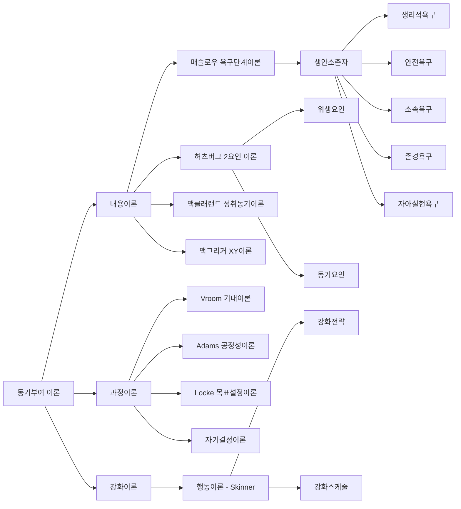

# 조직관리론: 조직 목표 달성을 위한 체계적 접근법

<!-- mtoc-start -->

- [정의 및 개념](#정의-및-개념)
- [주요 특징](#주요-특징)
- [동기부여 이론 체계](#동기부여-이론-체계)
  - [내용이론](#내용이론)
  - [과정이론](#과정이론)
  - [강화이론](#강화이론)
- [활용 사례](#활용-사례)
- [기대 효과 및 필요성](#기대-효과-및-필요성)
- [마무리](#마무리)
- [Keywords](#keywords)

<!-- mtoc-end -->

조직관리론(Organization Management Theory)은 주어진 환경 속에서 조직의 목표를 효과적으로 달성하기 위해 조직의 구성과 구성원의 직무부여 등을 지휘 통솔하고 감독하는 과정을 다루는 학문입니다. 생리적욕구, 안전욕구, 소속욕구, 존경욕구, 자아실현욕구(생안소존자)를 고려한 체계적인 접근법을 통해 조직의 효율성을 극대화하는 방법을 연구합니다.

## 정의 및 개념

- 의미: 조직의 목표 달성을 위해 구성원의 활동을 계획, 조직, 지휘, 통제하는 일련의 과정.
- 핵심 이론: 동기부여이론(구성원의 욕구에 따라 조직관리 결정), 상황이론(조직과 구성원의 상황에 의해 관리방식 결정).

## 주요 특징

- **조직 구성방법의 분류**: 중앙집중형(한 관리자의 의사결정), 분산형(팀원 모두의 의사결정 참여), 혼합형(분산팀과 중앙의 혼합)
- **목표 지향성**: 조직의 명확한 목표 설정과 달성을 위한 체계적 접근 강조
- **인적자원 중심**: 구성원의 동기부여와 역량 개발을 통한 조직 성과 향상 추구
- **상황 적응력**: 내·외부 환경 변화에 유연하게 대응할 수 있는 관리 체계 구축

## 동기부여 이론 체계

위 다이어그램은 조직관리론에서 핵심적인 동기부여 이론을 체계적으로 보여줍니다. 내용이론, 과정이론, 강화이론으로 구분되며 각각의 이론은 인간 행동의 다양한 측면을 설명합니다.

### 내용이론

- **매슬로우 욕구단계이론(생안소존자)**

  - 생리적욕구 → 안전욕구 → 소속욕구 → 존경욕구 → 자아실현욕구
  - 하위욕구가 충족되어야 상위욕구 충족 가능

- **허츠버그 2요인 이론**

  - 위생요인: 불만족 요인(회사정책, 봉급, 대인관계)
  - 동기요인: 만족 요인(성취, 인정, 작업자체, 책임)

- **맥클래랜드 성취동기이론**

  - 성취욕구: 탁월함 추구
  - 친화욕구: 대인관계 중시
  - 권력욕구: 타인 통제력 추구

- **맥그리거 XY이론**
  - Theory X: 수동적 인간관(통제, 지시 필요)
  - Theory Y: 능동적 인간관(자율통제 가능)

### 과정이론

- **Vroom 기대이론**

  - 경제적 합리성에 의거한 동기부여
  - 동기 = 기대감 × 수단성 × 유의성

- **Adams 공정성이론**

  - 공정성 인식: 자신과 비교대상 간의 투입-성과 비율 비교
  - 불공정성 인식: 과소보상(투입>성과), 과대보상(투입<성과)

- **Locke 목표설정이론**

  - SMARTS 원칙
    - Specific(구체적)
    - Measurable(계수화 가능)
    - Alignment(사명과 비전 연계)
    - Result-Controlled(노력과 상관관계, 실행가능 목표설정)
    - Timely(달성기간, 효율적 달성)
    - Stretch(도전적 목표, 의욕유발)

- **자기결정이론**
  - 자기행동의 자기통제 희망
  - 외재적보상 vs 내재적보상의 영향력 비교

### 강화이론

- **행동이론(Skinner)**
  - 기본전제: 효과의 법칙(강화된 행동 반복)
  - 강화전략
    - 긍정적강화: 바람직한 행동 후 보상
    - 부정적강화: 바람직한 행동 후 불쾌자극 제거
    - 소거: 긍정적강화 제거
    - 벌: 부정적결과 제공
  - 강화스케줄: 연속강화, 부분강화

## 활용 사례

- **성과관리 시스템**: 목표설정이론과 강화이론을 활용한 KPI 설정 및 인센티브 제도 구축
- **조직문화 개선**: 매슬로우와 허츠버그 이론을 적용한 구성원 만족도 향상 프로그램
- **리더십 개발**: 상황이론과 XY이론을 활용한 리더십 스타일 개발 및 적용
- **조직구조 재설계**: 중앙집중형, 분산형, 혼합형 조직 구조의 전략적 배치를 통한 효율성 증대

## 기대 효과 및 필요성

- **생산성 향상**: 적절한 동기부여와 조직구조 설계를 통한 업무 효율성 증대
- **인재 유지**: 구성원의 욕구 이해와 충족을 통한 이직률 감소 및 핵심인재 유지
- **혁신 촉진**: 자율성과 창의성을 증진하는 관리방식 도입으로 조직 혁신 역량 강화
- **위기대응력 향상**: 상황이론에 기반한 유연한 조직관리로 환경 변화에 신속 대응
- **갈등 감소**: 공정성이론에 근거한 보상체계 설계로 조직 내 갈등 최소화

## 마무리

조직관리론은 다양한 이론을 통해 조직과 구성원의 관계를 체계적으로 이해하고 관리하는 방법을 제시합니다. 생안소존자로 대표되는 매슬로우의 욕구단계이론부터 목표설정, 공정성, 강화이론에 이르기까지 다양한 접근법을 통합적으로 적용함으로써 조직의 목표 달성과 구성원의 만족을 동시에 추구할 수 있습니다. 현대 조직은 이러한 이론적 기반을 토대로 변화하는 환경에 적응하며 지속적인 성장을 이끌어낼 수 있을 것입니다.

## Keywords

Organization Management Theory, 동기부여이론, 상황이론, 매슬로우 욕구단계, 생안소존자, 목표설정이론, SMARTS 원칙, 허츠버그 2요인, 공정성이론, 강화이론
