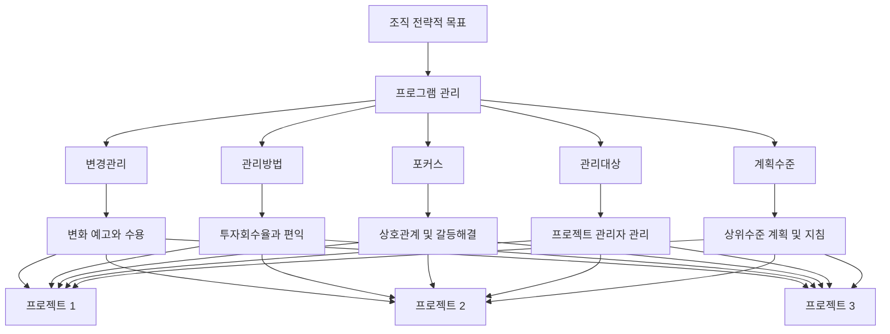

# 프로그램관리: 전략적 목표 달성을 위한 통합적 접근법

<!-- mtoc-start -->

- [정의 및 개념](#정의-및-개념)
- [주요 특징](#주요-특징)
- [프로그램관리 구조도](#프로그램관리-구조도)
- [활용 사례](#활용-사례)
- [기대 효과 및 필요성](#기대-효과-및-필요성)
- [마무리](#마무리)
- [Keywords](#keywords)

<!-- mtoc-end -->

프로그램관리(Program Management)는 기업이 전략적 목표를 효과적으로 달성하기 위해 상호 연관된 프로젝트 그룹을 체계적으로 관리하는 접근 방식입니다. 단일 프로젝트 관리를 넘어서 여러 프로젝트 간의 상호작용과 의존성을 고려하여 조직의 전략적 가치를 극대화하는 데 중점을 둡니다. 프로그램관리는 변경, 관리방법, 포커스, 관리대상, 계획수준 등 다양한 요소를 통합적으로 고려하여 진행됩니다.

## 정의 및 개념

- 프로그램관리: 상호 연관된 프로젝트 그룹을 통합적으로 관리하여 개별 프로젝트의 단순 합보다 더 큰 전략적 가치를 창출하는 관리 체계.
- 목적: 조직의 전략적 목표 달성을 위해 프로젝트 간 상호연관성을 효과적으로 관리하고 최적화하는 것.
- 특징: 변화관리 강조, 편익 중심 접근, 상호관계 관리, 프로젝트 관리자 조정, 상위수준 계획 수립.

## 주요 특징

- **변관포대계(변경관리, 관리방법, 포커스, 관리대상, 계획수준)**: 프로그램관리의 핵심 차원을 구성하는 요소들로, 이를 통해 프로그램의 전략적 가치를 최적화.
- **변경관리 중심**: 조직 내 변화를 예고하고 체계적으로 수용하는 접근법을 통해 프로그램 진행 과정에서 발생하는 변화를 효과적으로 관리.
- **편익 중심 관리방법**: 투자회수율(ROI)과 프로그램을 통해 제공되는 편익에 초점을 맞춰 가치 중심의 의사결정 진행.
- **상호관계 관리**: 개별 프로젝트 간의 의존성과 상호작용을 분석하고 갈등을 해결하여 시너지 효과 창출.
- **프로젝트 관리자 조정**: 여러 프로젝트 관리자들을 조정하고 지원하여 프로그램 목표에 부합하는 프로젝트 진행 보장.

## 프로그램관리 구조도

프로그램관리 구조도는 조직의 전략적 목표에서 출발하여 변관포대계 요소를 거쳐 개별 프로젝트로 연결되는 흐름을 보여줍니다. 이 구조를 통해 프로그램 관리자는 전략적 목표와 개별 프로젝트 간의 연계성을 유지하며 통합적 관리를 수행합니다.

## 활용 사례

- **IT 전환 프로그램**: 기업의 디지털 전환을 위한 여러 IT 프로젝트(인프라 업그레이드, 애플리케이션 현대화, 데이터 마이그레이션)를 통합 관리하여 비즈니스 연속성 보장.
- **신제품 출시 프로그램**: R&D, 생산, 마케팅, 유통 등 다양한 부서의 프로젝트를 조율하여 신제품의 성공적 출시 지원.
- **조직 변화 프로그램**: 조직 구조 개편, 프로세스 혁신, 문화 변화 등의 프로젝트를 통합하여 조직 변화의 일관성 확보.
- **국가 인프라 개발 프로그램**: 도로, 전력망, 통신망 등 다양한 인프라 구축 프로젝트를 연계하여 국가 발전 목표 달성.

## 기대 효과 및 필요성

- **전략적 일관성 확보**: 개별 프로젝트가 조직의 전략적 목표에 일관되게 기여하도록 보장.
- **자원 최적화**: 프로젝트 간 자원 공유와 중복 방지를 통한 효율성 증대.
- **위험 관리 강화**: 프로젝트 간 상호의존성에서 비롯되는 위험을 식별하고 관리.
- **성과 극대화**: 프로젝트 간 시너지 효과를 통해 개별 프로젝트 합보다 큰 가치 창출.
- **변화 관리 효율화**: 조직 내 변화를 체계적으로 도입하고 관리하여 저항 최소화.
- **이해관계자 만족도 향상**: 통합적 접근을 통해 다양한 이해관계자의 기대를 효과적으로 관리.

## 마무리

프로그램관리는 상호 연관된 프로젝트 그룹을 통합적으로 관리함으로써 조직의 전략적 목표 달성을 지원하는 중요한 관리 체계입니다. 변관포대계 요소를 균형 있게 고려하여 프로그램을 관리한다면, 개별 프로젝트의 단순 합보다 더 큰 가치를 창출할 수 있습니다. 조직이 복잡한 환경에서 전략적 목표를 효과적으로 달성하기 위해서는 체계적인 프로그램관리 방법론의 도입과 실행이 필수적입니다.

## Keywords

Program Management, 변경관리, 프로젝트 포트폴리오, 전략적 정렬, 편익 관리, 상호의존성 관리, 갈등 해결, 자원 최적화, 변관포대계, ROI 관리
