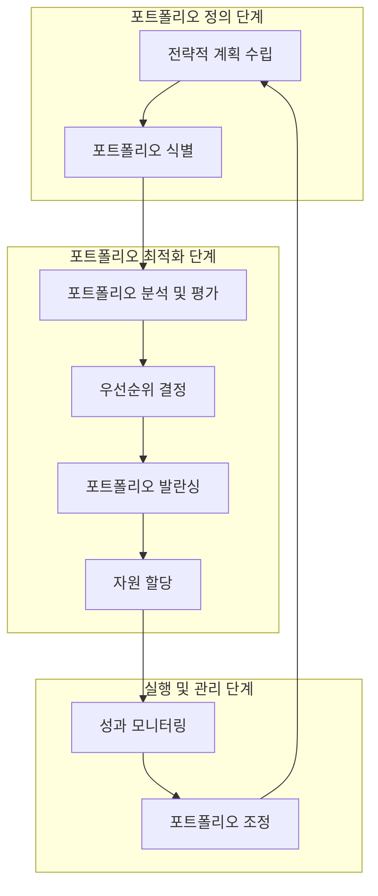

# 포트폴리오 관리: 조직의 전략적 자원 최적화 체계

<!-- mtoc-start -->

- [정의 및 개념](#정의-및-개념)
- [주요 특징](#주요-특징)
- [포트폴리오 관리 프로세스](#포트폴리오-관리-프로세스)
- [활용 사례](#활용-사례)
- [기대 효과 및 필요성](#기대-효과-및-필요성)
- [마무리](#마무리)
- [Keywords](#keywords)

<!-- mtoc-end -->

포트폴리오 관리(Portfolio Management)는 조직이 보유한 제한된 자원을 전략적으로 배분하여 최대의 가치를 창출하기 위한 관리 체계입니다. 여러 프로젝트와 프로그램을 조직의 전략적 관점에서 평가하고, 우선순위를 결정하며, 위험과 기회를 종합적으로 관리하는 접근 방식을 제공합니다.

## 정의 및 개념

- 개념: 조직의 목표달성을 위해 프로젝트나 프로그램의 우선순위를 결정하고, 조직의 전략적 관점에서 위험과 기회를 관리하는 체계.
- 필요성: 제한된 자원의 최적화 전략 제시 및 전체 프로젝트에 대한 종합적 진척사항과 투자성과 분석 수행.
- 관리방법: 포트폴리오 구성요소의 총체적 성과기준 설정 및 측정.
- 포커스: 포트폴리오 의사결정에 대한 가치 부가 활동에 중점.
- 관리대상: 포트폴리오 스텝(단계) 및 구성요소 관리.
- 계획수준: 포트폴리오와 연관된 프로세스의 체계적 설계 및 운영.

## 주요 특징

- **전략적 연계성**: 모든 프로젝트와 프로그램이 조직의 전략적 목표와 연계되도록 관리하여 자원 낭비 방지.
- **통합적 의사결정**: 개별 프로젝트 단위가 아닌 포트폴리오 전체의 관점에서 투자 의사결정을 수행하여 시너지 효과 창출.
- **지속적 모니터링**: 환경 변화를 지속적으로 감시하고 포트폴리오 구성을 적시에 조정하여 전략적 민첩성 확보.
- **자원 최적화**: 제한된 조직 자원(인력, 자금, 시간 등)을 전략적 우선순위에 따라 배분하여 효율성 극대화.
- **위험 분산**: 다양한 프로젝트와 프로그램을 균형 있게 구성하여 조직 전체의 위험을 관리하고 안정적 성과 달성.

## 포트폴리오 관리 프로세스

포트폴리오 관리는 전략적 계획 수립부터 성과 모니터링 및 조정까지 순환적 프로세스로 구성됩니다. 각 단계는 유기적으로 연결되어 지속적인 가치 창출과 최적화를 가능하게 합니다.

## 활용 사례

- **IT 투자 포트폴리오**: 기업의 다양한 IT 프로젝트를 전략적 중요도, ROI, 위험도 등을 기준으로 평가하고 투자 우선순위 결정.
- **연구개발(R&D) 포트폴리오**: 혁신적 제품 개발을 위한 다양한 R&D 프로젝트를 시장 가능성, 기술적 실현 가능성, 전략적 중요도 등을 기준으로 관리.
- **인프라 투자 포트폴리오**: 공공기관이나 대기업의 인프라 프로젝트를 사회적 영향, 경제성, 시급성 등을 고려하여 우선순위 선정 및 관리.
- **마케팅 포트폴리오**: 다양한 마케팅 활동과 캠페인을 고객 영향력, 브랜드 가치, 투자 효율성 등을 기준으로 조정 및 관리.

## 기대 효과 및 필요성

- **전략적 자원 배분**: 제한된 자원을 전략적 우선순위에 따라 효율적으로 배분하여 조직의 핵심 역량 강화.
- **투자 최적화**: 투자 포트폴리오의 균형을 유지하여 위험을 분산하고 안정적인 수익 창출.
- **의사결정 투명성**: 객관적 기준에 근거한 의사결정으로 조직 내 투명성 확보 및 이해관계자 신뢰 구축.
- **변화 대응력 향상**: 환경 변화에 신속하게 대응할 수 있는 체계적인 포트폴리오 조정 메커니즘 확보.
- **성과 가시성**: 포트폴리오 전체의 성과를 종합적으로 모니터링하여 경영진의 전략적 통찰력 강화.

## 마무리

포트폴리오 관리는 단순한 프로젝트 목록 관리가 아닌, 조직의 전략적 목표 달성을 위한 핵심 경영 도구입니다. 제한된 자원 환경에서 최대의 가치를 창출하기 위해서는 체계적인 포트폴리오 관리 체계의 도입이 필수적이며, 이를 통해 조직은 불확실한 비즈니스 환경에서도 안정적이고 지속 가능한 성장을 이룰 수 있습니다.

## Keywords

Portfolio Management, Strategic Alignment, 자원 최적화, 우선순위 결정, Value Optimization, 위험 분산, 전략적 의사결정, 성과 모니터링, 포트폴리오 발란싱, 투자 효율성
