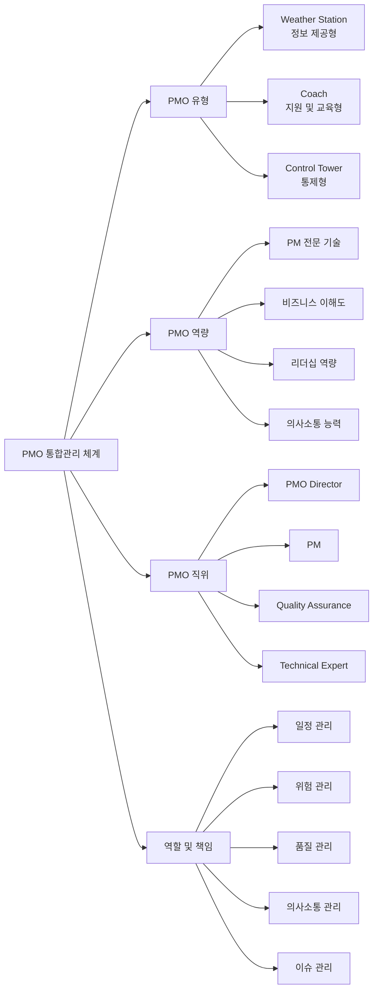

# PMO (Project Management Office): 대규모 프로젝트의 효율적인 관리전담

<!-- mtoc-start -->

- [정의 및 개념](#정의-및-개념)
- [주요 특징](#주요-특징)
- [PMO 모델 및 구조](#pmo-모델-및-구조)
- [활용 사례](#활용-사례)
- [기대 효과 및 필요성](#기대-효과-및-필요성)
- [마무리](#마무리)
- [Keywords](#keywords)

<!-- mtoc-end -->

프로젝트 관리 오피스(Project Management Office, PMO)는 IT 프로젝트의 자원, 일정, 진도, 이슈관리 등을 효율적으로 수행하기 위해 만들어진 프로젝트 통합관리 전담조직입니다. 복잡하고 대규모화된 프로젝트 환경에서 체계적인 관리와 위험을 최소화하기 위한 중재 역할과 품질 향상을 목적으로 합니다. 특히 공공분야와 대규모 프로젝트에서 그 필요성이 두드러지고 있습니다.

## 정의 및 개념

- 대규모 프로젝트의 효율적인 관리를 위한 전담 조직으로, 프로젝트 계획, 실행, 통제의 전 과정을 지원하는 관리체계.
- 프로젝트 간 자원 최적화, 표준화된 방법론 적용, 위험관리를 통해 프로젝트 성공률을 높이는 전략적 기능 수행.

- 목적: 체계적인 관리, 위험 최소화, 중재 역할, 품질 향상
- 등장배경: 프로젝트 대규모화, 공공분야에서의 필요성 증대
- 유형: Weather Station(정보 제공), Coach(지원 및 교육), Control Tower(통제)

## 주요 특징

1. **통합 관리 체계**: 프로젝트의 모든 요소(일정, 비용, 자원, 품질)를 통합적으로 관리하여 전체 프로젝트의 효율성 향상
2. **표준화된 프로세스**: 일관된 방법론과 템플릿을 활용하여 프로젝트 수행의 일관성 및 예측 가능성 확보
3. **전문 인력 구성**: PMO 기술, 역할 책임, 포지션을 고려한 전문 인력을 구성하여 프로젝트 지원 및 관리 역량 강화
4. **중앙 집중식 정보 관리**: 프로젝트 관련 모든 정보와 지식을 중앙에서 관리하여 의사결정 지원 및 경험 축적
5. **조직 전략 연계**: 개별 프로젝트가 조직의 전략적 목표와 일치하도록 조정하고 감독하는 역할 수행

## PMO 모델 및 구조

PMO는 유형, 역량, 직위, 역할 및 책임의 4가지 주요 모델로 구성되며, 각 조직의 필요와 프로젝트 특성에 따라 적합한 구조를 선택하여 운영됩니다. 가장 효과적인 PMO는 프로젝트의 복잡성과 조직 문화를 고려하여 맞춤형으로 설계됩니다.

## 활용 사례

1. **대규모 공공 IT 프로젝트**: 정부기관의 시스템 구축 프로젝트에서 PMO가 요구사항 관리, 일정 관리, 계약 관리를 수행하여 투명성 확보
2. **금융권 차세대 시스템 구축**: 여러 벤더와 내부 팀이 참여하는 복잡한 환경에서 PMO가 조정 역할을 담당하여 일관된 방향성 유지
3. **글로벌 ERP 구축**: 다국적 기업의 ERP 도입 시 PMO가 국가별 법규와 비즈니스 요구사항을 조율하며 통합 관리
4. **디지털 트랜스포메이션**: 조직의 디지털 전환 과정에서 PMO가 다양한 디지털 이니셔티브를 조율하고 변화관리 지원

## 기대 효과 및 필요성

1. **프로젝트 성공률 향상**: 체계적인 관리와 모니터링을 통해 일정 준수, 예산 관리, 품질 확보 가능성 증대
2. **자원 최적화**: 프로젝트 간 자원 공유와 효율적 배분을 통한 비용 절감 및 생산성 향상
3. **위험 감소**: 사전 위험 식별 및 관리를 통한 프로젝트 실패 가능성 최소화
4. **의사결정 지원**: 정확한 데이터와 현황 보고를 통한 신속하고 효과적인 의사결정 지원
5. **조직 역량 강화**: 프로젝트 경험과 지식의 축적 및 공유를 통한 조직 전체의 프로젝트 관리 역량 향상

## 마무리

PMO는 단순한 프로젝트 관리 지원 조직을 넘어 조직의 전략적 목표 달성을 위한 핵심 요소로 자리잡고 있습니다. 효과적인 PMO 도입과 운영을 위해서는 계획 수립부터 지속적 개선까지의 체계적인 접근이 필요하며, 조직의 특성과 프로젝트 환경에 맞는 맞춤형 PMO 모델을 구축하는 것이 성공의 열쇠입니다. 프로젝트의 복잡성이 증가하는 현대 비즈니스 환경에서 PMO의 역할은 더욱 중요해질 것으로 예상됩니다.

## Keywords

Project Management Office, 프로젝트 관리 오피스, Control Tower, Weather Station, Coach, 통합 관리, 위험 관리, Resource Optimization, Project Governance, 표준화 프로세스, 프로젝트 성공률
