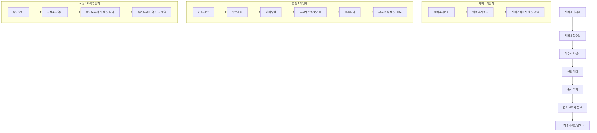

# 정보시스템 감리: 효과적인 IT 프로젝트 관리와 품질 보증을 위한 필수 과정

<!-- mtoc-start -->

- [정의 및 개념](#정의-및-개념)
- [주요 특징](#주요-특징)
- [감리 프로세스](#감리-프로세스)
- [감리 영역 및 관점](#감리-영역-및-관점)
- [활용 사례](#활용-사례)
- [기대 효과 및 필요성](#기대-효과-및-필요성)
- [마무리](#마무리)
- [Keywords](#keywords)

<!-- mtoc-end -->

정보시스템 감리(Information System Audit)는 IT 프로젝트의 성공적인 수행과 품질 보증을 위한 핵심 제도입니다. 감리는 제3자적 관점에서 정보시스템의 효율성과 안정성을 종합적으로 점검하고, 잠재적 문제점을 조기에 발견하여 개선하도록 유도합니다. 특히 대규모 IT 프로젝트에서 위험 요소를 식별하고 관리하는 데 중요한 역할을 담당하며, 발주기관과 피감리인의 이해관계로부터 독립된 객관적 평가를 제공합니다.

## 정의 및 개념

- 정보시스템 감리: 감리발주기관 및 피감리인의 이해관계로부터 독립된 자가 제3자적 관점에서 정보시스템의 효율성 및 안정성을 종합적으로 점검하고 문제점을 개선하도록 하는 행위 및 제도
- 목적: 효효안경준객품 - 효과성(최적방안), 효율성, 안정성(내부통제), 경제성(비용적정성), 준거성, 객관성, 품질보증을 통한 정보시스템 품질 향상
- 감리시점: 요구정의 단계, 설계 단계, 종료 단계의 3단계로 구분하여 각 단계별 점검 수행

## 주요 특징

- 독립성: 발주기관과 피감리인의 이해관계로부터 독립된 제3자적 관점에서 수행
- 객관성: 표준화된 점검기준과 방법론을 바탕으로 객관적인 평가 제공
- 단계별 접근: 프로젝트 생명주기에 따라 요구정의, 설계, 종료 단계별로 감리 수행
- 종합적 점검: 효과성, 효율성, 안정성, 경제성, 준거성 등 다양한 관점에서 종합적 평가
- 개선 지향성: 단순 문제점 지적이 아닌 개선방안 제시를 통한 시스템 품질 향상 지원

## 감리 프로세스

감리 프로세스는 감리계약체결부터 조치결과확인 및 보고까지 체계적인 절차로 구성됩니다.

이 프로세스는 예비조사, 현장조사, 시정조치확인의 3단계로 구분되며, 각 단계별로 세부 활동이 정의되어 있습니다. 감리의 효과성과 객관성을 보장하기 위해 각 단계마다 명확한 산출물과 점검 활동이 포함됩니다.

## 감리 영역 및 관점

| 감리영역        | 사업유형/감리시점 | 감리관점/점검기준                     |
| --------------- | ----------------- | ------------------------------------- |
| 프로젝트 관리   | 모든 사업         | 일정, 범위, 자원, 위험관리 적절성     |
| 시스템 아키텍처 | 정보시스템 구축   | 아키텍처 설계 타당성, 확장성, 통합성  |
| 데이터베이스    | DB 구축/이관      | 데이터 모델링, 무결성, 성능 적정성    |
| 응용시스템      | 소프트웨어 개발   | 기능 구현 적절성, 품질, 테스트 충분성 |
| 시스템 운영     | 인프라 구축       | 가용성, 안정성, 성능, 보안성 확보     |

## 활용 사례

- 공공기관 정보화 사업: 국가 정보화 사업의 품질 보증 및 예산 낭비 방지를 위한 의무 감리 수행
- 금융권 시스템 구축: 고객 정보 보안 및 시스템 안정성 확보를 위한 철저한 감리 적용
- 대규모 ERP 도입: 조직 전반의 업무 프로세스 변화에 따른 위험 관리 및 품질 보증
- 클라우드 전환 프로젝트: 기존 시스템의 클라우드 마이그레이션 과정에서의 데이터 무결성 및 보안성 검증
- 핵심 업무시스템 고도화: 레거시 시스템 개선 시 업무 연속성 및 성능 보장을 위한 감리 수행

## 기대 효과 및 필요성

- 프로젝트 위험 감소: 잠재적 문제점을 조기에 발견하여 프로젝트 실패 위험 최소화
- 품질 향상: 객관적인 제3자 검증을 통한 최종 산출물의 품질 보증
- 비용 효율성: 문제점 조기 발견을 통한 수정 비용 절감 및 예산 낭비 방지
- 표준 준수: 산업 표준 및 법적 요구사항 충족 여부 확인
- 투명성 강화: 발주기관과 수행기관 간의 투명한 프로젝트 관리 지원
- 지식 이전: 감리 과정에서 축적된 경험과 지식의 조직 내 전파 및 공유

## 마무리

정보시스템 감리는 IT 프로젝트의 성공적인 수행과 품질 보증을 위한 필수적인 활동입니다. 단순한 검증 절차를 넘어 프로젝트의 효과성, 효율성, 안정성을 종합적으로 평가하고 개선방안을 제시함으로써 조직의 정보시스템 품질 향상에 기여합니다. 특히 대규모 정보화 사업에서는 감리를 통한 객관적인 평가와 지속적인 개선 활동이 프로젝트 성공의 핵심 요소라 할 수 있습니다. 감리 프로세스와 방법론을 체계적으로 적용하여 정보시스템의 가치를 극대화하고 리스크를 최소화하는 전략적 접근이 필요합니다.

## Keywords

Information System Audit, 정보시스템 감리, Project Quality Assurance, 프로젝트 품질보증, Third-party Verification, 제3자 검증, Audit Process, 감리 프로세스, 효효안경준객품, System Effectiveness, 시스템 효과성, Quality Control, 품질통제, IT Governance, IT 거버넌스
