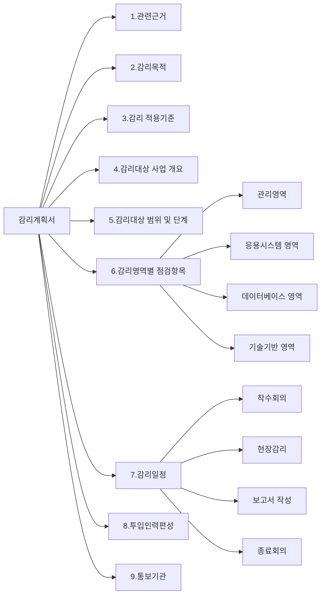

# 감리계획서: 효과적인 정보시스템 감리 수행 체계

<!-- mtoc-start -->

- [정의 및 개념](#정의-및-개념)
- [주요 특징](#주요-특징)
- [감리계획서 구성체계](#감리계획서-구성체계)
- [정보시스템 감리계획서 구성체계 상세 항목](#정보시스템-감리계획서-구성체계-상세-항목)
- [활용 사례](#활용-사례)
- [기대 효과 및 필요성](#기대-효과-및-필요성)
- [마무리](#마무리)
- [Keywords](#keywords)

<!-- mtoc-end -->

감리계획서(Information System Audit Plan)는 정보시스템 구축 과정의 품질을 보장하기 위한 핵심 문서입니다. 체계적인 감리 활동을 통해 프로젝트의 위험을 최소화하고, 법적·제도적 요구사항을 충족시키며, 발주기관과 사업자 간의 명확한 소통 기반을 제공합니다. 효과적인 감리계획서는 감리 목적과 범위를 명확히 정의하고, 감리 방법론과 일정을 체계적으로 구성하여 정보시스템 구축 사업의 성공적 완수를 지원합니다.

## 정의 및 개념

- 정보시스템 감리계획서: 정보시스템의 효율성, 안전성, 신뢰성 확보를 위해 제3자적 관점에서 점검하고 문제점을 개선하기 위한 감리 활동의 체계적 계획 문서.
- 목적: 정보시스템 개발 과정 및 결과에 대한 독립적이고 객관적인 관점에서의 품질 보증 및 위험 관리 수행.

- 특징: 법적 근거 기반, 단계별 감리 체계, 객관적 평가 기준 제시
- 필요성: 개발 과정의 오류 및 결함 최소화, 제도적 요구사항 충족, 발주처-개발사 간 분쟁 예방

## 주요 특징

1. **법적 근거 명시**: 전자정부법, 안전행정부 고시 등 감리 수행의 법적·제도적 근거를 명확히 제시하여 감리 활동의 정당성 확보
2. **체계적 점검항목 구성**: 감리 영역별(관리, 응용, 데이터, 기술 등) 세부 점검항목을 체계적으로 구성하여 누락 없는 감리 수행 보장
3. **전문 인력 편성**: 감리 영역별 전문성을 갖춘 감리원을 편성하여 효과적인 감리 수행 및 품질 보증
4. **명확한 일정 계획**: 착수회의, 현장감리, 감리보고서 작성, 종료회의 등 세부 일정을 구체적으로 제시하여 체계적 감리 진행

## 감리계획서 구성체계

감리계획서는 관련근거부터 통보기관까지 9개 주요 섹션으로 구성되며, 특히 감리영역별 점검항목과 감리일정은 하위 요소로 세분화되어 체계적인 감리 활동의 기반을 제공합니다. 전체 구성 요소들이 유기적으로 연결되어 감리의 목적 달성을 지원합니다.

## 정보시스템 감리계획서 구성체계 상세 항목

| 주요 구성항목                         | 세부 내용                                                                                                                                                                                                                                                                                                                                                                     | 작성 시 고려사항                                                                                              |
| ------------------------------------- | ----------------------------------------------------------------------------------------------------------------------------------------------------------------------------------------------------------------------------------------------------------------------------------------------------------------------------------------------------------------------------- | ------------------------------------------------------------------------------------------------------------- |
| **1. 관련근거**                       | - 감리계약 관련 근거(계약번호, 계약일자) - 감리 의뢰 공문 정보 - 관련 법규(전자정부법, 시행령 등)                                                                                                                                                                                                                                                                       | - 공공부문의 경우 조달청 계약번호 명시 - 발주기관 및 계약 당사자 정보 정확히 기재                          |
| **2. 감리목적**                       | - 감리 수행 목적 서술 - 기대효과 및 중점 점검사항 - 감리 수행 결과의 활용방안                                                                                                                                                                                                                                                                                           | - 해당 프로젝트의 특성에 맞는 구체적 목적 제시 - 발주기관의 기대사항 반영                                  |
| **3. 감리 적용기준**                  | - 전자정부법, 행정안전부 고시 - 정보시스템 감리기준 - 감리 수행 지침 - 기관별 표준 및 지침                                                                                                                                                                                                                                                                           | - 최신 법규 및 지침 버전 참조 - 기관 내부 지침이 있는 경우 포함                                            |
| **4. 감리대상 사업의 개요**           | - 사업명 - 사업기간 - 사업목적 - 주요 사업내용 - 이해관계자 현황                                                                                                                                                                                                                                                                                                  | - 발주기관 및 사업자 정보 포함 - 사업 범위 및 주요 산출물 명시                                             |
| **5. 감리대상 범위 및 단계**          | - 감리대상 시스템 범위 - 감리 단계(요구분석, 설계, 구현, 시험 등) - 제외 대상 및 사유                                                                                                                                                                                                                                                                                   | - 단계별 감리 시점 및 범위 명확화 - 기술적/비기술적 요소 포함 여부                                         |
| **6. 감리영역별 점검항목**            | **관리영역**: - 사업관리 - 일정관리 - 인력관리 - 위험관리 - 형상관리  **응용시스템 영역**: - 기능적합성 - 성능효율성 - 호환성 - 사용성 - 신뢰성  **데이터베이스 영역**: - DB 설계 - 데이터 표준 - 데이터 품질 - 데이터 이행  **기술기반 영역**: - 하드웨어 - 네트워크 - 보안 - 운영체제 - 미들웨어 | - 프로젝트 특성에 맞는 중점 점검항목 선정 - 각 영역별 세부 점검항목 목록 포함 - 점검기준 및 방법론 명시 |
| **7. 감리일정**                       | - 착수회의 일시 및 장소 - 현장감리 기간 - 감리보고서 작성 기간 - 종료회의 일시 및 장소 - 시정조치 확인 일정                                                                                                                                                                                                                                                       | - 구체적 일자 및 시간 명시 - 주요 이해관계자 참석 가능성 고려 - 충분한 검토 시간 확보                   |
| **8. 투입인력편성**                   | - 감리총괄 책임자 - 영역별 감리원 구성 - 감리원 자격 및 전문분야 - 감리원별 역할 및 책임 - 투입공수                                                                                                                                                                                                                                                               | - 감리 영역별 전문가 배치 - 감리원 자격증 및 경력 명시 - 영역별 적정 인력 배분                          |
| **9. 감리 계획서 및 보고서 통보기관** | - 발주기관 - 사업자 - 감독기관 - 기타 이해관계자                                                                                                                                                                                                                                                                                                                     | - 통보 방법 및 절차 명시 - 보안등급에 따른 배포 제한사항 포함                                              |

## 활용 사례

1. **정보시스템 구축 사업**: 국가기관 및 공공기관의 정보시스템 구축 사업에서 각 단계(요구사항 분석, 설계, 구현, 시험)별 감리 수행 시 기준 문서로 활용
2. **정보보호 시스템 도입**: 개인정보 보호를 위한 시스템 구축 시 보안 요구사항 충족 여부를 검증하기 위한 감리 계획 수립에 활용
3. **시스템 고도화 사업**: 기존 시스템의 성능 개선이나 기능 확장 과정에서 변경 영향도 평가 및 품질 보증을 위한 감리 활동 계획에 활용
4. **클라우드 전환 프로젝트**: 온-프레미스 환경에서 클라우드 환경으로 전환 시 안정성과 성능을 보장하기 위한 감리 체계 수립에 활용

## 기대 효과 및 필요성

1. **품질 향상**: 체계적인 감리를 통해 정보시스템 개발 과정의 오류를 조기 발견하고 수정하여 최종 산출물의 품질 보장
2. **비용 절감**: 개발 초기 단계부터 문제점을 식별하고 개선함으로써 향후 발생할 수 있는 재작업 비용 최소화
3. **이해관계자 신뢰 구축**: 객관적인 제3자에 의한 평가를 통해 발주기관과 개발사 간의 신뢰 형성 및 의사소통 촉진
4. **법적 리스크 감소**: 관련 법규 및 지침 준수 여부를 사전에 점검함으로써 향후 발생할 수 있는 법적 분쟁 예방
5. **보안 강화**: 보안 요구사항 및 취약점 점검을 통해 정보시스템의 보안 수준 향상 및 침해사고 위험 감소

## 마무리

감리계획서는 정보시스템 구축 사업의 성공을 위한 핵심 관리 도구입니다. 체계적인 감리계획서를 통해 프로젝트의 위험을 최소화하고, 품질을 보장하며, 이해관계자 간의 효과적인 소통을 촉진할 수 있습니다. 특히 공공부문 정보화 사업에서는 법적·제도적 요구사항을 충족하기 위해 감리계획서의 체계적인 수립과 이행이 필수적입니다. 향후 디지털 전환 시대에 맞춰 클라우드, 인공지능, 빅데이터 등 신기술 도입 영역으로 감리 범위를 확장하고, 감리 방법론을 지속적으로 발전시켜 나가는 것이 중요합니다.

## Keywords

Information System Audit Plan, 정보시스템 감리계획서, Audit Criteria, 감리 적용기준, Audit Scope, 감리범위, Quality Assurance, 품질보증, Compliance Verification, 준수성 검증, Risk Management, 위험관리, Independent Verification, 독립적 검증, 감리보고서, 감리일정
