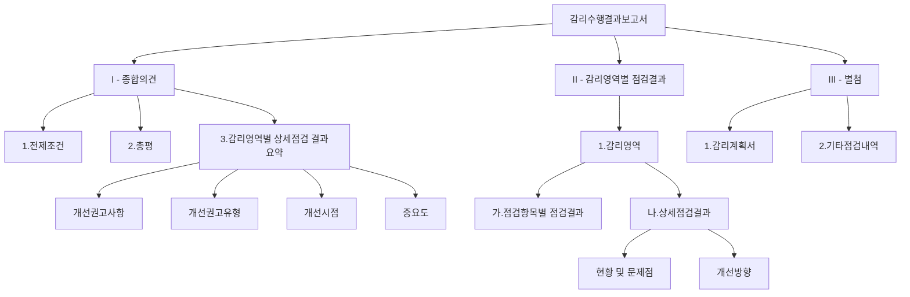

# 감리수행결과보고서: 효과적인 IT 프로젝트 품질 보증 도구

<!-- mtoc-start -->

- [정의 및 개념](#정의-및-개념)
- [주요 특징](#주요-특징)
- [구조도](#구조도)
- [활용 사례](#활용-사례)
- [기대 효과 및 필요성](#기대-효과-및-필요성)
- [마무리](#마무리)
- [Keywords](#keywords)

<!-- mtoc-end -->

감리수행결과보고서(Audit Performance Report)는 IT 프로젝트의 품질과 성과를 객관적으로 평가하고, 개선 방안을 제시하는 감리 활동의 최종 산출물입니다. 이 보고서는 효과성, 효율성, 안정성, 경제성, 준거성, 객관성, 품질보증이라는 7가지 핵심 가치(효효안경준객품)를 기반으로 작성되며, 감리 발주기관과 피감리인에게 프로젝트의 현황과 개선 방향에 대한 중요한 정보를 제공합니다.

## 정의 및 개념

- 개념: IT 프로젝트의 품질 및 프로세스에 대한 전문적 검토와 평가 결과를 체계적으로 정리한 공식 문서. 감리 과정에서 발견된 문제점과 개선 방안을 포함하는 종합적 보고서.
- 목적: 프로젝트의 효과성, 효율성, 안정성, 경제성, 준거성, 객관성, 품질보증을 확보하기 위한 독립적인 평가 결과 제공.

## 주요 특징

- **객관적 평가**: 독립적 제3자의 관점에서 프로젝트의 현황과 문제점을 객관적으로 분석하고 평가
- **구조화된 형식**: 종합의견과 감리영역별 점검결과로 구성되어 체계적인 정보 전달 가능
- **개선 지향적 접근**: 단순한 문제점 지적뿐만 아니라 실질적인 개선 방향과, 중요도, 개선시점 제시
- **감리 증적 제공**: 감리 과정에서 수집한 증적과 검토 결과를 체계적으로 문서화하여 신뢰성 확보
- **의사결정 지원**: 프로젝트 관련 의사결정권자에게 프로젝트 현황에 대한 투명한 정보 제공

## 구조도

감리수행결과보고서는 종합의견, 감리영역별 점검결과, 별첨 문서로 체계화되어 있으며, 각 섹션은 세부 항목으로 구성됩니다. 이러한 구조적 접근은 감리 결과의 전달력과 활용도를 높여줍니다.

## 활용 사례

- **공공 정보화 사업**: 정부 및 공공기관의 대규모 IT 프로젝트에서 의무적으로 수행되는 감리 결과를 체계적으로 정리
- **금융권 시스템 구축**: 은행, 보험사 등 금융권의 핵심 시스템 구축 과정에서 품질 및 보안 검증 도구로 활용
- **기업 ERP 도입**: 기업의 ERP 도입 프로젝트에서 시스템 구축의 적정성과 업무 프로세스 개선 방향성 제시
- **SW 개발 프로젝트**: 대규모 소프트웨어 개발 프로젝트의 요구사항 충족 여부와 품질 수준 평가에 활용

## 기대 효과 및 필요성

- **품질 향상**: 개발 및 구축 과정에서 발생할 수 있는 결함을 조기에 발견하고 개선함으로써 최종 산출물의 품질 향상
- **비용 절감**: 프로젝트 수행 중 문제점을 조기에 발견하여 사후 수정 비용 최소화
- **위험 관리**: 프로젝트의 잠재적 위험요소를 식별하고 대응 방안을 마련함으로써 프로젝트 실패 위험 감소
- **법적 준거성 확보**: 법규 및 표준 준수 여부를 검증하여 규제 위반 리스크 최소화
- **의사결정 지원**: 경영진과 이해관계자들에게 프로젝트 현황에 대한 객관적 정보 제공

## 마무리

감리수행결과보고서는 IT 프로젝트의 품질과 성과를 객관적으로 평가하고 개선하는 핵심 도구입니다. 효과성, 효율성, 안정성, 경제성, 준거성, 객관성, 품질보증이라는 7가지 가치를 중심으로, 프로젝트의 성공적인 완수를 위한 방향을 제시합니다. 감리 결과를 체계적으로 문서화하고 활용함으로써 조직은 IT 투자의 가치를 극대화하고, 프로젝트 리스크를 효과적으로 관리할 수 있습니다.

## Keywords

Audit Performance Report, IT Project Audit, 감리수행결과보고서, 효효안경준객품, 개선권고사항, 품질보증, 감리영역, 상세점검결과, 객관적 평가, IT 프로젝트 관리
